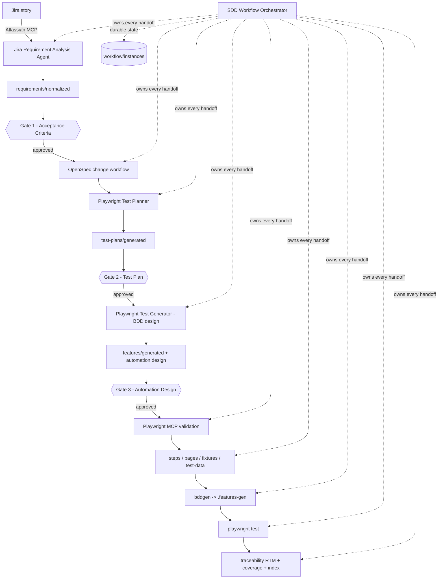
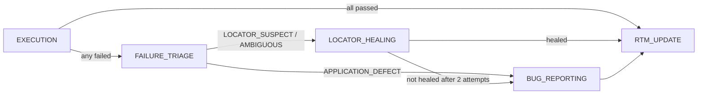

# eCore OpenSpec POC — Orchestrator-driven, OpenSpec-based Playwright-BDD automation framework

A proof of concept for a spec-driven test automation framework that turns a Jira story into
approved, traceable, executable Playwright-BDD tests through a **durable, resumable, agent-driven
workflow with three human approval gates**.

> **POC status.** The framework has been driven end to end by one real Jira story, `ETA-351`, from
> retrieval through three approval gates to a real browser run against the QA environment — 7 of 7
> scheduled scenarios passing. `ETA-351` is now the only story in the repository and the reference
> shape for every artifact. See [Known POC limitations](#known-poc-limitations).

---

## Solution architecture



Layers:

| Layer | Location | Purpose |
| --- | --- | --- |
| Workflow | `workflow/` | Durable state machine, one JSON instance per story+release, plus history and locks |
| Requirements | `requirements/` | Raw Jira snapshot → normalized artifact → approved artifact + review packages |
| Specification | `openspec/` | OpenSpec change proposals and specs (tool-owned) |
| Test design | `test-plans/` | Business test plans and Gate 2 approvals |
| BDD | `features/`, `steps/` | Gherkin business behaviour and thin step orchestration |
| Automation | `src/` | Page objects, components, fixtures, services, models, utilities |
| Defects | `defects/` | Governed defect reports raised from real failed executions, plus their schema |
| Traceability | `traceability/` | Capability-partitioned RTM, coverage matrices, lookup index, execution records |
| Reports | `reports/` | Playwright report, validation reports, traceability, execution and browser code-coverage reports |

---

## Agent ownership

| Agent | Location | Owns | Must never |
| --- | --- | --- | --- |
| **SDD Workflow Orchestrator** | `.github/agents/sdd-workflow-orchestrator.agent.md` | Workflow state, stage sequencing, gate enforcement, controlled merges, RTM updates | Author acceptance criteria, approve its own output, bypass a gate |
| **Jira Requirement Analysis** | `.github/agents/jira-requirement-analysis.agent.md` | Jira retrieval, requirement normalization, AC analysis, ambiguity capture, Gate 1 review package | Pass Gate 1, invent a business rule, write a test plan or automation code |
| **OpenSpec** | `.github/agents/openspec.agent.md` (tool-provided) | Change proposals, specs, archives | Skip the approved-requirements input |
| **Playwright Test Planner** | `.github/agents/playwright-test-planner.agent.md` (tool-provided) | Business test plans, browser exploration through Playwright MCP | Add unapproved requirements, silently change an approved expectation |
| **Playwright Test Generator** | `.github/agents/playwright-test-generator.agent.md` (tool-provided) | Feature files, step definitions, page objects, fixtures | Generate tests from an unapproved plan |
| **Playwright Test Healer** | `.github/agents/playwright-test-healer.agent.md` (tool-provided) | Repairing broken selectors and flaky waits | Change asserted business behaviour |
| **Bug Analyzer** | `.github/agents/bug-analyzer.agent.md` | Failure triage, evidence preservation, defect artifacts, Jira bug filing | Edit test code, invent severity or root cause, file before healing is exhausted, duplicate a fingerprint |
| **Governed Locator Healer** | `.github/agents/governed-locator-healer.agent.md` | Locator and wait repair in `src/pages/**` and `src/components/**`, capped at two attempts | Touch feature files, steps, assertions or test data; skip or weaken a test; file a Jira issue |

### Failure handling

A green run goes straight from execution to the RTM update. A failure takes a branch first:



There is **no fourth approval gate**: a red build must not wait on a human to be recorded. The
compensating controls are that a failure fingerprint already reported becomes a `DUPLICATE` rather
than a second ticket, and that every filed bug is assigned to a named human for review. The agent
may not approve, alter or close anything it filed, and it may not assign severity, priority or root
cause — those are human judgements.

> **Accepted risk.** A Playwright `trace.zip` can embed request headers, cookies and typed form
> values. This project attaches traces to its internal Jira deliberately. Set `BUG_ATTACH_TRACE=false`
> to withhold them; the defect artifact then records `attachmentsWithheld: true` rather than
> silently dropping evidence.

### Guardrail instruction files

Three `.github/instructions/*.instructions.md` files are auto-attached by file path and carry the
rules an agent cannot infer from the code:

| File | Applies to |
| --- | --- |
| [governed-artifacts.instructions.md](.github/instructions/governed-artifacts.instructions.md) | `requirements/**`, `test-plans/**`, `workflow/**`, `traceability/**`, `src/models/**` |
| [playwright-automation.instructions.md](.github/instructions/playwright-automation.instructions.md) | `features/**`, `steps/**`, `src/pages|components|fixtures|services/**`, `test-data/**`, `tests/**` |
| [framework-tooling.instructions.md](.github/instructions/framework-tooling.instructions.md) | `src/utils/**` |

Project-wide context lives in [AGENTS.md](AGENTS.md).

### Orchestrator responsibilities

1. Own `workflow/instances/<workflowId>.json` as the single source of truth for progress.
2. Acquire a `processingLock` before writing any shared artifact; release it afterwards.
3. Run exactly one stage per invocation, then persist state — never chain stages silently.
4. Halt at every approval gate and record `WAITING_FOR_HUMAN` with the review package path.
5. Validate an approval artifact against `requirements/schemas/approval.schema.json` before resuming.
6. Perform the controlled merge protocol when promoting an artifact to an `approved/` folder.
7. Record failures with an exact blocker; retry at most once, then escalate.
8. Update the RTM, coverage matrix and lookup index only from real artifact and execution data.

### Jira Requirement Analysis Agent responsibilities

1. Retrieve the story through the Atlassian MCP server; never guess a Jira field.
2. Normalize the story into a schema-valid artifact with stable `REQ-*` and `AC-*` identifiers.
3. Handle the three Jira cases: complete ACs (extract), partial ACs (extract and propose the gap),
   no ACs (propose all, marked `PROPOSED_BY_REQUIREMENT_ANALYSIS` with a rationale).
4. Raise an `AMB-*` ambiguity instead of inventing any business rule, role, message, limit,
   security policy, validation rule, integration behaviour or regulatory requirement.
5. Produce a nine-section Gate 1 review package plus a fillable approval template.
6. **Stop.** It cannot approve, cannot pass Gate 1, and cannot write a test plan or automation code.

---

## Atlassian MCP authentication

The Atlassian MCP server is configured in [.vscode/mcp.json](.vscode/mcp.json):

```json
"atlassian": { "type": "sse", "url": "https://mcp.atlassian.com/v1/sse" }
```

Authentication is **OAuth and requires a human**. It cannot be automated by an agent.

1. Open the Command Palette → **MCP: List Servers**.
2. Select **atlassian** → **Start Server**.
3. Complete the browser OAuth consent flow with your Atlassian account.
4. Re-check the server status; it must report *running*.

> The hosted Atlassian MCP server supports **Jira Cloud**. If your organisation runs Jira
> **Server / Data Center**, this endpoint will not work and Jira integration is **BLOCKED** until a
> supported connector is provided. Confirm your deployment type before starting a workflow.

---

## Prerequisites and setup

**Node.js 24 or later is required.** The framework runs TypeScript through Node's native
type-stripping — there is no build step and no bundler. `package.json` deliberately has no
`"type": "module"`; the resulting warning is suppressed inside the npm scripts.

```powershell
npm install                 # uses the Artifactory registry in .npmrc
npx playwright install      # download browser binaries (first time only)
Copy-Item .env.example .env # then fill in the values below
npm run validate:artifacts  # confirm the checkout is healthy (expect 14 passed)
```

> **npm E403 from `registry.npmjs.org`?** Public npm is firewalled here. The project `.npmrc`
> points at the corporate Artifactory registry, but it is **not** inherited by `npm install -g` or
> by `npm init` / `npx create-*` run outside this folder — configure the registry at user level
> (`~/.npmrc`) for those. Retrying the same command will not help.

---

## Environment configuration

Copy [.env.example](.env.example) to `.env` and fill in the values. `.env` is git-ignored and is
never committed.

| Variable | Required | Meaning |
| --- | --- | --- |
| `PLAYWRIGHT_BASE_URL` | for execution | URL of the application login page under test |
| `TEST_ENVIRONMENT` | no (default `qa`) | One of `local`, `dev`, `qa`, `uat`, `staging` |
| `HEADLESS` | no (default `true`) | Boolean-compatible: `true/false/1/0/yes/no/on/off` |
| `COVERAGE_ENABLED` | no (default `true`) | Capture browser V8 code coverage on every run. Set `false` to skip capture |
| `COVERAGE_INCLUDE_THIRD_PARTY` | no (default `false`) | Also record scripts served from origins other than `PLAYWRIGHT_BASE_URL` |
| `ECORE_LOGIN_TYPE` | for authenticated scenarios | Login mode label, e.g. `Organization Login` |
| `ECORE_USERNAME` | for authenticated scenarios | Application user name |
| `ECORE_ORGANIZATION` | for authenticated scenarios | Organization name on the login form |
| `ECORE_ORGANIZATION_ID` | for authenticated scenarios | Organization identifier |
| `ECORE_PASSWORD` | for authenticated scenarios | Application password |
| `TEST_USERNAME` | no | Generic alias; falls back to `ECORE_USERNAME` when empty |
| `TEST_PASSWORD` | no | Generic alias; falls back to `ECORE_PASSWORD` when empty |
| `JIRA_URL` | no | Jira Cloud site URL, for a direct REST fallback |
| `JIRA_EMAIL` | no | Atlassian account e-mail, for a direct REST fallback |
| `JIRA_API_TOKEN` | no | Atlassian API token. **Not used by the MCP server**, which uses OAuth |
| `JIRA_PROJECT_KEY` | no | Default Jira project key |
| `JIRA_BUG_PROJECT_KEY` | no | Project bugs are filed in. Falls back to `JIRA_PROJECT_KEY` |
| `JIRA_BUG_ISSUE_TYPE` | no | Issue type name for filed bugs. Defaults to `Bug` |
| `JIRA_BUG_ASSIGNEE_ACCOUNT_ID` | for bug filing | Atlassian accountId every filed bug is assigned to for review |
| `JIRA_BUG_LINK_TYPE` | no | Issue-link type joining bug to story. Defaults to `Relates` |
| `BUG_ATTACH_TRACE` | no | Attach `trace.zip` to filed bugs. Defaults to `true` |

All access goes through the typed loader in [src/utils/env.ts](src/utils/env.ts). Page objects,
fixtures and steps must import `env` from there and must never read `process.env` directly. Missing
values are enforced **lazily** (`requireBaseUrl()`, `requireCredentials()`, `requireEcoreLogin()`,
`requireJiraConfig()`, `requireJiraBugConfig()`) so scaffolding and validation work without secrets. Secret values are never
logged or embedded in an error message — only variable *names* appear in errors.

---

## OpenSpec workflow

OpenSpec owns the specification layer between approved requirements and test planning. Its own
prompts and skills are installed under `.github/prompts/` and `.github/skills/`.

| Step | Prompt | Effect |
| --- | --- | --- |
| Explore | `/opsx-explore` | Understand existing specs before changing anything |
| Propose | `/opsx-propose` | Create a change proposal from approved requirements |
| Update | `/opsx-update` | Revise an open proposal |
| Apply | `/opsx-apply` | Apply an approved change |
| Sync | `/opsx-sync` | Reconcile specs with applied changes |
| Archive | `/opsx-archive` | Archive a completed change |

The orchestrator enters OpenSpec only at the `OPENSPEC_GENERATION` stage, only with a Gate 1
approved requirement artifact as input.

---

## Three approval gates

| Gate | Stage | Reviews | Approval artifact | Halts until approved |
| --- | --- | --- | --- | --- |
| **1 — Acceptance Criteria** | `AC_APPROVAL` | Extracted and proposed ACs, ambiguities | `requirements/approved/<STORY>-ac-approval.json` | Yes |
| **2 — Test Plan** | `TEST_PLAN_APPROVAL` | Business test plan and scenario coverage | `test-plans/approved/<TP-ID>-approval.json` | Yes |
| **3 — Automation Design** | `AUTOMATION_APPROVAL` | Feature files, step/page/fixture design, locator strategy | `features/approved/<capability>/<TP-ID>-automation-approval.json` | Yes |

Rules that are not negotiable:

- **A chat message is never an approval.** Only a schema-valid approval artifact on disk counts.
- Every approval is validated against `requirements/schemas/approval.schema.json` before use.
- `approvalId` must match its gate: `APR-AC-*`, `APR-TP-*`, `APR-AD-*`.
- An agent may never approve its own output.
- A rejected or changes-requested decision returns the workflow to the producing stage.

---

## How to start a Jira workflow

1. Authenticate the Atlassian MCP server (see above) and configure `.env`.
2. In VS Code Agent Mode, select the **SDD Workflow Orchestrator** agent.
3. Ask it to start the workflow, for example:
   *"Start the SDD workflow for Jira story ABC-123, release 2.1, capability account-access."*
4. It creates `workflow/instances/WF-ABC-123-R2.1.json`, delegates `JIRA_RETRIEVAL` to the Jira
   Requirement Analysis Agent, and halts at Gate 1 with `WAITING_FOR_HUMAN`.
5. Inspect progress at any time with `npm run workflow:status`.

## How to record AC approval

1. Read the review package named in `pendingApproval.reviewPackagePath`
   (example: [requirements/reviews/ETA-351-ac-review.md](requirements/reviews/ETA-351-ac-review.md)).
2. Copy the template named in `pendingApproval.approvalTemplatePath` to the path named in
   `pendingApproval.expectedApprovalPath`, for example
   `requirements/approved/ETA-351-ac-approval.json`.
3. Replace every `<...>` placeholder. Give **one decision per acceptance criterion**
   (`APPROVE`, `REJECT`, `DEFER` or `REQUEST_CHANGES`) and remove the `_`-prefixed helper keys.
4. Run `npm run validate:requirements`.

## How to resume after AC approval

Ask the orchestrator: *"Resume WF-ABC-123-R2.1."* It re-reads the workflow state, validates the
approval artifact, bumps `artifactVersion`, promotes the requirement to `requirements/approved/`,
records `AC_APPROVAL` as complete and advances to `OPENSPEC_GENERATION`.

## How to record Test Plan approval

Create `test-plans/approved/<TP-ID>-approval.json` with `gate: "TEST_PLAN"`, an `APR-TP-*`
identifier, `sourceArtifactPath` pointing at the plan, and one decision per `TS-*` scenario. See
[test-plans/approved/TP-ETA-351-001-approval.json](test-plans/approved/TP-ETA-351-001-approval.json).

## How to resume after Test Plan approval

Ask the orchestrator to resume. It validates the approval, promotes the plan to
`test-plans/approved/` and advances to `BDD_DESIGN`.

## How to record Automation Design approval

Review the automation design package, for example
[features/generated/account-access/TP-ETA-351-001-automation-design.md](features/generated/account-access/TP-ETA-351-001-automation-design.md),
then create `features/approved/<capability>/<TP-ID>-automation-approval.json` with
`gate: "AUTOMATION_DESIGN"` and an `APR-AD-*` identifier.

## How to resume after Automation Design approval

Ask the orchestrator to resume. It promotes the feature files to `features/approved/<capability>/`
and advances to `PLAYWRIGHT_VALIDATION`, where the Playwright Test Planner validates every
`MCP_VALIDATION_REQUIRED` locator against the real application through Playwright MCP. A mismatch
between the application and an approved expectation is **recorded and returned to the owning gate**,
never silently accepted.

## How to generate BDD tests

```powershell
npm run bdd
```

`bddgen` reads `features/approved/**/*.feature` plus `steps/**` and `src/fixtures/**`, and writes
executable specs to `.features-gen/` (git-ignored, never edited by hand).

## How to run tests

```powershell
npm test              # bddgen + playwright test
npm run test:headed   # visible browser
npm run test:ui       # Playwright UI mode
```

Scenarios carry `@suite-*` and `@risk-*` tags, so a subset can be run without a separate config:

```powershell
npm run test:smoke       # scenarios tagged @suite-smoke
npm run test:regression  # scenarios tagged @suite-regression
npm run test:critical    # scenarios tagged @risk-high
```

Add `-- --list` to any of them to see which scenarios a tag selects without running them.

Projects: `bdd` (generated business scenarios), `technical` (`tests/`), `seed` (`tests/seed.spec.ts`).

To also measure which application JavaScript the run executed, use `npm run test:coverage`
(see [How to collect browser code coverage](#how-to-collect-browser-code-coverage)).

## How to open the Playwright report

```powershell
npm run report
```

Every run also writes a machine-readable copy of the same results to
`reports/execution/results.json` (Playwright's `json` reporter). Use it for CI dashboards or as
the raw evidence behind a `traceability/executions/EXEC-*.json` record. It is overwritten on each
run and is git-ignored, so it is **working output, not an approved artifact** — an execution record
is still created deliberately, never generated from this file automatically.

Passing `--reporter=...` on the command line **replaces** the configured reporters, so
`playwright test --reporter=list` produces neither the HTML report nor the JSON file.

## How to collect browser code coverage

```powershell
npm run test:coverage   # clears old captures, runs npm test with capture on, renders the report
npm run coverage:report # re-render from existing captures without re-running tests
npm run coverage:open   # open the HTML report in the default browser (Windows)
npm run coverage:clean  # delete reports/coverage/
```

The report is a plain static file — no server is required, unlike `npm run report`. Open
`reports/coverage/report/index.html` directly if you prefer, or read
`reports/coverage/report/coverage-summary.json` / `lcov.info` from tooling.

How it works:

1. An **auto fixture** in [src/fixtures/test.ts](src/fixtures/test.ts) calls Chromium's V8 coverage
   API around every test, with `resetOnNavigation` disabled so a multi-page business flow
   accumulates instead of resetting.
2. Each test writes its raw V8 output to `reports/coverage/raw/` under a UUID file name.
3. [src/utils/coverage-report.ts](src/utils/coverage-report.ts) converts every script with
   **`v8-to-istanbul`**, merges all tests into one Istanbul coverage map and renders
   `html`, `lcovonly`, `json`, `json-summary` and a console `text-summary`.
4. Script URLs are materialised into `reports/coverage/sources/` through a sanitising,
   containment-checked path mapper, so the HTML report can display real source code.

Rules:

- **Capture is opt-in and Chromium-only.** With `COVERAGE_ENABLED` unset, every coverage function
  is a no-op — `npm test`, `npm run test:headed` and `npm run test:ui` are completely unchanged.
- **A coverage failure never fails a test.** Capture errors are warnings; a failing suite still
  produces a report and still returns its own non-zero exit code.
- **This is application CODE coverage, not requirement coverage.** It measures which JavaScript of
  the application under test executed. It is never merged into `traceability/`, and an executed
  line is never evidence that an acceptance criterion is covered. Requirement coverage remains the
  four RTM-derived measures below.
- `reports/coverage/` is git-ignored and regenerated on every run.

---

## How RTM updates work

The RTM is updated **only** by the orchestrator, only at the `RTM_UPDATE` stage, and only from real
artifacts and real execution records.

1. Acquire the capability's processing lock.
2. Read the existing partition and merge by stable `traceId` — never rewrite the whole file.
3. Update statuses, artifact versions, automation references and execution references.
4. Recompute the coverage matrix from RTM data alone.
5. Update `traceability/index/lookup.index.json`.
6. Append an entry to `workflow/history/<workflowId>.history.jsonl`.
7. Release the lock.

Four coverage measures are tracked, each with an explicit denominator:

| Measure | Numerator / denominator |
| --- | --- |
| `acDesignCoveragePct` | approved ACs linked to approved scenarios / approved ACs |
| `automationCoveragePct` | approved ACs with executable automation / approved ACs |
| `executionCoveragePct` | automated ACs executed / approved ACs with executable automation |
| `passCoveragePct` | executed ACs passed / automated ACs executed |

A measure whose denominator is zero is reported as `null`, never as 0% or 100%. Deferred, blocked,
manual-only, failed and clarification-required criteria are reported as **gaps**, so missing data can
never masquerade as coverage. Success is never claimed without a real execution record.

## How capability partitioning works

Traceability is partitioned **one file per business capability**:

```
traceability/capabilities/<capability>.rtm.json
traceability/capabilities/<capability>.coverage.json
traceability/index/lookup.index.json
traceability/releases/<release>.baseline.json
```

Capabilities are kebab-case business areas (for example `account-access`), not technical
modules. Feature files, test data and page objects follow the same partitioning. Because each story
touches exactly one capability partition, two workflows for different capabilities never write to
the same file, and the orchestrator's lock scope stays narrow.

## How the design scales beyond 3,000 test cases

| Concern | Mechanism |
| --- | --- |
| No monolithic RTM | One RTM partition per capability; a single file never holds all traces |
| Fast lookup | `traceability/index/lookup.index.json` maps story, requirement, AC, plan, scenario, feature and execution IDs to their partitions, so nothing is scanned linearly |
| Bounded agent context | Batching: one story and at most ten scenarios per agent invocation |
| Stable identity | Every artifact carries an immutable ID (`REQ-*`, `AC-*`, `TP-*`, `TS-*`, `TRC-*`, `AMB-*`) so merges are by key, never by position |
| Safe concurrency | `processingLock` scoped to a capability partition prevents concurrent writes |
| Resumability | Durable workflow state means a crashed or interrupted run resumes at `lastSuccessfulStage` without redoing approved work |
| Idempotency | Stage re-execution checks recorded `completedStages` and output paths before acting |
| Incremental change | Release baselines freeze a point in time; a re-run diffs against it instead of rewriting history |
| Cheap validation | Schema and semantic validation are plain Node scripts (`npm run validate:artifacts`) that run over partitions, not over a single giant document |

---

## Validation commands

```powershell
npm run validate:requirements   # requirement + approval + test-plan structure and Gate 1 evidence
npm run validate:workflow       # workflow state machine integrity and locks
npm run validate:rtm            # RTM, coverage and index integrity
npm run validate:defects        # defect reports are backed by real failed executions
npm run validate:automation     # locator and wait policy in page objects, steps and fixtures
npm run validate:artifacts      # everything
npm run triage:failures         # classify failed results, preserve evidence, fingerprint them
npm run workflow:status         # read-only summary of every workflow instance
npm run typecheck               # tsc --noEmit
```

Validation writes a machine-readable report to `reports/validation/validation-<scope>.json` and exits
non-zero on any failure.

---

## Repository layout

```
.github/agents/          Custom and tool-provided agents
.github/instructions/    Path-scoped guardrails auto-attached by file glob
.github/skills/          OpenSpec skills (tool-owned)
.github/prompts/         /opsx-* prompts (tool-owned)
requirements/            raw | normalized | approved | reviews | schemas | examples (empty)
openspec/                OpenSpec changes and specs (tool-owned)
test-plans/              generated | approved | test-plan.schema.json
features/                generated | approved (partitioned by capability)
steps/                   Thin step definitions
src/                     pages | components | fixtures | services | models | utils
test-data/               Fabricated, non-secret inputs: one <capability>.sample.json per capability
defects/                 Governed defect reports (DEF-*.json) | schemas
traceability/            index | capabilities | releases | executions | schemas
workflow/                definitions | instances | queues | history
tests/                   Technical (non-BDD) tests
reports/                 playwright-report | coverage | validation | traceability | execution | defects
specs/                   Playwright Planner output (tool-owned)
```

---

## Known POC limitations

1. **Jira retrieval still needs a human.** The Atlassian MCP server requires interactive OAuth, which
   an agent cannot perform unattended. `ETA-351` was retrieved with human-assisted authentication and
   is labelled `REAL_JIRA_DATA`. Jira Server / Data Center is not supported by the configured
   endpoint.
2. **Execution is proven for one capability only.** `ETA-351` ran against the QA environment and
   [traceability/executions/EXEC-ETA-351-001.json](traceability/executions/EXEC-ETA-351-001.json)
   records 7 of 7 scheduled scenarios passing. Nothing else in the repository has been executed, and
   **no result is ever reported as passing without an execution record**.
3. **Locator validation was done without Playwright MCP.** The `playwright-test` MCP server exposed
   no callable tools, so locators for `account-access` were validated by driving a real Chromium
   session against the live application instead. The evidence standard held; the mechanism differed.
   See [reports/validation/ETA-351-playwright-validation.md](reports/validation/ETA-351-playwright-validation.md).
   Any new capability starts again at `MCP_VALIDATION_REQUIRED`.
4. **Locking is advisory.** `processingLock` is a cooperative field in the workflow state, adequate
   for a single-orchestrator POC. Multi-runner concurrency needs a real lock service.
5. **Bug analysis is out of scope.** No bug-analysis agent exists.
6. **Schema validation is hand-rolled.** `src/utils/schema-parity.ts` performs a structural parity
   check between each JSON Schema and its instances; full JSON Schema keyword evaluation is
   delegated to the Zod models. A production build should add a dedicated JSON Schema validator.
7. **`.npmrc` contains a plaintext Artifactory token.** This file was pre-existing and was
   deliberately not modified. **REVIEW_REQUIRED** — rotate the token and move it out of the
   repository before this project is shared or published.
8. **Not a git repository yet.** `.gitignore` is in place but `git check-ignore` could not be
   verified because the workspace has not been initialised with `git init`.

