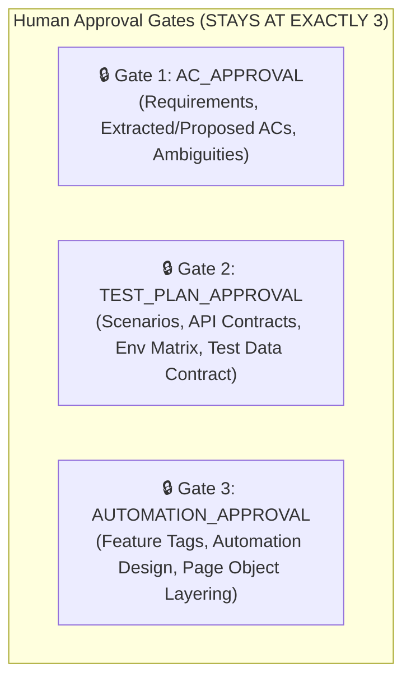
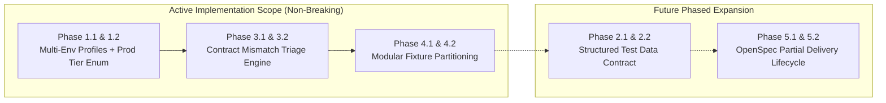

# Framework Gaps Analysis & Phased Improvement Plan

This document records the comprehensive architectural and structural scan of the OpenSpec-driven,
orchestrator-governed Playwright-BDD framework. It identifies existing framework gaps, evaluates the
impact of potential fixes on workflow stages and human approval gates, and provides a phased,
non-breaking implementation plan.

---

## 1. Executive Summary

A deep scan across schemas (`*/schemas/*.json`), Zod models (`src/models/`), semantic rules
(`src/utils/semantic-rules.ts`), triage engine (`src/utils/failure-triage.ts`), fixtures
(`src/fixtures/`), workflow instances, and environment loaders revealed five key areas of
improvement:

1. **Multi-Environment Scalability & Prod Safety:** Handling dynamic multi-node tiers (`qa1`–`qa5`,
   `dev1`–`dev5`, `stg1`–`stg3`) and missing `prod` execution guards.
2. **Structured Test Data Lifecycle:** Elevating flat `string[]` test data requirements into a typed
   data contract with explicit gap tracking and cleanup hooks.
3. **Failure Triage & API Contract Mismatch Engine:** Auto-classifying `CONTRACT_MISMATCH` signals
   and capturing `apiExchanges` in `failure-triage.ts`.
4. **Modular Capability Fixtures:** De-monolithing `src/fixtures/test.ts` into domain slices to
   support scaling beyond 3,000+ tests without merge conflicts.
5. **OpenSpec Partial Delivery & Archival Split:** Preserving deferred acceptance criteria during
   change archival without stalling completed capabilities.

---

## 2. Identified Real & Framework Gaps

### 🔴 Gap 1: Multi-Environment Scaling, Instance Multiplicity & Prod Safety

* **Current Implementation:**
  * `src/utils/env.ts` defines `TEST_ENVIRONMENTS = ['local', 'dev', 'qa', 'uat', 'staging'] as const`.
  * Environment URLs (`PLAYWRIGHT_BASE_URL`, `API_BASE_URL`, `ECORE_API_BASE_URL`) are loaded from a
    single static `.env` file.
* **The Real Gap:**
  1. **Multi-Instance Tiers:** Enterprise deployments often feature multiple instances per tier (e.g.,
     `qa1.eoriginal.org` vs `qa5.eoriginal.org`). Currently, targeting a different node requires
     manually editing `.env`.
  2. **`prod` Missing from Schema:** `TEST_ENVIRONMENTS` lacks `'prod'`.
  3. **No Production Execution Guard:** Destructive endpoints or state-mutating UI flows have no
     runtime mechanism to prevent accidental execution against production.

---

### 🔴 Gap 2: Test Data Lifecycle & Structured Data Contract

* **Current Implementation:**
  * In `test-plans/test-plan.schema.json` and `src/models/test-plan.model.ts`, `testDataRequirements`
    is a flat array of free-text strings (`string[]`).
  * Static samples exist in `test-data/<capability>.sample.json` (`dataClassification: "SYNTHETIC_INPUTS"`).
* **The Real Gap:**
  1. **No Data Source Classification:** The framework cannot programmatically distinguish between:
     * `AUTHOR_SUPPLIED` (literal limits/thresholds).
     * `PRE_EXISTING_SEEDED` (abstract records requiring cross-tier confirmation).
     * `SYNTHETIC_FABRICATED` (inputs for negative/edge paths).
     * `DYNAMICALLY_GENERATED` (on-the-fly seed data).
     * `DATA_GAP` (unconfirmed/missing seed data).
  2. **No Data Lifecycle Tracking:** Execution records (`EXEC-*.json`) do not track teardown status
     or cleanup failures for state-mutating scenarios.

---

### 🟠 Gap 3: Failure Triage Lacks Automated `CONTRACT_MISMATCH` Handling

* **Current Implementation:**
  * `src/models/defect.model.ts` and `defects/schemas/defect-report.schema.json` define
    `CONTRACT_MISMATCH` for API defects.
  * In `src/utils/failure-triage.ts`, `FailureClassification` only contains
    `['LOCATOR_SUSPECT', 'APPLICATION_DEFECT', 'AMBIGUOUS', 'ENVIRONMENT_BLOCKER']`.
* **The Real Gap:**
  1. `failure-triage.ts` lacks pattern matchers for Zod schema validation errors and status code
     discrepancies.
  2. API contract failures are misclassified as `APPLICATION_DEFECT` or `AMBIGUOUS`.
  3. `evidence.apiExchanges` is not auto-extracted from failing API executions during triage.

---

### 🟠 Gap 4: Monolithic Fixture Registry (`src/fixtures/test.ts`)

* **Current Implementation:**
  * Every page object, modal component, business service, and API client is wired into a single
    `test.extend<FrameworkFixtures>` block in `src/fixtures/test.ts`.
* **The Real Gap:**
  * As the test suite scales to 50+ page objects and 3,000+ scenarios across dozens of capabilities,
    a single fixture file becomes a development bottleneck and merge collision point.

---

### 🟡 Gap 5: Partial Delivery Archival Handling in OpenSpec

* **Current Implementation:**
  * `openspec archive <change>` moves the entire `openspec/changes/<change-name>/` directory to
    `openspec/changes/archive/`.
* **The Real Gap:**
  * Real stories (such as `EC-12000`) often deliver 15 ACs while deferring 2 ACs. Archiving the whole
    change either archives undelivered specs or leaves the change open indefinitely, blocking
    downstream workflows.

---

## 3. Impact Assessment: Stages & Human Approval Gates

A core requirement of this framework is maintaining lean, auditable governance without introducing
unnecessary process overhead.



### Impact on Human Approval Gates: **STAYS AT 3 GATES**

* **No 4th Gate Added:** Adding a 4th approval gate for test data or environment readiness would
  violate the lean governance model.
* **Gate 2 (Test Plan Approval) Absorption:**
  * The **Test Data Contract** (author-supplied, seeded, synthetic, gaps) is reviewed and approved at
    **Gate 2**.
  * The **Target Environment Matrix** (`dev`, `qa`, `staging`, `prod`) and `prod-safe` flags are agreed
    at **Gate 2**.
  * `SEM-GATES` and `SEM-APPROVAL-EVIDENCE` validators remain untouched and complete.

### Impact on Workflow Stages: **STAYS AT 17 STAGES**

* **No New Stages Introduced:** Rather than adding intermediate stages (e.g., `DATA_PROVISIONING`),
  data verification and environment profile selection are embedded into existing stages:
  * Stage 9 (`PLAYWRIGHT_VALIDATION`): Validates DOM locators and observes API traffic.
  * Stage 12 (`EXECUTION`): Enforces runtime `prod-safe` guards before test execution.
  * Stage 13 (`FAILURE_TRIAGE`): Classifies `CONTRACT_MISMATCH` alongside locator/application signals.

---

## 4. Phased Implementation Plan



---

## 4. Redrawn Implementation Scope (Near-Term Execution)

The near-term scope is scoped strictly to **Phases 1.1, 1.2, 3.1, 3.2, 4.1, and 4.2**, designed to be
100% backward-compatible with zero breakage of existing workflows, tests, or gate artifacts.

### 🔹 Phase 1.1: Multi-Environment Profile Resolution
* **Goal:** Allow switching between multiple instances (`qa1`, `qa5`, `stg2`, `dev3`) without hand-editing `.env`.
* **Implementation Strategy (Non-Breaking):**
  * Support optional environment profile configs under `config/environments/{profile}.json` (e.g. `qa5.json`).
  * Add a resolver in `src/utils/env.ts` that checks `process.env.TEST_ENV_PROFILE` or `--env=<name>`.
  * **Zero-Breakage Guarantee:** When no profile is specified, `env.ts` falls back seamlessly to the existing `.env` variables (`PLAYWRIGHT_BASE_URL`, `API_BASE_URL`, `TEST_ENVIRONMENT`). Existing CI and local setups continue working with zero change.

### 🔹 Phase 1.2: Extend Environment Enum with `'prod'`
* **Goal:** Formally recognize `prod` as a valid test tier in `TEST_ENVIRONMENTS`.
* **Implementation Strategy:**
  * Add `'prod'` to `TEST_ENVIRONMENTS` in `src/utils/env.ts` and `src/models/common.model.ts`.
  * Update `environmentSchema` so `TEST_ENVIRONMENT=prod` is valid without throwing a schema validation error.
  * **Zero-Breakage Guarantee:** Pure enum extension; all existing environments (`local`, `dev`, `qa`, `uat`, `staging`) retain their exact validation rules.

### 🔹 Phase 3.1: Automated `CONTRACT_MISMATCH` Classification & Evidence Extraction
* **Goal:** Ensure API contract failures (Zod schema mismatches, HTTP status errors on API scenarios) are classified accurately in `failure-triage.ts`.
* **Implementation Strategy:**
  * Add `'CONTRACT_MISMATCH'` to `FailureClassification` in `src/utils/failure-triage.ts`.
  * Add regex pattern matchers for Zod issues (`zoderror`, `invalid_type`, `unrecognized_keys`, `expected.*received`) occurring on scenarios carrying `@interface-api` or `@interface-hybrid`.
  * Auto-extract and redact request/response payload into `evidence.apiExchanges` in `reports/validation/failure-triage.json`.
  * **Zero-Breakage Guarantee:** UI failures continue matching `LOCATOR_SIGNALS` / `APPLICATION_SIGNALS` exactly as before.

### 🔹 Phase 3.2: Locator Healer Guard for API Defect Routing
* **Goal:** Prevent the locator healer from burning attempts on API failures.
* **Implementation Strategy:**
  * In `failure-triage.ts`, inspect tags for `@interface-api` or classification `CONTRACT_MISMATCH`.
  * Set `next: "BUG_REPORTING"` directly, bypassing `LOCATOR_HEALING`.
  * **Zero-Breakage Guarantee:** UI scenarios with `LOCATOR_SUSPECT` continue entering `LOCATOR_HEALING` up to the governed 2-attempt cap.

### 🔹 Phase 4.1 & 4.2: Modular Capability Fixture Partitioning & Composition
* **Goal:** Eliminate `src/fixtures/test.ts` as a monolithic merge bottleneck while scaling to 3,000+ tests.
* **Implementation Strategy:**
  * Extract domain-specific fixture definitions into modular files:
    * `src/fixtures/account-access.fixture.ts` (Login pages, organization services).
    * `src/fixtures/home-navigation.fixture.ts` (Navigation menus, Command Center).
    * `src/fixtures/paper-out.fixture.ts` (Modals, export services, hybrid contexts).
    * `src/fixtures/api-client.fixture.ts` (Generic `apiRequest` and `eoExportApi`).
  * Compose them in `src/fixtures/test.ts` by merging fixture interfaces and exporting `test` and `expect`.
  * **Zero-Breakage Guarantee:** The exported `test` in `src/fixtures/test.ts` exposes the exact same fixture keys (`loginPage`, `homePage`, `paperOutExport`, `apiRequest`, `browserCoverage`). All step definitions (`steps/**/*.steps.ts`) import `test` and `expect` from `../src/fixtures/test.ts` with **zero code changes required**.

---

## 5. Deep-Dive: Why Phase 2.1 & 2.2 Will NOT Break OpenSpec Standards

The user specifically requested verification on whether implementing **Phase 2.1 & 2.2 (Structured Test Data Contract in Test Plans)** would break OpenSpec standards or framework governance.

### 1. Strict Layer Separation: OpenSpec vs. Test Planning
* **OpenSpec Layer (`openspec/`):**
  * Governed by `@fission-ai/openspec`.
  * OpenSpec authoring rules mandate: *"OpenSpec artifacts describe business behaviour only — no selectors, locators, page objects, fixtures, test data or TypeScript."*
  * The OpenSpec CLI (`openspec validate <change> --strict`) validates only markdown files (`proposal.md`, `tasks.md`, `design.md`, `specs/**/*.md`).
  * OpenSpec **never parses or validates JSON test plans** (`test-plans/`).
* **Test Planning Layer (`test-plans/`):**
  * Governed by `test-plans/test-plan.schema.json`, `src/models/test-plan.model.ts`, and Gate 2 (`TEST_PLAN_APPROVAL`).
  * This layer owns execution details: `testScenarioId`, `interfaceType`, `apiContract`, and `testDataRequirements`.

### 2. Backward Compatibility via Zod Union Typing (Phase 2.1)
When updating `test-plan.schema.json` and `test-plan.model.ts`, backward compatibility is maintained by allowing `testDataRequirements` to accept **either** plain strings or structured objects:

```typescript
// Zod Model in src/models/test-plan.model.ts
export const structuredTestDataSchema = z.object({
  name: z.string().min(1),
  classification: z.enum(['AUTHOR_SUPPLIED', 'SEEDED', 'SYNTHETIC', 'DYNAMIC', 'DATA_GAP']),
  description: z.string().min(1),
  targetTiers: z.array(z.string()).min(1),
  provider: z.string().optional(),
  cleanupStrategy: z.enum(['NONE', 'API_TEARDOWN', 'UI_TEARDOWN', 'MANUAL']).default('NONE'),
  gapRef: z.string().regex(/^RISK-TP-|^AMB-/).optional(),
});

export const testDataRequirementsSchema = z.array(
  z.union([z.string(), structuredTestDataSchema])
);
```

* **Why this is 100% safe:**
  * Existing approved test plans (`TP-ETA-351-001.json`, `TP-ETA-411-001.json`, `TP-EC-12000-001.json`) using `string[]` will continue to pass `npm run validate:artifacts` with zero errors.
  * New test plans can utilize the rich structured object without causing schema regression.

### 3. Gate 2 Template Alignment (Phase 2.2)
* `templates/manifest.json` maps `test-plans/generated/<TP-ID>-review.md` to `test-plan.schema.json`.
* Adding a structured table renderer to `templates/reviews/test-plan-review.template.md` simply enriches the human-readable Gate 2 package.
* `TPL-STRUCTURE` and `TPL-REVIEW-SECTIONS` checks in `src/utils/semantic-rules.ts` will validate parity seamlessly.

**Conclusion:** Implementing Phase 2.1 and 2.2 does **not touch OpenSpec files**, does **not alter OpenSpec validation**, and preserves full backward compatibility across all governed JSON artifacts.

---

## 6. Summary of Governance Alignment

| Framework Principle | How This Plan Maintains It |
| :--- | :--- |
| **No Invented Business Rules** | Test data gaps are recorded as explicit `DATA_GAP` / `RISK-TP-*` entries, never guessed. |
| **No Guessed Locators or Contracts** | API contracts remain strictly bound to `OPENAPI` or `HUMAN_APPROVED` (Gate 2) with shape hashes. |
| **Honest Execution & Coverage** | Prod-restricted or data-gapped scenarios report `null` coverage on unverified tiers. |
| **3 Immutable Approval Gates** | All enhancements feed into existing Gate 1, Gate 2, or Gate 3 artifacts without adding a 4th gate. |
