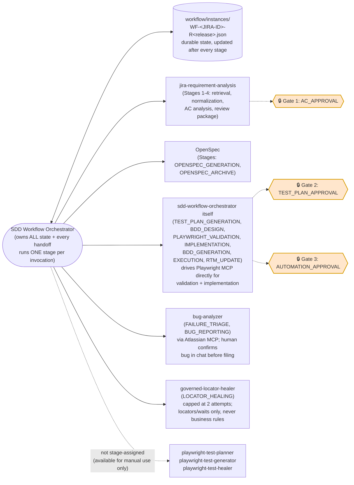

# Framework Orchestration Diagram

Visual companion to [docs/framework-file-creation-sequence.md](framework-file-creation-sequence.md).
That document is the authority on *every file* created, in order; this document is the authority on
*control flow* — which agent runs each stage, where the three human approval gates sit, and how a
failing execution branches before rejoining the happy path. Source of truth for both:
[workflow/definitions/sdd-jira-to-automation.workflow.json](../workflow/definitions/sdd-jira-to-automation.workflow.json).

The **SDD Workflow Orchestrator** drives every stage below from that single JSON definition, running
exactly one stage per invocation and persisting `workflow/instances/WF-<JIRA-ID>-R<release>.json`
after each one. No stage here is triggered by a chat message — advancement past a 🔒 gate requires a
schema-valid approval artifact on disk.

## 1. End-to-end stage flow

```mermaid
flowchart TD
    Start(["Jira story exists"]) --> S1

    subgraph REQ["Requirements — Agent: jira-requirement-analysis"]
        S1["JIRA_RETRIEVAL\nreports/jira/*.jira.json (REST fallback only)\nrequirements/raw/&lt;JIRA-ID&gt;.json"]
        S2["REQUIREMENT_NORMALIZATION\nrequirements/normalized/&lt;JIRA-ID&gt;.json"]
        S3["AC_ANALYSIS\n(enrich normalized file: proposed ACs, AMB-*)"]
        S4["AC_REVIEW_PACKAGE\n&lt;JIRA-ID&gt;-ac-review.md + approval template\n+ rtm.proposed.json"]
        S1 --> S2 --> S3 --> S4
    end

    S4 --> G1{{"🔒 GATE 1\nAC_APPROVAL (human)\nrequirements/approved/&lt;JIRA-ID&gt;-ac-approval.json"}}

    G1 -->|APPROVE| S5
    G1 -->|REQUEST_CHANGES| S3

    subgraph SPEC["Spec — Agent: OpenSpec"]
        S5["OPENSPEC_GENERATION\nopenspec/changes/&lt;change-name&gt;/\nproposal.md, tasks.md, design.md, specs/**"]
    end

    S5 --> S6

    subgraph TP["Test Plan — Agent: sdd-workflow-orchestrator\n(invoking Playwright Test Planner)"]
        S6["TEST_PLAN_GENERATION\ntest-plans/generated/&lt;TP-ID&gt;.json\n+ review.md + approval template\n(each scenario: interfaceType UI/API/HYBRID)\n(scenarioAction REUSE + reuseSource:\ncross-story match PROPOSED, never assumed)"]
    end

    S6 --> G2{{"🔒 GATE 2\nTEST_PLAN_APPROVAL (human)\ntest-plans/approved/&lt;TP-ID&gt;-approval.json\n(API/HYBRID contracts agreed HUMAN_APPROVED here;\nreuseSource.status set CONFIRMED here)"}}

    G2 -->|APPROVE| S7
    G2 -->|REQUEST_CHANGES| S6

    subgraph BDD["BDD Design — Agent: sdd-workflow-orchestrator\n(invoking Playwright Test Generator)"]
        S7["BDD_DESIGN\nfeatures/generated/&lt;capability&gt;/&lt;feature&gt;.feature\n+ automation-design.md\n(locators: MCP_VALIDATION_REQUIRED,\nendpoints: API_CONTRACT_UNVERIFIED)"]
        S8["AUTOMATION_REVIEW_PACKAGE\nfinalize automation-design.md\n+ automation-approval template"]
        S7 --> S8
    end

    S8 --> G3{{"🔒 GATE 3\nAUTOMATION_APPROVAL (human)\nfeatures/approved/&lt;capability&gt;/&lt;TP-ID&gt;-automation-approval.json\nfeatures/approved/&lt;capability&gt;/&lt;feature&gt;.feature"}}

    G3 -->|APPROVE| S9
    G3 -->|REQUEST_CHANGES| S7

    subgraph VAL["Validation — Agent: sdd-workflow-orchestrator\n(driving Playwright MCP directly)"]
        S9["PLAYWRIGHT_VALIDATION\nreports/validation/&lt;TP-ID&gt;-browser-validation.json\n+ -api-validation.json (API/HYBRID only, OBSERVED)\n+ scripts/&lt;jira-id&gt;-&lt;topic&gt;-probe.ts"]
    end

    S9 --> S10

    subgraph IMPL["Implementation — Agent: sdd-workflow-orchestrator"]
        S10["IMPLEMENTATION\nsteps/**, src/pages/**, src/components/**\nsrc/api/** + src/models/api/** (API/HYBRID only)\nsrc/fixtures/&lt;capability&gt;.fixture.ts + test.ts\nsrc/services/**, test-data/&lt;capability&gt;.sample.json"]
    end

    S10 --> S11["BDD_GENERATION\nnpm run bdd -> .features-gen/** (generated, never hand-edited)"]
    S11 --> S12["EXECUTION\nnpm test\nreports/playwright-report/**, reports/execution/results.json\ntraceability/executions/EXEC-&lt;JIRA-ID&gt;-&lt;nnn&gt;.json"]

    S12 --> D{"All scenarios\npassed?"}
    D -->|Yes| S15
    D -->|No| S13

    subgraph TRIAGE["Failure Handling"]
        S13["FAILURE_TRIAGE\nAgent: bug-analyzer (npm run triage:failures)\ndefects/&lt;DEF-ID&gt;.json\nreports/defects/&lt;DEF-ID&gt;/**"]
        S13 --> E{"Classification"}
        E -->|ENVIRONMENT_BLOCKER| Halt["Halt.\nNever healed, never filed."]
        E -->|LOCATOR_SUSPECT / AMBIGUOUS| S14a["LOCATOR_HEALING\nAgent: governed-locator-healer\n(max 2 attempts; locators/waits only)"]
        E -->|APPLICATION_DEFECT / CONTRACT_MISMATCH /\nhealing exhausted| S14b["BUG_REPORTING\nAgent: bug-analyzer (via Atlassian MCP)\nHuman confirms bug in chat first;\nno 4th approval gate — compensating controls apply"]
        S14a -->|Healed| S12
        S14a -->|Not healed after 2 attempts| S14b
        S14b --> S15
    end

    subgraph RTM["Traceability — Agent: sdd-workflow-orchestrator"]
        S15["RTM_UPDATE\ntraceability/capabilities/&lt;capability&gt;.rtm.json\n(automation.reusedFromTraceId when CONFIRMED-reused)\n+ .coverage.json, index/lookup.index.json\nworkflow/history/&lt;workflowId&gt;.history.jsonl"]
    end

    S15 --> S16

    subgraph ARCH["Archive — Agent: OpenSpec"]
        S16["OPENSPEC_ARCHIVE\nnpx openspec validate --strict && archive\nopenspec/specs/** (living spec)\nopenspec/changes/archive/&lt;change-name&gt;/**"]
    end

    S16 --> Done(["COMPLETED\nWF-&lt;JIRA-ID&gt;-R&lt;release&gt;.json -> COMPLETED"])

    classDef gate fill:#ffe6cc,stroke:#d79b00,stroke-width:2px;
    class G1,G2,G3 gate;
    classDef halt fill:#f8cecc,stroke:#b85450,stroke-width:2px;
    class Halt halt;
```

## 2. Orchestrator, agents and durable state

## 3. Reading the diagram

- **Three 🔒 gates halt the workflow** until a schema-valid approval JSON exists on disk — a chat
  reply is never treated as approval. `REQUEST_CHANGES` at any gate returns control to the stage
  named in its arrow above, not to the beginning of the story.
- **`PLAYWRIGHT_VALIDATION` and `IMPLEMENTATION` are both driven by the orchestrator itself**, not
  delegated to the generic `playwright-test-planner` / `playwright-test-generator` sub-agents — those
  agents' own output formats (a markdown plan, a flat `.spec.ts`) don't match this framework's
  governed JSON reports or its strict feature/step/page-object/fixture layering. They remain
  available for a human to invoke manually outside the governed workflow.
- **`EXECUTION` is the only branch point.** All scenarios passing skips straight to `RTM_UPDATE`
  (Stage 15). Any failure enters `FAILURE_TRIAGE`, which classifies the failure before deciding
  whether to heal, file a bug, or halt outright:
  - `ENVIRONMENT_BLOCKER` (DNS/TLS/proxy/refused connection/missing config) **halts** — it proves
    nothing about the product and is never healed or filed.
  - `LOCATOR_SUSPECT` / `AMBIGUOUS` goes to `LOCATOR_HEALING`, capped at exactly **2 attempts** so an
    unhealable failure becomes a reportable defect instead of a silently skipped test. A healed
    scenario loops back to `EXECUTION`; an exhausted one falls through to `BUG_REPORTING`.
  - `APPLICATION_DEFECT` / `CONTRACT_MISMATCH` (API-only failures skip locator healing entirely —
    they exercise no locator) go straight to `BUG_REPORTING`. No fourth approval gate exists here;
    compensating controls apply instead — failure-fingerprint de-duplication (`REPORTED` →
    `DUPLICATE`), mandatory reviewer assignment, and a required human confirmation of the composed
    bug in chat before `createJiraIssue` is ever called.
  - Every triage branch eventually rejoins at `RTM_UPDATE` (Stage 15) — a defect never leaves a story
    permanently stuck; it only ever changes *what* the RTM records.
- **`OPENSPEC_ARCHIVE` is documentation lifecycle only.** It moves no feature file and changes no
  tag — every scenario in `features/approved/**` keeps executing exactly as before. It is blocked if
  `openspec validate --strict` fails or if the RTM shows no passing execution for the story, so a
  spec can never be archived as delivered on no evidence.
- **Capability partitioning, not a monolithic file.** `traceability/capabilities/<capability>.rtm.json`
  is one file per business capability, cross-referenced by
  `traceability/index/lookup.index.json`, which is what lets this scale past 3,000+ tests without a
  linear scan.
- **A cross-story match is a Gate 2 proposal, not an agent decision.** `TEST_PLAN_GENERATION` may set
  `scenarioAction: REUSE` with a `reuseSource` naming the other story's scenario and the layers
  checked for equivalence (never a matching title alone); it stays `PROPOSED` and is raised as an
  Open question in the review package until a human sets it `CONFIRMED` at `GATE 2`. `SEM-TEST-REUSE`
  fails an approved plan still carrying a `PROPOSED` claim. Once confirmed, `RTM_UPDATE` records the
  reuse as `automation.reusedFromTraceId` on the new trace instead of `IMPLEMENTATION` generating a
  duplicate feature, step, page object or fixture.

## Related reading

| Topic | File |
| --- | --- |
| Full architecture, gates, coverage model | [README.md](../README.md) |
| Every file a story produces, in exact creation order | [docs/framework-file-creation-sequence.md](framework-file-creation-sequence.md) |
| How to write a Jira story this framework can automate without raising ambiguities | [docs/jira-story-intake-standard-and-worked-example.md](jira-story-intake-standard-and-worked-example.md) |
| Machine-readable stage/agent/requires/produces definition (source of truth for this diagram) | [workflow/definitions/sdd-jira-to-automation.workflow.json](../workflow/definitions/sdd-jira-to-automation.workflow.json) |
| Non-negotiable rules enforced at each gate | [AGENTS.md](../AGENTS.md) |
