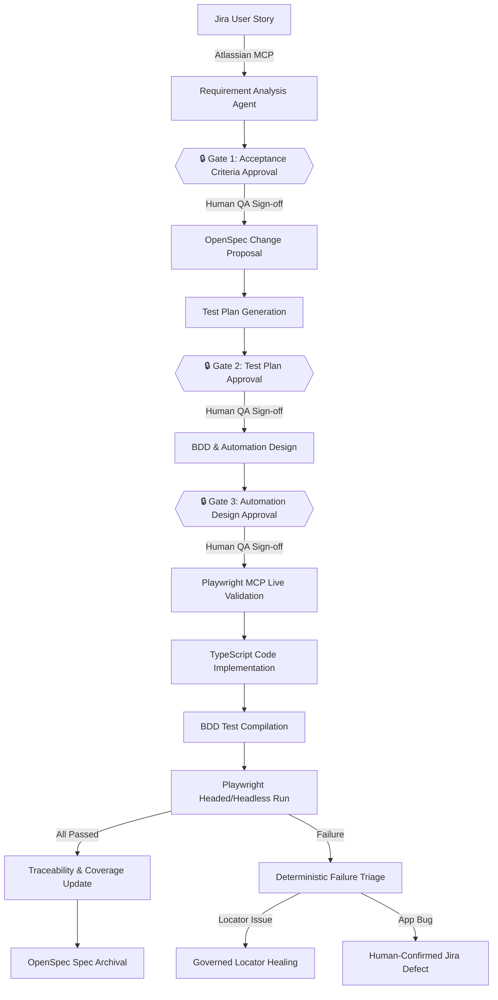
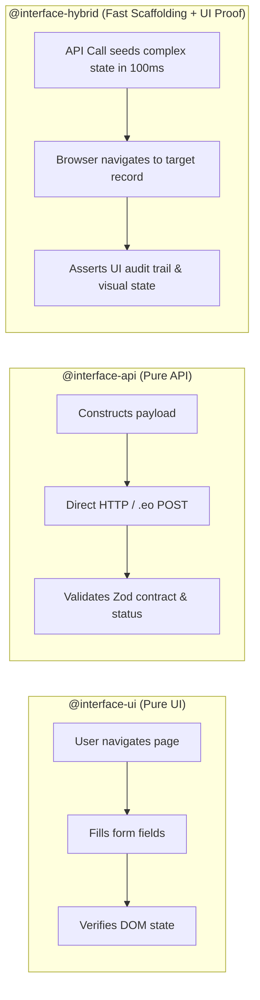
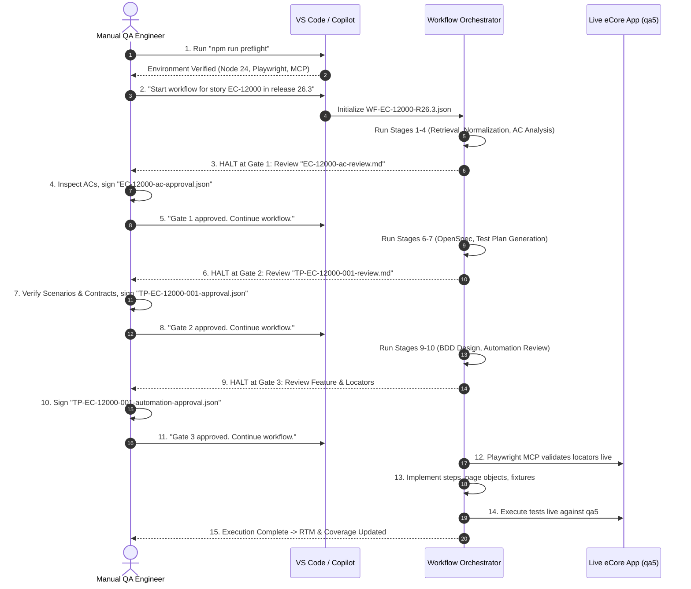
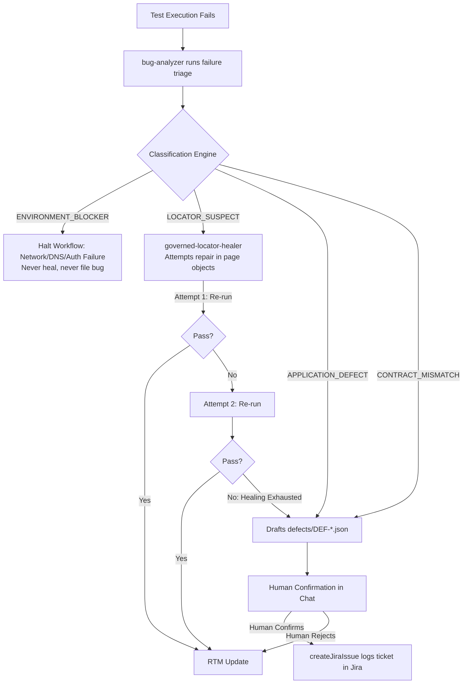
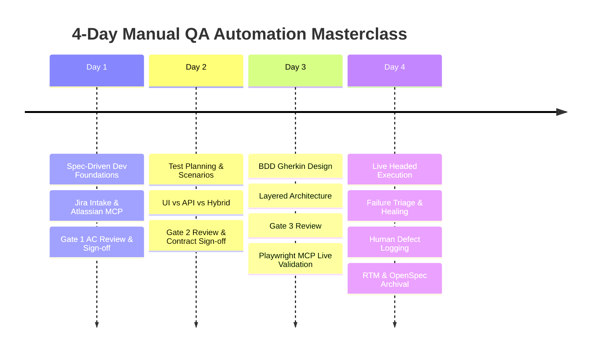
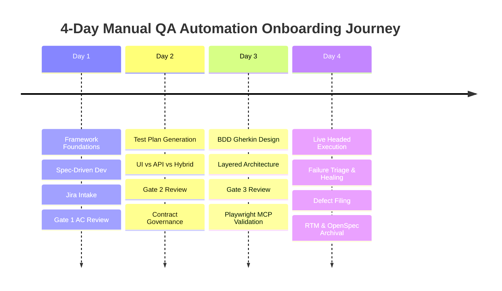

# Manual QA Training & Operations Playbook

**Orchestrator-Driven, Spec-Driven Playwright-BDD Automation Framework**

A complete, production-grade training guide and operational manual for **Manual QA Engineers, QA Leads, Product Owners, and Automation Engineers**.

---

## Table of Contents

1. [Executive Summary & Framework Vision](#1-executive-summary--framework-vision)
2. [Why Governed Spec-Driven Development (SDD)?](#2-why-governed-spec-driven-development-sdd)
3. [Core Glossary & Stable ID Architecture](#3-core-glossary--stable-id-architecture)
4. [The Role of OpenSpec: From Delta Changes to Living Specifications](#4-the-role-of-openspec-from-delta-changes-to-living-specifications)
5. [The Testing Spectrum: UI vs. API vs. HYBRID Framework Capabilities](#5-the-testing-spectrum-ui-vs-api-vs-hybrid-framework-capabilities)
6. [The 3 Human Approval Gates (Quality Safeguards)](#6-the-3-human-approval-gates-quality-safeguards)
7. [The 18-Stage End-to-End Workflow & Orchestration Layer](#7-the-18-stage-end-to-end-workflow--orchestration-layer)
8. [Managing Ambiguities (`AMB-*`) & Execution Blockers (`BLOCKER-*`)](#8-managing-ambiguities-amb--and-execution-blockers-blocker-)
9. [Step-by-Step QA Playbook: Operating the Workflow](#9-step-by-step-qa-playbook-operating-the-workflow)
10. [Execution Guide: Headed Mode, Tagging & Test Scoping](#10-execution-guide-headed-mode-tagging--test-scoping)
11. [Failure Triage, Governed Locator Healing & Defect Logging](#11-failure-triage-governed-locator-healing--defect-logging)
12. [Reports, Metrics, and RTM Traceability](#12-reports-metrics-and-rtm-traceability)
13. [Architecture Layering & Code Guidelines for QA](#13-architecture-layering--code-guidelines-for-qa)
14. [Environmental Traps & Troubleshooting Guide](#14-environmental-traps--troubleshooting-guide)
15. [4-Day Interactive QA Training Curriculum](#15-4-day-interactive-qa-training-curriculum)

---

## 1. Executive Summary & Framework Vision

### 1.1 The Core Mission
This framework bridges the historic divide between **Manual QA domain expertise** and **Automated Test Execution**. It takes a raw Jira user story and transforms it into an approved, traceable, and executable Playwright-BDD test suite through a **durable, resumable, agent-driven workflow with three mandatory human approval gates**.

The core premise:
> **AI agents write the repetitive code and probe live applications, but human QA engineers retain absolute governance over business rules, acceptance criteria, test designs, locator safety, and defect reporting.**



### 1.2 The Five Non-Negotiable Rules
These rules are enforced programmatically by [src/utils/semantic-rules.ts](src/utils/semantic-rules.ts) and Zod schema validators:

1. **A chat message is never an approval.** An approval only exists when a schema-valid JSON artifact (e.g., `requirements/approved/EC-12000-ac-approval.json`) is written to disk.
2. **Never invent a business rule.** No role, error message, boundary limit, timeout, or security policy may be invented by an AI agent. Missing facts are escalated as `AMB-*` ambiguities for human QA decision.
3. **Never fabricate a passing result.** No test scenario may report `PASSED` without a real execution record against the application. A coverage metric with 0 criteria is `null`—never 100%.
4. **Never guess a locator or API contract.** Unverified selectors stay marked `MCP_VALIDATION_REQUIRED` until validated against the live DOM via Playwright MCP. API endpoints must carry verifiable provenance.
5. **No agent approves its own output.** All gates require human reviewer signatures. Defect tickets cannot be created in Jira until a human QA engineer explicitly confirms the composed bug in chat.

---

## 2. Why Governed Spec-Driven Development (SDD)?

| Capability Area | Traditional Manual + Scripted Automation | Ungoverned Autonomous AI Coding | Governed SDD Framework (This Framework) |
| :--- | :--- | :--- | :--- |
| **Requirements Intake** | Manual test authoring; missed edge cases; ambiguity discovered late in sprint. | Scrapes story and hallucinates missing business logic and rules. | **Governed Extraction:** Extracts verbatim ACs, flags ambiguities (`AMB-*`), proposes gap criteria with rationales. |
| **Approval & Quality Gates** | Ad-hoc PR code review after hours of automation code is already written. | Zero formal gates; code merged silently without QA oversight. | **3 Mandatory Gates:** QA approves ACs (Gate 1), Test Plans (Gate 2), and Feature/Locators (Gate 3). |
| **Specification Management** | Stale confluence pages and outdated Jira descriptions. | No centralized specification concept; tests drift from intent. | **OpenSpec Layer:** Living, version-controlled markdown specs synced to every approved release. |
| **Interface Flexibility** | Siloed UI tests (Selenium/Cypress) and separate Postman collections. | Inconsistent mixing of UI and network calls. | **First-Class Hybrid:** Seamlessly combines UI workflows with backend `.eo` RPC/API calls in one scenario. |
| **Locator Stability** | Brittle XPath/CSS selectors that break on every frontend deployment. | Guesses selectors based on training data hallucinations. | **Playwright MCP Validation:** Live DOM inspection selects accessible roles and labels before code is authored. |
| **Failure Resolution** | Lengthy manual triage; manual copy-pasting of logs into Jira bugs. | Agent blindly alters test assertions to force tests to pass green. | **Governed Triage & Healing:** Classifies failures; self-heals locators (max 2 tries); human confirms bugs before Jira filing. |
| **Traceability** | Disconnected spreadsheets or brittle Jira plugins. | No traceability back to requirements. | **Partitioned RTM:** 100% auditable bidirectional traceability matrix scaling to 3,000+ tests. |

---

## 3. Core Glossary & Stable ID Architecture

To eliminate ambiguity across human and AI collaboration, every artifact in the repository carries an immutable, regex-validated **Stable ID** (defined in [src/models/common.model.ts](src/models/common.model.ts)):

```
                                  +-----------------------+
                                  |   JIRA STORY KEY      |  (e.g., EC-12000)
                                  +-----------------------+
                                              |
                     +------------------------+------------------------+
                     |                                                 |
                     v                                                 v
         +-----------------------+                         +-----------------------+
         |   REQUIREMENT ID      |                         |  AMBIGUITY ID         |
         |   REQ-EC-12000-001    |                         |  AMB-EC-12000-001     |
         +-----------------------+                         +-----------------------+
                     |
                     v
         +-----------------------+
         |  ACCEPTANCE CRITERION |
         |   AC-EC-12000-001     |
         +-----------------------+
                     |
                     v
         +-----------------------+                         +-----------------------+
         |  TEST SCENARIO ID     | ----------------------> |  TRACEABILITY ID      |
         |   TS-EC-12000-001     |                         |  TRC-EC-12000-001     |
         +-----------------------+                         +-----------------------+
                     |                                                 |
                     +------------------------+------------------------+
                                              |
                                              v
                                  +-----------------------+
                                  |  APPROVAL ARTIFACT    |
                                  |  APR-AC-EC-12000-001  |
                                  |  APR-TP-EC-12000-001  |
                                  |  APR-AD-EC-12000-001  |
                                  +-----------------------+
```

### Stable ID Reference Table

| Artifact Type | ID Pattern | Real Example | What It Represents |
| :--- | :--- | :--- | :--- |
| **Jira Story** | `[A-Z]+-[0-9]+` | `EC-12000`, `ETA-351` | The parent business user story in Jira. |
| **Requirement** | `REQ-<STORY>-<nnn>` | `REQ-EC-12000-001` | A normalized, discrete business requirement statement. |
| **Acceptance Criterion** | `AC-<STORY>-<nnn>` | `AC-EC-12000-002` | An extracted or proposed condition of satisfaction. |
| **Ambiguity** | `AMB-<STORY>-<nnn>` | `AMB-EC-12000-001` | An unresolved question or missing requirement rule. |
| **Execution Blocker** | `BLOCKER-<STORY>-<nnn>` | `BLOCKER-EC-12000-004` | An environmental, data, or application defect blocking execution. |
| **Test Plan** | `TP-<STORY>-<nnn>` | `TP-EC-12000-001` | The parent test plan document. |
| **Test Scenario** | `TS-<STORY>-<nnn>` | `TS-EC-12000-003` | A single business test scenario path. |
| **Approval Artifact** | `APR-{AC\|TP\|AD}-…` | `APR-AC-EC-12000-001` | The human QA sign-off artifact recorded on disk. |
| **Traceability Trace** | `TRC-<STORY>-<nnn>` | `TRC-EC-12000-001` | The RTM link connecting requirement $\rightarrow$ code $\rightarrow$ execution. |
| **Defect Report** | `DEF-<STORY>-<nnn>` | `DEF-ETA-411-001` | A triaged application bug artifact ready for Jira filing. |

---

## 4. The Role of OpenSpec: From Delta Changes to Living Specifications

### 4.1 What is OpenSpec?
**OpenSpec** is the specification authority within this framework. In standard automation projects, tests are written against Jira tickets that are closed and forgotten, leaving the repository with zero documentation of how the system is supposed to behave today.

OpenSpec solves this by creating **Living Specifications**:
1. **Delta Changes (`openspec/changes/<change-name>/`):** When a new story is started, OpenSpec drafts a proposed modification containing:
   - `proposal.md`: Summary of business intent and user context.
   - `specs/<capability>/spec.md`: The exact delta specification formatted with requirements and scenarios.
   - `design.md`: Technical architectural decisions.
   - `tasks.md`: Implementation breakdown.
2. **Strict Validation:** OpenSpec CLI validates all delta specs against JSON schemas (`npx openspec validate --strict`).
3. **Living Spec Archival (`openspec/specs/`):** When all automated tests pass and the RTM is updated, the change is archived (`npx openspec archive <change-name>`). The delta spec merges into the root `openspec/specs/`, creating a permanent, living documentation repository of the entire system.

```
       NEW JIRA STORY
             │
             ▼
[Stage 6: OPENSPEC_GENERATION]
  └─► Drafts Delta Spec: openspec/changes/track-paper-out-media-type/
             │
             ▼
[Stages 7-15: Test Plan -> Implementation -> Execution]
             │
             ▼
[Stage 18: OPENSPEC_ARCHIVE]
  └─► Merges Delta into Root: openspec/specs/paper-out-export/spec.md
```

---

## 5. The Testing Spectrum: UI vs. API vs. HYBRID Framework Capabilities

A major breakthrough of this framework is its first-class support for **UI, API, and HYBRID test scenarios** within the exact same Gherkin BDD syntax.



### 5.1 `@interface-ui` (Pure Browser Automation)
* **How it operates:** Drives the full browser lifecycle via Playwright (`page.goto`, `click`, `fill`).
* **When to use:** End-to-end user navigation, modal interactions, field validations, and visual workflows.
* **Locator Strategy:** Uses accessible locators (`getByRole`, `getByLabel`, `getByPlaceholder`, `getByText`). Never uses brittle CSS or raw XPath.

### 5.2 `@interface-api` (Direct Backend RPC / AJAX Execution)
* **What eCore's API actually is:** eCore is a server-rendered Java application without a standard REST API. AJAX endpoints live under `/ssweb/setup/workspace/**/ajax/`, end in `.eo`, and accept **form-encoded payloads** returning DataTables HTML envelopes.
* **How it operates:** Executes lightweight, fast HTTP requests using strongly typed API clients in `src/api/` (extending `ApiClient`) and validates full payload responses against Zod schemas in `src/models/api/`.
* **When to use:** Backend data calculations, permission checks, and mass data creation.

### 5.3 `@interface-hybrid` (The High-Speed Production Pattern)
* **The Problem:** Creating complex test preconditions through the UI (e.g., logging in, navigating 5 menu levels, searching for a collection, creating a transaction, approving it) takes 60+ seconds per test.
* **The Hybrid Solution:**
  1. The step definition issues a direct `.eo` backend API call (`eoRequestExport`) to instantly create/seed the state in 150ms.
  2. The browser is then directed to the generated record to verify the user-facing outcome (e.g., confirming the audit trail in the Document History modal).
* **Governance Rule:** An API step in a Hybrid scenario is **scaffolding only**—it reaches a state fast, but the human-approved acceptance criterion is judged by the UI audit trail.

### 5.4 API Contract Governance: `OBSERVED` vs. `HUMAN_APPROVED`
To prevent agents from guessing APIs or cementing product bugs as correct behaviour:
* **`OBSERVED`:** A contract captured from live network traffic during Playwright MCP exploration. It records what the system *currently does*, not what it *should do*. It cannot back an acceptance assertion alone.
* **`HUMAN_APPROVED`:** At **Gate 2 (Test Plan Approval)**, the human QA inspects the observed contract. Once the human confirms the endpoint, parameters, and status code, the contract is promoted to `HUMAN_APPROVED` with a computed `responseShapeHash` (fingerprinting keys and types to catch future API drift).

---

## 6. The 3 Human Approval Gates (Quality Safeguards)

The workflow will **halt immediately** at each gate. No agent can bypass a gate.

```
       ================================================================
       | 🔒 GATE 1: ACCEPTANCE CRITERIA APPROVAL                       |
       | Halts after Stage 4 (AC_REVIEW_PACKAGE)                       |
       | Review Doc: requirements/reviews/<STORY>-ac-review.md         |
       | Sign-off:   requirements/approved/<STORY>-ac-approval.json   |
       ================================================================
                                      │
                                      ▼
       ================================================================
       | 🔒 GATE 2: TEST PLAN APPROVAL                                 |
       | Halts after Stage 7 (TEST_PLAN_GENERATION)                    |
       | Review Doc: test-plans/generated/<TP-ID>-review.md            |
       | Sign-off:   test-plans/approved/<TP-ID>-approval.json        |
       ================================================================
                                      │
                                      ▼
       ================================================================
       | 🔒 GATE 3: AUTOMATION DESIGN APPROVAL                         |
       | Halts after Stage 10 (AUTOMATION_REVIEW_PACKAGE)              |
       | Review Doc: features/generated/<cap>/<TP-ID>-automation-design.md
       | Sign-off:   features/approved/<cap>/<TP-ID>-automation-approval.json
       ================================================================
```

### Gate 1: Acceptance Criteria Approval
* **What QA Reviews:** The 9-section review package in `requirements/reviews/<STORY>-ac-review.md`.
* **QA Checklist:**
  1. Did the agent extract all original Jira ACs verbatim into `extractedCriteria`?
  2. Are proposed edge-case criteria (`PROPOSED_BY_REQUIREMENT_ANALYSIS`) valid and necessary?
  3. Are all ambiguities (`AMB-*`) accurately stated?
* **Action:** Copy `requirements/reviews/<STORY>-ac-approval.template.json` to `requirements/approved/<STORY>-ac-approval.json`, set `"decision": "APPROVED"`, add your name/email, and save.

### Gate 2: Test Plan Approval
* **What QA Reviews:** `test-plans/generated/<TP-ID>-review.md`.
* **QA Checklist:**
  1. Is there 100% scenario coverage across all Gate 1 approved ACs?
  2. Are Interface Types (`UI`, `API`, `HYBRID`) correctly assigned?
  3. Are API contracts verified and promoted to `HUMAN_APPROVED`?
  4. Are physical/visual validations properly marked `MANUAL_ONLY`?
  5. Are cross-story scenario reuse claims (`REUSE`) confirmed?
* **Action:** Copy template to `test-plans/approved/<TP-ID>-approval.json`, set `"decision": "APPROVED"`, and save.

### Gate 3: Automation Design Approval
* **What QA Reviews:** `features/generated/<capability>/<feature>.feature` and design markdown.
* **QA Checklist:**
  1. Does Gherkin use pure business domain language (no selectors or clicks in feature files)?
  2. Are all 6 mandatory tags present (`@release-`, `@capability-`, `@req-`, `@ac-`, `@tp-`, `@ts-`)?
  3. Is the locator hierarchy sound (`getByRole` $\rightarrow$ `getByLabel` $\rightarrow$ `getByText`)?
* **Action:** Copy template to `features/approved/<capability>/<TP-ID>-automation-approval.json`, set `"decision": "APPROVED"`, and save.

---

## 7. The 18-Stage End-to-End Workflow & Orchestration Layer

The orchestration layer ([workflow/definitions/sdd-jira-to-automation.workflow.json](workflow/definitions/sdd-jira-to-automation.workflow.json)) drives every stage sequentially:

```
[1. JIRA_RETRIEVAL]
       │
[2. REQUIREMENT_NORMALIZATION]
       │
[3. AC_ANALYSIS]
       │
[4. AC_REVIEW_PACKAGE]
       │
[5. AC_APPROVAL] ────────────── (🔒 GATE 1: Human QA Review & Sign-off)
       │
[6. OPENSPEC_GENERATION]
       │
[7. TEST_PLAN_GENERATION]
       │
[8. TEST_PLAN_APPROVAL] ──────── (🔒 GATE 2: Human QA Review & Sign-off)
       │
[9. BDD_DESIGN]
       │
[10. AUTOMATION_REVIEW_PACKAGE]
       │
[11. AUTOMATION_APPROVAL] ────── (🔒 GATE 3: Human QA Review & Sign-off)
       │
[12. PLAYWRIGHT_VALIDATION]
       │
[13. IMPLEMENTATION]
       │
[14. BDD_GENERATION]
       │
[15. EXECUTION]
       │
 ┌─────┴────────────────────────┐
 │ (All Passed)                 │ (Any Failed)
 ▼                              ▼
[18. RTM_UPDATE]       [16. FAILURE_TRIAGE]
       │                        │
[19. OPENSPEC_ARCHIVE]          ├─► Locator Suspect ──► [17. LOCATOR_HEALING]
       │                        │                              │ (Healed)     │ (Unhealable)
[20. COMPLETED]                 │                              ▼              ▼
                                └─► Defect / Blocker ──► [BUG_REPORTING] ──► [RTM_UPDATE]
```

### Complete 18-Stage Technical Specification

| Stage # | Stage Key | Agent Owner | Required Inputs | Produced Outputs | Quality Function |
| :--- | :--- | :--- | :--- | :--- | :--- |
| **1** | `JIRA_RETRIEVAL` | `jira-requirement-analysis` | Jira Story Key | `requirements/raw/<STORY>.json` | Fetches raw story snapshot via Atlassian MCP. |
| **2** | `REQUIREMENT_NORMALIZATION` | `jira-requirement-analysis` | Raw JSON | `requirements/normalized/<STORY>.json` | Structures requirements into immutable `REQ-*` IDs. |
| **3** | `AC_ANALYSIS` | `jira-requirement-analysis` | Normalized JSON | `requirements/normalized/<STORY>.json` | Extracts verbatim `AC-*` items and flags ambiguities (`AMB-*`). |
| **4** | `AC_REVIEW_PACKAGE` | `jira-requirement-analysis` | Normalized JSON | `requirements/reviews/<STORY>-ac-review.md` | Builds structured review package and Gate 1 approval template. |
| **5** | `AC_APPROVAL` | **Human QA** | Review Package | `requirements/approved/<STORY>-ac-approval.json` | **Gate 1:** Human QA signs off on requirements and ACs. |
| **6** | `OPENSPEC_GENERATION` | `OpenSpec` | Gate 1 Approval | `openspec/changes/<change>/proposal.md` | Creates OpenSpec change proposal and delta specifications. |
| **7** | `TEST_PLAN_GENERATION` | `sdd-workflow-orchestrator` | Approved Requirements | `test-plans/generated/<TP-ID>.json` | Authors test scenarios (`TS-*`), interface types, and API contracts. |
| **8** | `TEST_PLAN_APPROVAL` | **Human QA** | Test Plan Review | `test-plans/approved/<TP-ID>-approval.json` | **Gate 2:** Human QA signs off on test plan and API contracts. |
| **9** | `BDD_DESIGN` | `sdd-workflow-orchestrator` | Approved Test Plan | `features/generated/<cap>/<feature>.feature` | Generates Gherkin feature files and locator architecture. |
| **10** | `AUTOMATION_REVIEW_PACKAGE`| `sdd-workflow-orchestrator` | Generated Feature | `features/generated/<cap>/<TP-ID>-design.md` | Finalizes automation design document and Gate 3 template. |
| **11** | `AUTOMATION_APPROVAL` | **Human QA** | Design Document | `features/approved/<cap>/<TP-ID>-approval.json` | **Gate 3:** Human QA signs off on feature files and locators. |
| **12** | `PLAYWRIGHT_VALIDATION` | `sdd-workflow-orchestrator` | Approved Feature | `reports/validation/<TP-ID>-browser-validation.json`| Explores live DOM via Playwright MCP to validate locators. |
| **13** | `IMPLEMENTATION` | `sdd-workflow-orchestrator` | Validation Report | `steps/*.ts`, `src/pages/*.ts`, `src/fixtures/*.ts` | Implements TypeScript step definitions and page objects. |
| **14** | `BDD_GENERATION` | `sdd-workflow-orchestrator` | Approved Features & Steps | `.features-gen/**` | Compiles Gherkin into executable Playwright specs (`bddgen`). |
| **15** | `EXECUTION` | `sdd-workflow-orchestrator` | `.features-gen/**` | `reports/playwright-report/`, `traceability/executions/`| Executes test suite live in target QA environment (`qa5`). |
| **16** | `FAILURE_TRIAGE` | `bug-analyzer` | `reports/execution/results.json` | `defects/DEF-*.json`, `reports/defects/` | Classifies failures (App Bug, Locator, Environment, Contract). |
| **17** | `LOCATOR_HEALING` | `governed-locator-healer` | `defects/DEF-*.json` | Updated `src/pages/**` / `src/components/**` | Self-heals broken locators (strictly capped at 2 attempts). |
| **18** | `BUG_REPORTING` | `bug-analyzer` | Triaged Defect | `defects/DEF-*.json` & Jira Ticket | **Human Confirmation Point:** Logs defect in Jira upon approval. |
| **19** | `RTM_UPDATE` | `sdd-workflow-orchestrator` | Execution Record | `traceability/capabilities/<cap>.rtm.json` | Updates RTM, coverage percentage, and global search index. |
| **20** | `OPENSPEC_ARCHIVE` | `OpenSpec` | Passing RTM | `openspec/specs/**` | Archives delta change; updates living specification. |

---

## 8. Managing Ambiguities (`AMB-*`) & Execution Blockers (`BLOCKER-*`)

### 8.1 What is an Ambiguity (`AMB-*`)?
An `AMB-*` artifact is raised during **Requirements Analysis** when the Jira story is missing a critical rule.
* *Example:* `AMB-EC-12000-001`: *"The story does not specify how Paper Out is initiated from the Collections view."*
* **Resolution Process:** QA asks the Product Owner $\rightarrow$ QA records the decision in `requirements/approved/<STORY>-ac-approval.json` $\rightarrow$ The orchestrator incorporates the decision into the Test Plan.

### 8.2 What is an Execution Blocker (`BLOCKER-*`)?
A `BLOCKER-*` artifact is raised during **Playwright MCP Validation** or **Execution** when tests cannot execute due to an application defect or environment gap.
* *Example:* `BLOCKER-EC-12000-004`: *"Media Type is not recorded anywhere on historical records in qa5."*
* **How to Escalate:** Use the `blocker-escalation-note` skill to generate a human-forwardable escalation note for developers or environment teams.

---

## 9. Step-by-Step QA Playbook: Operating the Workflow



---

## 10. Execution Guide: Headed Mode, Tagging & Test Scoping

### 10.1 Running Headed Mode (Watch Tests Execute in Chrome)
To see the browser automate interactions on your screen:

```powershell
# Step 1: Compile BDD feature files scoped to your story
npx bddgen test --tags "@EC-12000"

# Step 2: Run Playwright in headed Chrome mode
npx playwright test --headed --grep "@EC-12000"
```

### 10.2 Targeted Execution by Test Suite Tags

| Test Scope | PowerShell Execution Command |
| :--- | :--- |
| **Single Scenario** | `npx playwright test --headed --grep "@ts-TS-EC-12000-001"` |
| **Smoke Suite** | `npx bddgen test --tags "@suite-smoke"; npx playwright test --headed --grep "@suite-smoke"` |
| **Regression Suite**| `npx bddgen test --tags "@suite-regression"; npx playwright test --grep "@suite-regression"` |
| **Critical / High Risk**| `npx playwright test --grep "@risk-high"` |
| **API Scenarios Only** | `npx playwright test --grep "@interface-api"` |
| **Hybrid Scenarios Only**| `npx playwright test --grep "@interface-hybrid"` |

---

## 11. Failure Triage, Governed Locator Healing & Defect Logging



### 11.1 Failure Classifications

1. **`ENVIRONMENT_BLOCKER`:** Network timeout, 502 Bad Gateway, DNS failure, or expired test credentials. The test never reached the app. **Never healed and never logged as a bug.**
2. **`LOCATOR_SUSPECT`:** The application logic passed, but a DOM button ID or label changed. Routed to the **Governed Locator Healer**.
3. **`APPLICATION_DEFECT`:** The application displayed an incorrect error message, failed a business calculation, or crashed. Routed to **Bug Reporting**.
4. **`CONTRACT_MISMATCH`:** An API endpoint returned a 500 status or returned JSON fields that violate the approved Zod contract.

### 11.2 The Two-Attempt Locator Healing Cap
To prevent infinite healing loops or silent test corruption:
- The healer is permitted **exactly 2 attempts** to update selectors in `src/pages/**` or `src/components/**`.
- It is strictly **forbidden** from modifying feature files, step definitions, assertion expectations, or test data.
- If unhealed after attempt 2, it reverts speculative edits and escalates to human QA.

### 11.3 Human-Confirmed Defect Logging
Before any bug is filed in Jira:
1. `bug-analyzer` presents the full markdown defect summary in chat (including reproducing steps, expected vs. actual behavior, error stack, and screenshots).
2. The agent asks: *"Do you confirm filing this defect in Jira?"*
3. The human QA must reply explicitly (e.g., *"Confirmed, please file"*).
4. The confirmation is transcribed verbatim into the defect's audit notes, and the ticket is filed and assigned to `JIRA_BUG_ASSIGNEE_ACCOUNT_ID`.

---

## 12. Reports, Metrics, and RTM Traceability

### 12.1 Report Locations & Commands

| Report Type | Location | How QA Opens / Views It |
| :--- | :--- | :--- |
| **Playwright HTML Report** | `reports/playwright-report/index.html` | `npm run report` or `Start-Process reports\playwright-report\index.html` |
| **Playwright JSON Execution** | `reports/execution/results.json` | Parsed by RTM update stage and CI/CD pipelines. |
| **Browser Code Coverage** | `reports/coverage/report/index.html` | `npm run coverage:open` |
| **RTM Traceability Matrix** | `traceability/capabilities/<capability>.rtm.json` | Viewable in VS Code JSON editor or converted to summary. |
| **Requirement Coverage** | `traceability/capabilities/<capability>.coverage.json` | Shows total vs. automated vs. manual-only vs. blocked ACs. |

### 12.2 Requirement Coverage vs. Browser Code Coverage
QA must never confuse these two distinct metrics:
* **Requirement Coverage (`traceability/capabilities/`):** Measures the percentage of approved business acceptance criteria verified by passing automated tests.
  $$\text{Coverage \%} = \frac{\text{Passed Actionable ACs}}{\text{Total Actionable ACs}} \times 100$$
* **Browser Code Coverage (`reports/coverage/`):** Measures which lines of frontend JavaScript files executed in the browser. *API tests contribute 0% to browser code coverage, but 100% to requirement coverage.*

---

## 13. Architecture Layering & Code Guidelines for QA

The codebase enforces strict separation of concerns across 6 layers:

```
[1. Gherkin Feature Files] (features/approved/**)
      │  Owns: Pure business behaviour, traceability tags
      ▼
[2. Step Definitions] (steps/**)
      │  Owns: Thin orchestration between steps and page objects
      ▼
[3. Page Objects & Components] (src/pages/**, src/components/**)
      │  Owns: DOM locators (getByRole, getByLabel), user actions
      ▼
[4. API Clients & Models] (src/api/**, src/models/api/**)
      │  Owns: HTTP calls, form-encoded .eo endpoints, Zod schema contracts
      ▼
[5. Fixtures & Services] (src/fixtures/**, src/services/**)
      │  Owns: Test setup, session reuse, teardown cleanup
      ▼
[6. Test Data] (test-data/**)
         Owns: Synthetic inputs, safe test payloads (Never secrets)
```

---

## 14. Environmental Traps & Troubleshooting Guide

### Trap 1: "Missing step definitions" when running `npm run test:headed`
* **Why it happens:** `npm run test:headed` runs `bddgen` across ALL feature files in `features/approved/`. If another story has an approved feature whose steps are being implemented, `bddgen` stops.
* **Solution:** Run targeted BDD generation:
  ```powershell
  npx bddgen test --tags "@EC-12000"
  npx playwright test --headed --grep "@EC-12000"
  ```

### Trap 2: Non-Reversible eCore Actions (Work Queue Destruction)
* **Why it happens:** Clicking *Print* / *Verify* on an Authorized Paper Out batch permanently destroys source documents in the vault on shared QA environments (`qa5`).
* **Solution:** Never write automated scenarios that self-provision destructive fixtures. Mark destructive verifications as `MANUAL_ONLY` (`TS-EC-12000-020`) or run against isolated test collections.

### Trap 3: PowerShell Script Chaining
* In Windows PowerShell, chaining with `&&` is a syntax error. Always use `;`:
  ```powershell
  npm run bdd; npx playwright test --headed
  ```

---

## 15. 4-Day Interactive QA Training Curriculum



### Day 1: Foundations, Spec-Driven Development & Gate 1
* **Topics:** Introduction to SDD, Agents vs. Human Governors, 5 Non-Negotiables, Jira MCP Intake.
* **Hands-on Lab:** Setting up VS Code, running `npm run preflight`, triggering story intake for `ETA-351`, conducting Gate 1 review, signing `APR-AC-ETA-351-001.json`.

### Day 2: Test Planning, Interface Types & Gate 2
* **Topics:** Designing Scenarios (`TS-*`), UI vs. API vs. Hybrid patterns, API Contract Governance (`OBSERVED` $\rightarrow$ `HUMAN_APPROVED`), managing `AMB-*` ambiguities.
* **Hands-on Lab:** Inspecting `openspec/changes/`, reviewing `test-plans/generated/TP-ETA-351-001-review.md`, approving Gate 2.

### Day 3: BDD Gherkin, Layering & Gate 3
* **Topics:** Writing clean Gherkin, mandatory tagging rules, 6-tier architecture layering, live DOM probing with Playwright MCP.
* **Hands-on Lab:** Reviewing feature files, signing Gate 3, watching Playwright MCP validate selectors live on `qa5`, inspecting generated page objects.

### Day 4: Execution, Failure Triage, Defect Governance & Living Specs
* **Topics:** Headed execution, Failure triage taxonomy, 2-attempt locator healing, human confirmation before Jira defect filing, RTM matrix and OpenSpec archival.
* **Hands-on Lab:** Running headed tests for `@EC-12000`, analyzing test reports (`reports/playwright-report/index.html`), simulating a defect, logging a bug, and executing `npx openspec archive`.

---

*This guide is maintained under version control in the [docs/](docs/) folder. For updates or architectural changes, refer to [README.md](README.md) and [AGENTS.md](AGENTS.md).*


### 1.3 The Non-Negotiable Core Rules
Every QA engineer and agent must adhere to the rules codified in [AGENTS.md](AGENTS.md):
1. **A chat message is never an approval.** An approval only exists when a schema-valid JSON artifact (e.g., `requirements/approved/EC-12000-ac-approval.json`) is committed to disk.
2. **Never invent a business rule.** If a Jira story is vague on an error message, boundary limit, role permission, or timeout, the agent must raise an `AMB-*` (Ambiguity) artifact for human QA decision—never guess.
3. **Never fabricate a passing result.** Tests must execute live against the real application environment. If an environment or data is unavailable, the state is `BLOCKED`. A coverage measure with 0 total criteria is `null`—never 100%.
4. **Never guess a locator or API contract.** Unverified locators remain marked `MCP_VALIDATION_REQUIRED` until validated against the live application via Playwright MCP. API endpoints must carry verifiable provenance.
5. **No agent approves its own output.** All gates require human reviewer signatures. Defect tickets cannot be created in Jira until a human QA engineer explicitly confirms the composed bug in chat.

---

## 2. Glossary & Core Concepts

| Term / Artifact | Stable ID Pattern | What It Means in Plain QA Language |
| :--- | :--- | :--- |
| **Orchestrator** | `sdd-workflow-orchestrator` | The workflow engine agent that maintains state in `workflow/instances/`, enforces gate transitions, and manages handoffs between sub-agents. |
| **Requirement** | `REQ-<STORY>-<nnn>` | A discrete business requirement parsed from the Jira story description. |
| **Acceptance Criterion** | `AC-<STORY>-<nnn>` | A verifiable condition of satisfaction. Extracted verbatim from Jira or proposed by analysis. |
| **Ambiguity** | `AMB-<STORY>-<nnn>` | A question, missing rule, unconfirmed UI location, or blocker raised when Jira context is incomplete. Requires QA resolution. |
| **Test Plan / Scenario** | `TP-…` / `TS-…-<nnn>` | High-level business test scenarios defining Given-When-Then paths, data requirements, and whether the test is UI, API, or HYBRID. |
| **Approval Artifact** | `APR-{AC\|TP\|AD}-…` | The immutable, version-controlled JSON record proving that a human QA reviewed and approved a specific stage. |
| **Feature File** | `.feature` | Executable Gherkin specification containing business scenarios and mandatory traceability tags (`@req-`, `@ac-`, `@ts-`). |
| **RTM** | `*.rtm.json` | Requirements Traceability Matrix connecting Jira Story $\rightarrow$ Requirements $\rightarrow$ ACs $\rightarrow$ Test Scenarios $\rightarrow$ Code $\rightarrow$ Executions. |
| **Coverage Matrix** | `*.coverage.json` | Computes percentage of approved ACs covered by automated tests, distinguishing automated pass, manual-only, deferred, and blocked. |
| **Browser Coverage** | `reports/coverage/` | Istanbul/V8 metric measuring which lines of application JavaScript executed during tests. *Never to be confused with Requirement Coverage.* |
| **Defect Report** | `DEF-<STORY>-<nnn>` | Governed JSON defect artifact capturing failing scenario, error logs, screenshots, and trace bundles for Jira filing. |

---

## 3. The 3 Human Approval Gates (Quality Safeguards)

The workflow cannot proceed past any gate without an explicit approval artifact signed by a human.

```
       +--------------------------------------------------------------+
       |                     JIRA STORY INTAKE                        |
       +--------------------------------------------------------------+
                                      |
                                      v
       ================================================================
       | GATE 1: ACCEPTANCE CRITERIA APPROVAL                         |
       | Review Package: requirements/reviews/<STORY>-ac-review.md    |
       | Artifact Signed: requirements/approved/<STORY>-ac-approval.json|
       ================================================================
                                      |
                                      v
       +--------------------------------------------------------------+
       |               OPENSPEC & TEST PLAN GENERATION                |
       +--------------------------------------------------------------+
                                      |
                                      v
       ================================================================
       | GATE 2: TEST PLAN APPROVAL                                   |
       | Review Package: test-plans/generated/<TP-ID>-review.md       |
       | Artifact Signed: test-plans/approved/<TP-ID>-approval.json   |
       ================================================================
                                      |
                                      v
       +--------------------------------------------------------------+
       |               BDD & AUTOMATION DESIGN DRAFTING               |
       +--------------------------------------------------------------+
                                      |
                                      v
       ================================================================
       | GATE 3: AUTOMATION DESIGN APPROVAL                           |
       | Review Package: features/generated/<cap>/<TP-ID>-design.md   |
       | Artifact Signed: features/approved/<cap>/<TP-ID>-approval.json|
       ================================================================
                                      |
                                      v
       +--------------------------------------------------------------+
       |       PLAYWRIGHT VALIDATION, CODE IMPLEMENTATION & RUN       |
       +--------------------------------------------------------------+
```

### Gate 1: Acceptance Criteria Approval (`ACCEPTANCE_CRITERIA`)
* **What QA Reviews:** The review document at `requirements/reviews/<STORY>-ac-review.md`.
* **Key QA Checklist:**
  1. Are all business requirements from Jira captured accurately in `REQ-*` entries?
  2. Are all extracted acceptance criteria (`AC-*`) faithful to the story?
  3. For any proposed ACs (`PROPOSED_BY_REQUIREMENT_ANALYSIS`), is the rationale sound?
  4. Are all open ambiguities (`AMB-*`) either answered or acknowledged?
* **How to Sign Off:** QA copies `requirements/reviews/<STORY>-ac-approval.template.json` to `requirements/approved/<STORY>-ac-approval.json`, sets `"decision": "APPROVED"`, adds their name and timestamp, and saves the file.

### Gate 2: Test Plan Approval (`TEST_PLAN`)
* **What QA Reviews:** The review document at `test-plans/generated/<TP-ID>-review.md`.
* **Key QA Checklist:**
  1. Does every approved AC have one or more test scenarios (`TS-*`) covering positive, negative, and edge conditions?
  2. Are scenario interface types appropriate (`UI`, `API`, or `HYBRID`)?
  3. For API or Hybrid scenarios, is the API contract reviewed? (An `OBSERVED` contract promoted to `HUMAN_APPROVED` at Gate 2 becomes as authoritative as an OpenAPI spec).
  4. Are any scenarios flagged as `MANUAL_ONLY` (e.g., visual pixel alignment, physical document printing) justified?
  5. Are cross-story scenario reuses (`scenarioAction: "REUSE"`) confirmed?
* **How to Sign Off:** QA completes `test-plans/approved/<TP-ID>-approval.json` with `"decision": "APPROVED"`.

### Gate 3: Automation Design Approval (`AUTOMATION_DESIGN`)
* **What QA Reviews:** The feature file in `features/generated/` and design document `features/generated/<capability>/<TP-ID>-automation-design.md`.
* **Key QA Checklist:**
  1. Does the Gherkin feature file follow declarative business language without leaking UI selector code into steps?
  2. Are all required traceability tags present (`@release-`, `@capability-`, `@req-`, `@ac-`, `@tp-`, `@ts-`)?
  3. Are page-object locator strategies sound (accessible role/label locators preferred over brittle CSS/XPath)?
  4. Are any non-reversible actions (e.g., permanent document destruction, locking records) safeguarded by dedicated fixtures?
* **How to Sign Off:** QA saves `features/approved/<capability>/<TP-ID>-automation-approval.json` with `"decision": "APPROVED"`.

---

## 4. The 18-Stage End-to-End Workflow Map

The workflow lifecycle defined in [workflow/definitions/sdd-jira-to-automation.workflow.json](workflow/definitions/sdd-jira-to-automation.workflow.json) comprises 18 discrete, idempotent stages:

```
[1. JIRA_RETRIEVAL]
       │
[2. REQUIREMENT_NORMALIZATION]
       │
[3. AC_ANALYSIS]
       │
[4. AC_REVIEW_PACKAGE]
       │
[5. AC_APPROVAL] ─── (GATE 1: Human QA Review & Sign-off)
       │
[6. OPENSPEC_GENERATION]
       │
[7. TEST_PLAN_GENERATION]
       │
[8. TEST_PLAN_APPROVAL] ─── (GATE 2: Human QA Review & Sign-off)
       │
[9. BDD_DESIGN]
       │
[10. AUTOMATION_REVIEW_PACKAGE]
       │
[11. AUTOMATION_APPROVAL] ─── (GATE 3: Human QA Review & Sign-off)
       │
[12. PLAYWRIGHT_VALIDATION]
       │
[13. IMPLEMENTATION]
       │
[14. BDD_GENERATION]
       │
[15. EXECUTION]
       │
 ┌─────┴────────────────────────┐
 │ (All Passed)                 │ (Any Failed)
 ▼                              ▼
[18. RTM_UPDATE]       [16. FAILURE_TRIAGE]
       │                        │
[19. OPENSPEC_ARCHIVE]          ├─► Locator Suspect ──► [17. LOCATOR_HEALING]
       │                        │                              │ (Healed)     │ (Unhealable)
[20. COMPLETED]                 │                              ▼              ▼
                                └─► Defect / Blocker ──► [BUG_REPORTING] ──► [RTM_UPDATE]
```

### Stage-by-Stage Reference Table

| # | Stage Name | Owner Agent | Inputs / Requires | Output Artifacts | Quality Objective |
| :- | :--- | :--- | :--- | :--- | :--- |
| **1** | `JIRA_RETRIEVAL` | `jira-requirement-analysis` | Jira Issue Key (`ETA-351`, `EC-12000`) | `requirements/raw/<STORY>.json` | Fetch raw story snapshot verbatim via Atlassian MCP. |
| **2** | `REQUIREMENT_NORMALIZATION` | `jira-requirement-analysis` | `requirements/raw/<STORY>.json` | `requirements/normalized/<STORY>.json` | Assign stable `REQ-*` IDs to each distinct requirement statement. |
| **3** | `AC_ANALYSIS` | `jira-requirement-analysis` | `requirements/normalized/<STORY>.json` | `requirements/normalized/<STORY>.json` | Extract verbatim `AC-*` items and identify missing edge-case criteria. |
| **4** | `AC_REVIEW_PACKAGE` | `jira-requirement-analysis` | Normalized requirements | `requirements/reviews/<STORY>-ac-review.md`<br>`requirements/reviews/<STORY>-ac-approval.template.json` | Build structured 9-section review package for Gate 1. |
| **5** | `AC_APPROVAL` | **Human QA Reviewer** | Gate 1 Review Package | `requirements/approved/<STORY>-ac-approval.json`<br>`requirements/approved/<STORY>.json` | **Gate 1 Halt:** QA verifies and signs off on ACs and ambiguities. |
| **6** | `OPENSPEC_GENERATION` | `OpenSpec` | Approved AC approval | `openspec/changes/<change-name>/proposal.md`<br>`openspec/changes/<change-name>/specs/...` | OpenSpec change proposal created containing business delta specs. |
| **7** | `TEST_PLAN_GENERATION` | `sdd-workflow-orchestrator` | Approved requirements & OpenSpec change | `test-plans/generated/<TP-ID>.json`<br>`test-plans/generated/<TP-ID>-review.md` | Author scenario matrix (`TS-*`), interface types, and API contracts. |
| **8** | `TEST_PLAN_APPROVAL` | **Human QA Reviewer** | Gate 2 Review Package | `test-plans/approved/<TP-ID>-approval.json`<br>`test-plans/approved/<TP-ID>.json` | **Gate 2 Halt:** QA verifies scenario coverage, interface types, and contracts. |
| **9** | `BDD_DESIGN` | `sdd-workflow-orchestrator` | Approved Test Plan | `features/generated/<cap>/<feature>.feature`<br>`features/generated/<cap>/<TP-ID>-design.md` | Draft Gherkin feature files and locator architecture. |
| **10** | `AUTOMATION_REVIEW_PACKAGE` | `sdd-workflow-orchestrator` | Generated feature file | `features/generated/<cap>/<TP-ID>-automation-approval.template.json` | Prepare Gate 3 review package. |
| **11** | `AUTOMATION_APPROVAL` | **Human QA Reviewer** | Gate 3 Review Package | `features/approved/<cap>/<TP-ID>-automation-approval.json`<br>`features/approved/<cap>/<feature>.feature` | **Gate 3 Halt:** QA confirms BDD phrasing and automation design. |
| **12** | `PLAYWRIGHT_VALIDATION` | `sdd-workflow-orchestrator` | Approved Feature & Plan | `reports/validation/<TP-ID>-browser-validation.json`<br>`reports/validation/<TP-ID>-api-validation.json` | Probe real application DOM with Playwright MCP; validate locators live. |
| **13** | `IMPLEMENTATION` | `sdd-workflow-orchestrator` | Browser validation reports | `steps/*.steps.ts`<br>`src/pages/*.page.ts`<br>`src/components/*.component.ts`<br>`src/fixtures/*.fixture.ts` | Generate TypeScript step definitions, page objects, and fixtures. |
| **14** | `BDD_GENERATION` | `sdd-workflow-orchestrator` | Approved features & steps | `.features-gen/**` | Run `bddgen` to compile Gherkin into Playwright spec files. |
| **15** | `EXECUTION` | `sdd-workflow-orchestrator` | `.features-gen/**` | `reports/playwright-report/**`<br>`traceability/executions/<EXEC-ID>.json` | Execute tests against target environment (`qa5`). |
| **16** | `FAILURE_TRIAGE` | `bug-analyzer` | `reports/execution/results.json` | `defects/DEF-*.json`<br>`reports/defects/DEF-*/**` | Classify failures: `APPLICATION_DEFECT`, `LOCATOR_SUSPECT`, `CONTRACT_MISMATCH`, or `ENVIRONMENT_BLOCKER`. |
| **17** | `LOCATOR_HEALING` | `governed-locator-healer` | `defects/DEF-*.json` | Updated `src/pages/**` / `src/components/**` | Self-heal broken selectors in page objects (capped strictly at 2 tries). |
| **18** | `BUG_REPORTING` | `bug-analyzer` | Triaged defect artifact | `defects/DEF-*.json` & Jira ticket | **Human Confirmation Point:** Propose bug in chat; file to Jira upon human approval. |
| **19** | `RTM_UPDATE` | `sdd-workflow-orchestrator` | Execution record | `traceability/capabilities/<cap>.rtm.json`<br>`traceability/capabilities/<cap>.coverage.json`<br>`traceability/index/lookup.index.json` | Update RTM traceability, coverage percentage, and global search index. |
| **20** | `OPENSPEC_ARCHIVE` | `OpenSpec` | Verified passing RTM | `openspec/specs/**`<br>`openspec/changes/archive/**` | Archive OpenSpec change; delta specification becomes the living baseline. |

---

## 5. Step-by-Step Operational Guide for Manual QA

### Step 1: Preflight & Environment Verification
Before starting any work, verify your local development environment:
```powershell
npm run preflight
```
*Preflight validates Node version (24+), dependencies, browser binaries, and environment variables.*

To validate all repository artifacts against JSON schemas and semantic rules:
```powershell
npm run validate:artifacts
```

### Step 2: Authenticate Jira MCP
1. Open VS Code Command Palette (`Ctrl+Shift+P`).
2. Type **MCP: List Servers**.
3. Locate **atlassian** and click **Start Server**.
4. Complete the browser OAuth login with your Atlassian credentials.

### Step 3: Starting a Story Workflow
Prompt the Copilot agent in VS Code:
> "Start the SDD workflow for Jira story EC-12000 in release 26.3 under capability paper-out-export."

The orchestrator initializes `workflow/instances/WF-EC-12000-R26.3.json` and runs through stages 1 to 4, stopping at **Gate 1**.

### Step 4: Reviewing and Approving Gate 1
1. Open and review `requirements/reviews/EC-12000-ac-review.md`.
2. Verify extracted ACs and proposed edge cases.
3. Open `requirements/reviews/EC-12000-ac-approval.template.json`.
4. Fill in:
   ```json
   {
     "approvalId": "APR-AC-EC-12000-001",
     "jiraStoryId": "EC-12000",
     "decision": "APPROVED",
     "reviewer": "Your Name <your.email@company.com>",
     "reviewedAt": "2026-09-23T10:00:00.000Z",
     "notes": "Reviewed and confirmed all 17 acceptance criteria with product owner."
   }
   ```
5. Save as `requirements/approved/EC-12000-ac-approval.json`.
6. Resume the orchestrator:
   > "Gate 1 approved. Continue the workflow."

### Step 5: Reviewing and Approving Gate 2 & Gate 3
Follow the same review pattern for:
* **Gate 2 (Test Plan):** Inspect `test-plans/generated/<TP-ID>-review.md` $\rightarrow$ Approve `test-plans/approved/<TP-ID>-approval.json`.
* **Gate 3 (Automation Design):** Inspect `features/generated/<cap>/<TP-ID>-automation-design.md` $\rightarrow$ Approve `features/approved/<cap>/<TP-ID>-automation-approval.json`.

---

## 6. Executing Tests (Headed Mode, Scoping, and CLI)

### 6.1 Running Tests in Headed Mode
To watch tests execute live in a real Google Chrome browser window:

**To run a specific story suite:**
```powershell
npx bddgen test --tags "@EC-12000"
npx playwright test --headed --grep "@EC-12000"
```

**To run smoke tests only:**
```powershell
npm run test:smoke -- --headed
```

**To run regression or high-risk tests:**
```powershell
npm run test:regression -- --headed
npm run test:critical -- --headed
```

### 6.2 Key CLI Commands for QA

| Command | Purpose |
| :--- | :--- |
| `npm run preflight` | Checks runtime environment, CLIs, and browser binaries. |
| `npm run validate:artifacts` | Runs 24 semantic and schema validation checks across the workspace. |
| `npm run bdd` | Compiles approved Gherkin feature files into `.features-gen/`. |
| `npm test` | Generates BDD tests and runs all approved scenarios headless. |
| `npm run test:headed` | Runs Playwright tests with a visible Chrome window. |
| `npm run test:coverage` | Executes tests with V8 JavaScript code coverage enabled. |
| `npm run report` | Opens the rich Playwright HTML execution report in your default browser. |
| `npm run workflow:status` | Displays the status of all active and completed story workflows. |
| `npm run triage:failures` | Classifies failed tests, captures screenshots/traces, and fingerprints defects. |

---

## 7. Failure Triage, Locator Healing, and Governed Defect Filing

When an automated test fails during execution, the framework follows strict failure governance:

```
[Test Execution Failure]
           │
           ▼
[Step 1: Evidence Preservation] ──► Copies traces & screenshots from test-results/ to reports/defects/
           │
           ▼
[Step 2: Failure Classification]
           ├─► ENVIRONMENT_BLOCKER  ──► Halt workflow (Network/DNS/Auth failure; never file a bug)
           ├─► LOCATOR_SUSPECT      ──► Trigger Governed Locator Healer (max 2 attempts)
           ├─► APPLICATION_DEFECT   ──► Route to Bug Reporting
           └─► CONTRACT_MISMATCH    ──► Route to Bug Reporting
```

### 7.1 Automated Locator Healing (`governed-locator-healer`)
* If a UI element ID or layout changed, the healer attempts to locate the new accessible selector in `src/pages/**` or `src/components/**`.
* **Strict Guardrails:** The healer is allowed **exactly 2 attempts**. It can NEVER modify feature files, step definitions, assertion expectations, or test data.
* If healing succeeds, the test passes and the workflow proceeds to RTM update. If it fails twice, it is classified as `LOCATOR_UNHEALABLE` and escalated to human QA.

### 7.2 Human-Confirmed Defect Filing
* If classified as `APPLICATION_DEFECT`, `bug-analyzer` drafts `defects/DEF-<STORY>-<nnn>.json`.
* **The Human Confirmation Rule:** The agent will **never** call Jira's `createJiraIssue` API automatically. It displays the fully composed bug summary in chat.
* Only after the human QA replies with explicit confirmation (e.g., *"Confirmed, please file this defect"*) is the bug submitted to Jira and assigned to the configured QA lead (`JIRA_BUG_ASSIGNEE_ACCOUNT_ID`).

---

## 8. Accessing and Interpreting Reports

### 8.1 Playwright HTML Execution Report
* **Path:** [reports/playwright-report/index.html](reports/playwright-report/index.html)
* **Command to Open:** `npm run report` or `Start-Process reports\playwright-report\index.html`
* **What QA Sees:** Interactive scenario breakdowns, step execution times, screenshots at point of failure, video recordings, and embedded Playwright Trace Viewer (`trace.zip`).

### 8.2 Playwright JSON Execution Report
* **Path:** [reports/execution/results.json](reports/execution/results.json)
* **What QA Sees:** Raw, machine-readable test execution metadata ingested by the RTM update stage.

### 8.3 Browser Code Coverage Report (Istanbul / V8)
* **Path:** `reports/coverage/report/index.html`
* **Command to Open:** `npm run coverage:open`
* **What QA Sees:** Line-by-line, branch, and function coverage of the application’s frontend JavaScript code.

### 8.4 Requirements Traceability Matrix (RTM) & Coverage
* **Path:** `traceability/capabilities/<capability>.rtm.json` and `traceability/capabilities/<capability>.coverage.json`
* **What QA Sees:**
  - Complete traceability linking Jira Story $\rightarrow$ Requirements $\rightarrow$ Acceptance Criteria $\rightarrow$ Test Plan Scenarios $\rightarrow$ Code $\rightarrow$ Execution Results.
  - Requirement Coverage summary:
    $$\text{Automated Coverage \%} = \frac{\text{Passed Scenarios}}{\text{Total Actionable ACs}} \times 100$$
  - Categorization of deferred, manual-only, and blocked scenarios.

---

## 9. Troubleshooting & Known Environmental Traps

### Trap 1: `npm run test:headed` fails with "Missing step definitions"
* **Cause:** Running `npm run test:headed` invokes `bddgen` across ALL feature files in `features/approved/`. If another story in the repository has approved features whose step definitions are still in progress, `bddgen` stops.
* **Resolution:** Scope `bddgen` to your specific story using tag filtering:
  ```powershell
  npx bddgen test --tags "@EC-12000"
  npx playwright test --headed --grep "@EC-12000"
  ```

### Trap 2: Windows PowerShell Command Syntax
* In Windows PowerShell, do not use `&&` to chain commands (which is a parse error). Use `;` instead:
  ```powershell
  npm run bdd; npx playwright test --headed
  ```

### Trap 3: Non-Reversible Application States (Work Queue & Vault Actions)
* In eCore, certain actions (like clicking *Print* / *Verify* in the Work Queue or executing `authorizeDestruction.eo`) **permanently destroy or lock vault documents** in shared test environments (`qa5`).
* **QA Rule:** Never write automated scenarios that self-provision non-reversible fixtures. High-impact destructive verifications must be marked `MANUAL_ONLY` or backed by pre-arranged human test data.

### Trap 4: Node 24 Native Type-Stripping
* All relative imports in TypeScript files must include the explicit `.ts` extension (e.g., `import { env } from '../utils/env.ts'`). Parameter properties in constructors are disabled (`erasableSyntaxOnly: true`).

---

## 10. 4-Day QA Training Curriculum & Syllabus

A structured 4-day interactive training agenda for coaching manual QA teams:



### Day 1: Foundations, Spec-Driven Development & Gate 1
* **Theory:**
  - The evolution from traditional Manual QA to Spec-Driven Quality Engineering.
  - Understanding the SDD architecture, agents, and durable workflow state.
  - The 5 Non-Negotiable Rules and the meaning of Human Approval Gates.
* **Hands-on Lab:**
  - Setting up VS Code, Node 24, and running `npm run preflight`.
  - Authenticating Atlassian MCP.
  - Triggering Jira story intake for a real story (`ETA-351` or `EC-12000`).
  - Conducting a Gate 1 Acceptance Criteria review and authoring `APR-AC-*.json`.

### Day 2: Test Planning, API Contracts & Gate 2
* **Theory:**
  - Deconstructing test scenarios: Positive, Negative, Boundary, and Edge Cases.
  - Understanding Interface Types: `@interface-ui`, `@interface-api`, `@interface-hybrid`.
  - API Contract Governance: Why `OBSERVED` contracts must be ratified as `HUMAN_APPROVED` at Gate 2.
  - Managing `AMB-*` ambiguities and `MANUAL_ONLY` classifications.
* **Hands-on Lab:**
  - Inspecting OpenSpec proposals in `openspec/changes/`.
  - Reviewing the generated test plan in `test-plans/generated/`.
  - Validating scenario coverage against Gate 1 ACs.
  - Authoring and signing Gate 2 approval `APR-TP-*.json`.

### Day 3: BDD Gherkin, Architecture Layering & Gate 3
* **Theory:**
  - BDD best practices: Writing business-focused Gherkin without selector pollution.
  - Mandatory traceability tags (`@release-`, `@capability-`, `@req-`, `@ac-`, `@tp-`, `@ts-`).
  - Strict code layering: Features $\rightarrow$ Steps $\rightarrow$ Page Objects $\rightarrow$ Components $\rightarrow$ Fixtures $\rightarrow$ API Clients.
  - Exploring the DOM live with Playwright MCP (`browser_snapshot`, `browser_click`).
* **Hands-on Lab:**
  - Reviewing drafted feature files and locator strategies in Gate 3.
  - Signing Gate 3 approval `APR-AD-*.json`.
  - Watching Playwright MCP validate locators live against `qa5`.
  - Inspecting the generated TypeScript page objects and step definitions.

### Day 4: Execution, Failure Triage, Defect Filing & Traceability
* **Theory:**
  - Executing test suites in Headed vs. Headless mode.
  - Failure triage taxonomy: `APPLICATION_DEFECT` vs. `LOCATOR_SUSPECT` vs. `ENVIRONMENT_BLOCKER`.
  - Governed Locator Healing limits and guardrails.
  - Human confirmation before Jira defect logging.
  - Capability-partitioned RTM, coverage metrics, and OpenSpec delta spec archiving.
* **Hands-on Lab:**
  - Running `npx bddgen` and executing `@EC-12000` test cases in headed Chrome mode.
  - Simulating a UI failure and observing `npm run triage:failures`.
  - Reviewing `reports/playwright-report/index.html` and `reports/coverage/report/index.html`.
  - Validating the final RTM update in `traceability/capabilities/`.
  - Executing `npx openspec archive` to seal the living specification.

---

*This guide is maintained under version control in the [docs/](docs/) folder. For updates or architectural changes, refer to [README.md](README.md) and [AGENTS.md](AGENTS.md).*
