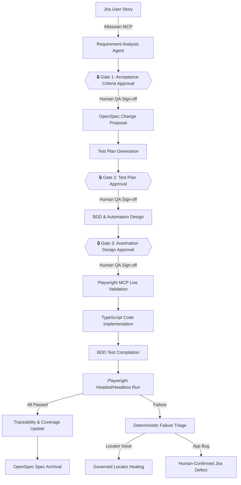
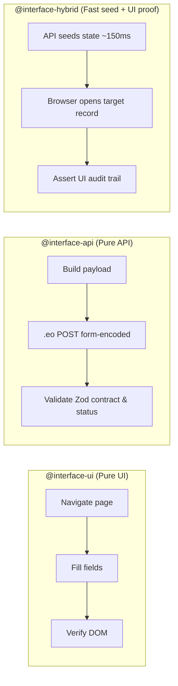
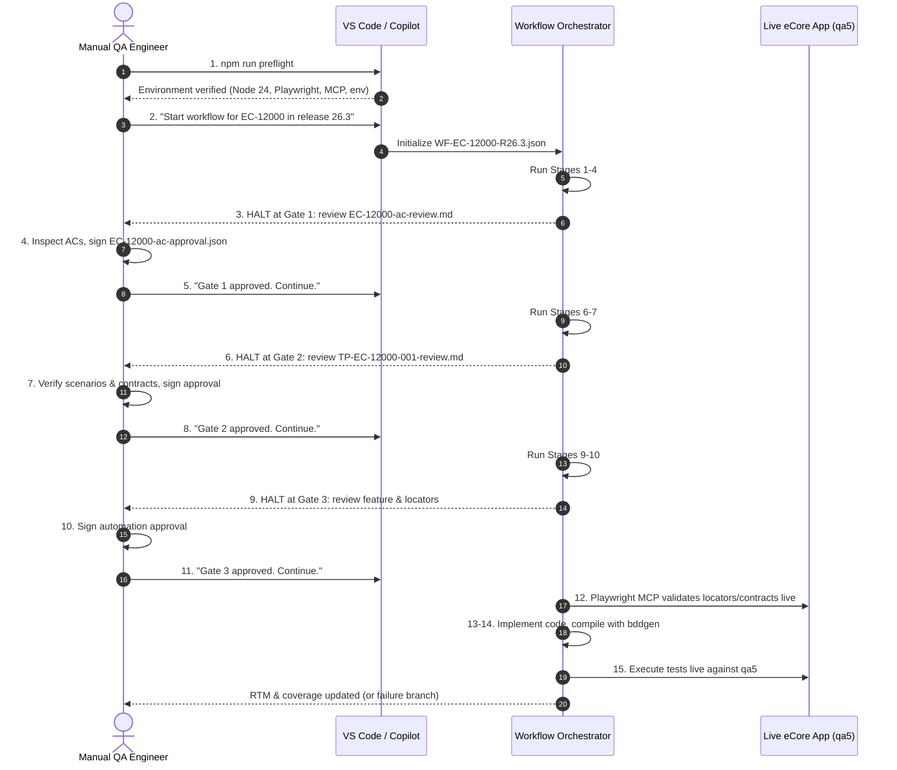
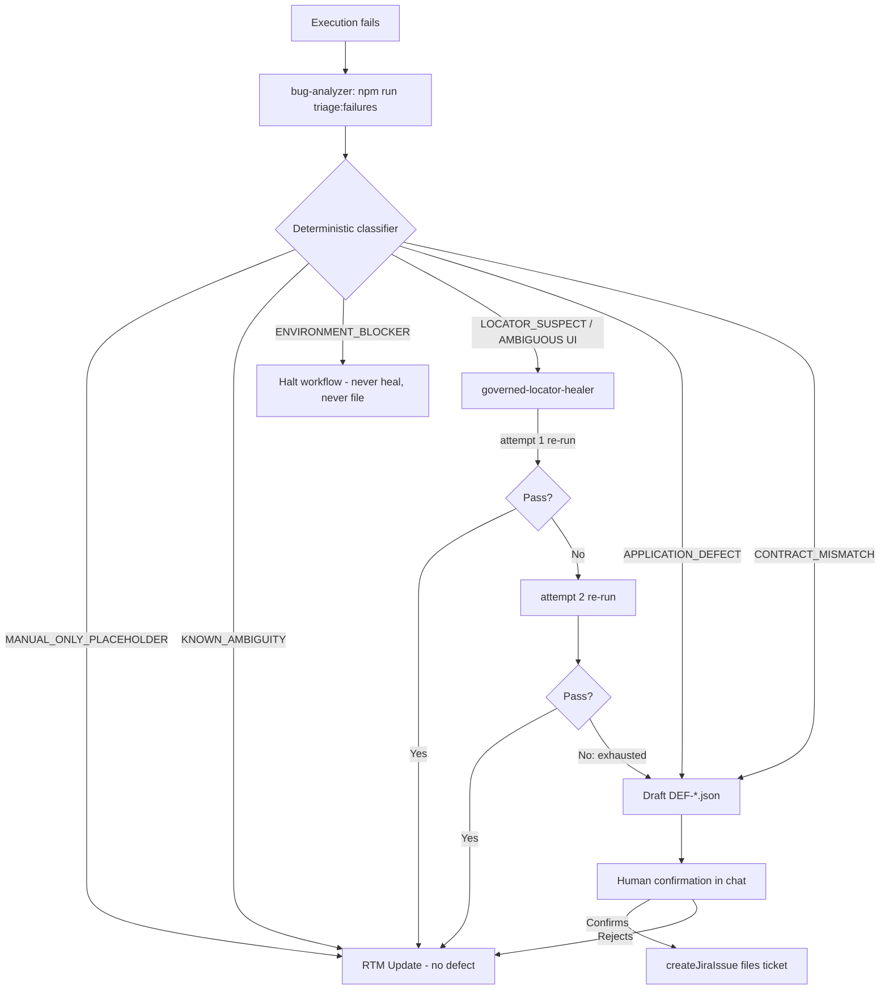
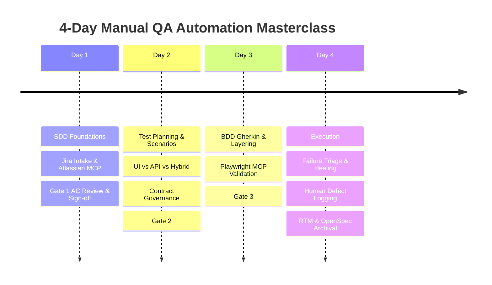

# Manual QA Training & Operations Playbook — v2

**Orchestrator-Driven, Spec-Driven Playwright-BDD Automation Framework**

A complete, production-grade training guide and operational manual for **Manual QA Engineers, QA
Leads, Product Owners, and Automation Engineers**. This v2 supersedes
[manual-qa-training-and-operations-guide.md](manual-qa-training-and-operations-guide.md): it
consolidates the duplicated tail sections of v1 into one clean flow, documents additional
first-class framework features and flows, and expands the interactive training curriculum in
[§16](#16-interactive-qa-training-curriculum-expanded).

> **What changed from v1**
> - Removed the duplicated section tree (v1 restarted its numbering after the curriculum).
> - Added: session capture for MCP, multi-environment profiles, second-identity roles, cross-story
>   scenario reuse, the full failure-triage taxonomy (including `MANUAL_ONLY_PLACEHOLDER` and
>   `KNOWN_AMBIGUITY`), API contract shape-hashing, capability-partitioned scaling, workflow locking
>   & resumability, the two workflow entry points, the templates/manifest system, and the `SEM-*`
>   semantic rules.
> - Expanded the training curriculum with hourly modules, learning objectives, graded labs,
>   knowledge checks, and a certification path.

---

## Table of Contents

1. [Executive Summary & Framework Vision](#1-executive-summary--framework-vision)
2. [Why Governed Spec-Driven Development (SDD)?](#2-why-governed-spec-driven-development-sdd)
3. [Core Glossary & Stable ID Architecture](#3-core-glossary--stable-id-architecture)
4. [The Role of OpenSpec: From Delta Changes to Living Specifications](#4-the-role-of-openspec-from-delta-changes-to-living-specifications)
5. [The Testing Spectrum: UI vs. API vs. HYBRID](#5-the-testing-spectrum-ui-vs-api-vs-hybrid)
6. [API Contract Governance & Shape-Hashing](#6-api-contract-governance--shape-hashing)
7. [The 3 Human Approval Gates](#7-the-3-human-approval-gates)
8. [The End-to-End Workflow & Orchestration Layer](#8-the-end-to-end-workflow--orchestration-layer)
9. [Workflow Mechanics: State, Locking, Idempotency & Entry Points](#9-workflow-mechanics-state-locking-idempotency--entry-points)
10. [Ambiguities, Blockers & Escalation Notes](#10-ambiguities-blockers--escalation-notes)
11. [Step-by-Step QA Playbook: Operating the Workflow](#11-step-by-step-qa-playbook-operating-the-workflow)
12. [Execution Guide: Headed/Headless, Tagging, Scoping & Sessions](#12-execution-guide-headedheadless-tagging-scoping--sessions)
13. [Failure Triage, Governed Locator Healing & Defect Logging](#13-failure-triage-governed-locator-healing--defect-logging)
14. [Reports, Metrics, RTM & Coverage at Scale](#14-reports-metrics-rtm--coverage-at-scale)
15. [Architecture, Layering, Governance Rules & Environment](#15-architecture-layering-governance-rules--environment)
16. [Interactive QA Training Curriculum (Expanded)](#16-interactive-qa-training-curriculum-expanded)
17. [Quick Reference Card](#17-quick-reference-card)

---

## 1. Executive Summary & Framework Vision

### 1.1 The Core Mission
This framework bridges the historic divide between **Manual QA domain expertise** and **Automated
Test Execution**. It takes a raw Jira user story and transforms it into an approved, traceable, and
executable Playwright-BDD test suite through a **durable, resumable, agent-driven workflow with
three mandatory human approval gates**.

The core premise:
> **AI agents write the repetitive code and probe live applications, but human QA engineers retain
> absolute governance over business rules, acceptance criteria, test designs, locator safety, and
> defect reporting.**



### 1.2 The Five Non-Negotiable Rules
Enforced programmatically by [src/utils/semantic-rules.ts](../src/utils/semantic-rules.ts) and the
Zod models. Violating any of them fails `npm run validate:artifacts`.

1. **A chat message is never an approval.** An approval only exists when a schema-valid JSON
   artifact (e.g., `requirements/approved/EC-12000-ac-approval.json`) is written to disk.
2. **Never invent a business rule.** No role, error message, boundary limit, timeout, or security
   policy may be invented by an AI agent. Missing facts are escalated as `AMB-*` ambiguities.
3. **Never fabricate a passing result.** No scenario reports `PASSED` without a real execution
   record. A coverage metric whose denominator is zero is `null` — never 0% and never 100%.
4. **Never guess a locator or an API contract.** Unverified selectors stay
   `MCP_VALIDATION_REQUIRED`; unverified endpoints stay `API_CONTRACT_UNVERIFIED` until validated
   through Playwright MCP.
5. **No agent approves its own output.** Every gate needs a human signature; a defect is filed to
   Jira only after a human confirms the composed bug in chat.

### 1.3 Who This Guide Serves

| Role | What you get from this guide |
| :--- | :--- |
| **Manual QA Engineer** | How to drive the workflow, review each gate, scope and run tests, read reports, and escalate blockers. |
| **QA Lead** | Governance model, coverage semantics, scaling design, and how to audit traceability. |
| **Product Owner** | How ambiguities surface for your decision and where your answers are recorded. |
| **Automation Engineer** | Layering rules, API contract governance, healing guardrails, and environment traps. |

---

## 2. Why Governed Spec-Driven Development (SDD)?

| Capability Area | Traditional Manual + Scripted | Ungoverned Autonomous AI | Governed SDD (This Framework) |
| :--- | :--- | :--- | :--- |
| **Requirements Intake** | Manual authoring; edge cases missed; ambiguity found late. | Scrapes story and hallucinates missing rules. | **Governed Extraction:** verbatim ACs, `AMB-*` for gaps, proposed criteria with rationale. |
| **Approval & Gates** | Ad-hoc PR review after code exists. | Zero gates; silent merges. | **3 Mandatory Gates:** ACs (G1), Test Plans (G2), Feature/Locators (G3). |
| **Specification** | Stale Confluence pages. | No spec concept; tests drift. | **OpenSpec Layer:** living, version-controlled specs. |
| **Interface Flexibility** | Siloed UI vs. Postman. | Inconsistent UI/network mixing. | **First-Class Hybrid:** UI + `.eo` RPC in one scenario. |
| **Locator Stability** | Brittle XPath/CSS. | Guessed selectors. | **Playwright MCP Validation:** live DOM, accessible roles. |
| **Failure Resolution** | Manual triage & copy-paste. | Agent forces green by editing asserts. | **Governed Triage & Healing:** classify, heal (≤2), human-confirm bug. |
| **Traceability** | Spreadsheets/plugins. | None. | **Partitioned RTM:** auditable, scales to 3,000+ tests. |
| **Data Safety** | Real creds sprinkled in tests. | Secrets leaked into code. | **`SYNTHETIC_INPUTS` isolation**, lazy secret loading, negative paths never use the real account. |

---

## 3. Core Glossary & Stable ID Architecture

Every artifact carries an immutable, regex-validated **Stable ID** (defined in
[src/models/common.model.ts](../src/models/common.model.ts)). Merges are always by key, never by
position.

```
                                  +-----------------------+
                                  |   JIRA STORY KEY      |  (e.g., EC-12000)
                                  +-----------------------+
                                              |
                     +------------------------+------------------------+
                     |                                                 |
                     v                                                 v
         +-----------------------+                         +-----------------------+
         |   REQUIREMENT ID      |                         |  AMBIGUITY ID         |
         |   REQ-EC-12000-001    |                         |  AMB-EC-12000-001     |
         +-----------------------+                         +-----------------------+
                     |
                     v
         +-----------------------+
         |  ACCEPTANCE CRITERION |
         |   AC-EC-12000-001     |
         +-----------------------+
                     |
                     v
         +-----------------------+                         +-----------------------+
         |  TEST SCENARIO ID     | ----------------------> |  TRACEABILITY ID      |
         |   TS-EC-12000-001     |                         |  TRC-EC-12000-001     |
         +-----------------------+                         +-----------------------+
                     |                                                 |
                     +------------------------+------------------------+
                                              |
                                              v
                                  +-----------------------+
                                  |  APPROVAL ARTIFACT    |
                                  |  APR-AC-EC-12000-001  |
                                  |  APR-TP-EC-12000-001  |
                                  |  APR-AD-EC-12000-001  |
                                  +-----------------------+
```

### Stable ID Reference Table

| Artifact Type | ID Pattern | Real Example | What It Represents |
| :--- | :--- | :--- | :--- |
| **Jira Story** | `[A-Z]+-[0-9]+` | `EC-12000`, `ETA-351` | Parent business user story in Jira. |
| **Requirement** | `REQ-<STORY>-<nnn>` | `REQ-EC-12000-001` | A normalized, discrete business requirement. |
| **Acceptance Criterion** | `AC-<STORY>-<nnn>` | `AC-EC-12000-002` | An extracted or proposed condition of satisfaction. |
| **Ambiguity** | `AMB-<STORY>-<nnn>` | `AMB-EC-12000-001` | An unresolved question or missing rule. |
| **Execution Blocker** | `BLOCKER-<STORY>-<nnn>` | `BLOCKER-EC-12000-004` | Environment/data/app defect blocking execution. |
| **Test Plan** | `TP-<STORY>-<nnn>` | `TP-EC-12000-001` | The parent test plan. |
| **Test Scenario** | `TS-<STORY>-<nnn>` | `TS-EC-12000-003` | A single business test scenario. |
| **Traceability Clarification** | `CLR-TP-<STORY>-<nnn>` | `CLR-TP-EC-12000-002` | A clarification raised by the test plan itself. |
| **Test-Plan Risk** | `RISK-TP-<STORY>-<nnn>` | `RISK-TP-EC-12000-001` | A risk recorded against a plan. |
| **Approval Artifact** | `APR-{AC\|TP\|AD}-…` | `APR-AC-EC-12000-001` | The human QA sign-off recorded on disk. |
| **Traceability Trace** | `TRC-<STORY>-<nnn>` | `TRC-EC-12000-001` | RTM link: requirement → code → execution. |
| **Defect Report** | `DEF-<STORY>-<nnn>` | `DEF-ETA-411-001` | A triaged defect artifact ready for Jira filing. |

> **ID immutability rule:** `REQ-*`, `AC-*` and `TS-*` IDs are story-scoped and never renamed or
> shared — even when a scenario is reused across stories (see [§5.5](#55-cross-story-scenario-reuse)).

---

## 4. The Role of OpenSpec: From Delta Changes to Living Specifications

### 4.1 What is OpenSpec?
**OpenSpec** is the specification authority. Instead of tests written against closed Jira tickets
that leave no record of intended behaviour, OpenSpec maintains **Living Specifications**.

1. **Delta Changes** (`openspec/changes/<change-name>/`) drafted at Stage `OPENSPEC_GENERATION`:
   - `proposal.md` — business intent and user context.
   - `specs/<capability>/<spec-name>/spec.md` — the exact behavioural delta (a *diff*, not the
     current state).
   - `design.md` — technical/architectural decisions.
   - `tasks.md` — implementation breakdown.
   - `.openspec.yaml` — change metadata (`schema`, `created`).
2. **Strict Validation:** `npx openspec validate <change-name> --strict`.
3. **Living Spec Archival** (`openspec/specs/`) at Stage `OPENSPEC_ARCHIVE`: `npx openspec archive
   <change-name>` folds the delta into the root spec and moves the change to a **date-stamped**
   archive folder, e.g. `openspec/changes/archive/2026-09-18-add-home-navigation/`.

```
       NEW JIRA STORY
             │
             ▼
[OPENSPEC_GENERATION]
  └─► Delta Spec: openspec/changes/track-paper-out-media-type/
             │
             ▼
[Test Plan → Implementation → Execution → RTM]
             │
             ▼
[OPENSPEC_ARCHIVE]
  ├─► Living Spec: openspec/specs/paper-out-export/<spec-name>/spec.md
  └─► Retired change: openspec/changes/archive/<YYYY-MM-DD>-<change-name>/
```

> **The CLI is the only writer.** Never hand-edit `openspec/specs/` and never move a change directory
> manually. Archiving is documentation lifecycle only — it moves **no** feature file and changes
> **no** tag, so every scenario in `features/approved/**` keeps running exactly as before.

### 4.2 Archive discipline
- Archive **only** after the RTM records a real passing execution for the story.
- A story with **deferred** ACs is archived for the **delivered** ones only; deferred ACs stay
  visible as open work and are never silently dropped.
- RTM entries carry `openSpecRefs`; after archival those refs are repointed from the change path to
  the living-spec path (`SEM-RTM` enforces this).

---

## 5. The Testing Spectrum: UI vs. API vs. HYBRID

This framework supports **UI, API, and HYBRID** scenarios inside the same Gherkin syntax, selected
by an `@interface-` tag. **A missing `@interface-` tag means UI**, so every file written before API
support existed is still valid.



### 5.1 `@interface-ui` — Pure Browser Automation
Drives the full browser lifecycle (`page.goto`, `click`, `fill`). Uses accessible locators
(`getByRole` → `getByLabel` → `getByPlaceholder` → `getByText` → `getByTestId`). Never brittle CSS or
raw XPath.

### 5.2 What eCore's API surface actually is
eCore is a **server-rendered Java application** — do not assume a REST API exists.
- **Sign-in is a form POST returning `302`**: no login endpoint, no token, no JSON body.
- The only AJAX lives under `/ssweb/setup/workspace/**/ajax/`, is RPC-style verbs ending in `.eo`,
  and takes **form-encoded** requests.
- Two traps: `submitTransactionSearch.eo` returns an **HTML fragment**; `getWorkspaceTableData.eo`
  returns a DataTables envelope in which **every business field is an HTML string**. Either can seed
  state; neither may judge an acceptance criterion.
- ~178 further `.eo` paths are **declared** in markup but **never exercised** → `UNVERIFIED`. A path
  appearing in that list is **not** permission to call it. Several are irreversible against shared QA
  data (`deleteTransaction`, `voidDocument`, `authorizeDestruction`).

### 5.3 `@interface-api` — Direct Backend RPC Execution
Executes fast form-encoded `.eo` requests via typed clients in `src/api/` (each extends `ApiClient`
in [src/api/api-client.ts](../src/api/api-client.ts), e.g.
[src/api/eo-request-export.client.ts](../src/api/eo-request-export.client.ts)) and validates the
**whole** response against a Zod contract in `src/models/api/` (e.g.
[src/models/api/eo-export.model.ts](../src/models/api/eo-export.model.ts)). Spot-checking three
fields and ignoring forty is the API version of a test that never looked.

### 5.4 `@interface-hybrid` — The High-Speed Production Pattern
- **Problem:** building preconditions through the UI (login → 5 menus → search → create → approve)
  costs 60+ seconds per test.
- **Solution:** a step issues a direct `.eo` call to seed state in ~150ms, then the browser verifies
  the user-facing outcome (e.g. the audit trail in the Document History modal).
- **Governance:** the API step is **scaffolding only** — it reaches a state, it never proves one.
  The human-approved acceptance criterion is judged by the UI, until a human promotes the observed
  contract to `HUMAN_APPROVED`.

### 5.5 Cross-story scenario reuse
Before authoring a new scenario, the agent checks the capability RTM and
[traceability/index/lookup.index.json](../traceability/index/lookup.index.json) for an existing
scenario covering the same behaviour in another story.
- A matching **title is never proof of equivalence** — AC text, Gherkin behaviour, `interfaceType`,
  data classification and release/requirement version must all match.
- Reuse is **proposed, never assumed**: `scenarioAction: REUSE` + a `reuseSource`
  (`sourceJiraStoryId`, `sourceTestScenarioId`, `matchedLayers`, `rationale`, `status: PROPOSED`).
- It becomes usable only when a human sets `reuseSource.status = CONFIRMED` at Gate 2.
  `SEM-TEST-REUSE` fails an `APPROVED` plan carrying a still-`PROPOSED` claim.

---

## 6. API Contract Governance & Shape-Hashing

To stop agents guessing APIs or cementing product bugs as "correct":

| Provenance | Meaning | Can it back an AC assertion? |
| :--- | :--- | :--- |
| `API_CONTRACT_UNVERIFIED` | Placeholder; nothing has confirmed it. | ❌ |
| `OBSERVED` | Captured from live traffic during MCP exploration — what the app *does*. | ❌ (can seed state only) |
| `AGENT_DRAFTED` (`UNVERIFIED`) | Drafted only when a human explicitly asks and confirms twice; records `DICTATED:`/`PROPOSED:` fields. | ❌ |
| `HUMAN_APPROVED` | Human confirmed endpoint, params, status at Gate 2. | ✅ |
| `OPENAPI` | Sourced from an OpenAPI document. | ✅ |

- A `HUMAN_APPROVED` contract must record a **`responseShapeHash`** from `computeResponseShapeHash`
  in [src/utils/api-contract-shape.ts](../src/utils/api-contract-shape.ts). The hash covers **keys
  and types only** (not values/ids/row counts, which change every run), so real drift is caught
  without false alarms.
- `SEM-API-CONTRACT` fails the build when an `@interface-` tag and its plan disagree, or when an
  approved plan asserts against a non-authoritative contract.

---

## 7. The 3 Human Approval Gates

The workflow **halts immediately** at each gate. No agent can bypass one.

```
 🔒 GATE 1 — ACCEPTANCE CRITERIA        halts after AC_REVIEW_PACKAGE
    Review:  requirements/reviews/<STORY>-ac-review.md
    Sign:    requirements/approved/<STORY>-ac-approval.json
 🔒 GATE 2 — TEST PLAN                   halts after TEST_PLAN_GENERATION
    Review:  test-plans/generated/<TP-ID>-review.md
    Sign:    test-plans/approved/<TP-ID>-approval.json
 🔒 GATE 3 — AUTOMATION DESIGN           halts after AUTOMATION_REVIEW_PACKAGE
    Review:  features/generated/<cap>/<TP-ID>-automation-design.md
    Sign:    features/approved/<cap>/<TP-ID>-automation-approval.json
```

### Gate 1 — Acceptance Criteria
**QA checklist:** all Jira ACs captured verbatim in `extractedCriteria`? proposed edge criteria
valid and necessary? every `AMB-*` accurately stated? **Sign-off:** copy the `*-ac-approval.template.json`
to `requirements/approved/<STORY>-ac-approval.json`, set item decisions, add reviewer + timestamp.

### Gate 2 — Test Plan
**QA checklist:** 100% scenario coverage across Gate 1 ACs? interface types correct? each `API`/`HYBRID`
scenario carries a contract, and each `OBSERVED` contract you intend to assert against is promoted to
`HUMAN_APPROVED` (with `responseShapeHash`)? physical/visual scenarios correctly `MANUAL_ONLY`?
cross-story `REUSE` claims confirmed? An **API scenario adds coverage — it never silently replaces a
UI scenario** (retirement is a human decision recorded here).

### Gate 3 — Automation Design
**QA checklist:** Gherkin is pure business language (no selectors/clicks in feature files)? all six
mandatory tags present (`@release-`, `@capability-`, `@req-`, `@ac-`, `@tp-`, `@ts-`) plus any
`@interface-`/`@risk-`/`@suite-`? locator hierarchy sound? destructive/non-reversible actions
safeguarded or marked `MANUAL_ONLY`? Feature files stay in `features/generated/` until the gate is
recorded — only `features/approved/` is compiled by `bddgen`.

> **Decision granularity:** only items with an item-level `APPROVE` flow downstream. `REJECT`,
> `DEFER` and `REQUEST_CHANGES` are excluded and recorded in the RTM with the matching status.
> `REQUEST_CHANGES` returns the workflow to the generating stage and increments `retryCount`.

---

## 8. The End-to-End Workflow & Orchestration Layer

The orchestration layer
([workflow/definitions/sdd-jira-to-automation.workflow.json](../workflow/definitions/sdd-jira-to-automation.workflow.json))
runs **one stage per invocation**, then persists state. The linear path has 15 stages through
`EXECUTION`; a conditional **failure-handling branch** inserts `FAILURE_TRIAGE`,
`LOCATOR_HEALING`/`BUG_REPORTING` before `RTM_UPDATE`. An all-green run skips the branch.

```
[1 JIRA_RETRIEVAL] → [2 REQUIREMENT_NORMALIZATION] → [3 AC_ANALYSIS] → [4 AC_REVIEW_PACKAGE]
      → 🔒[5 AC_APPROVAL] → [6 OPENSPEC_GENERATION] → [7 TEST_PLAN_GENERATION]
      → 🔒[8 TEST_PLAN_APPROVAL] → [9 BDD_DESIGN] → [10 AUTOMATION_REVIEW_PACKAGE]
      → 🔒[11 AUTOMATION_APPROVAL] → [12 PLAYWRIGHT_VALIDATION] → [13 IMPLEMENTATION]
      → [14 BDD_GENERATION] → [15 EXECUTION]
             │
   ┌─────────┴─────────────────────────────┐
   │ (all passed)                          │ (any failed)
   ▼                                        ▼
[RTM_UPDATE] → [OPENSPEC_ARCHIVE] → DONE   [FAILURE_TRIAGE]
                                             ├─ LOCATOR_SUSPECT/AMBIGUOUS → [LOCATOR_HEALING] ─ healed → [RTM_UPDATE]
                                             │                                              └ not healed(×2) → [BUG_REPORTING]
                                             ├─ APPLICATION_DEFECT / CONTRACT_MISMATCH → [BUG_REPORTING] → [RTM_UPDATE]
                                             ├─ MANUAL_ONLY_PLACEHOLDER / KNOWN_AMBIGUITY → [RTM_UPDATE] (no defect)
                                             └─ ENVIRONMENT_BLOCKER → HALT (never healed, never filed)
```

### Stage Reference Table

| Stage | Owner Agent | Key Inputs | Key Outputs | Quality Function |
| :--- | :--- | :--- | :--- | :--- |
| `JIRA_RETRIEVAL` | `jira-requirement-analysis` | Jira key | `requirements/raw/<STORY>.json` | Fetch verbatim snapshot via Atlassian MCP. |
| `REQUIREMENT_NORMALIZATION` | `jira-requirement-analysis` | raw JSON | `requirements/normalized/<STORY>.json` | Assign stable `REQ-*` IDs. |
| `AC_ANALYSIS` | `jira-requirement-analysis` | normalized JSON | (same, enriched) | Extract verbatim `AC-*`, flag `AMB-*`. |
| `AC_REVIEW_PACKAGE` | `jira-requirement-analysis` | normalized JSON | `*-ac-review.md`, `*-ac-approval.template.json`, `*.rtm.proposed.json` | Build Gate 1 package. |
| **`AC_APPROVAL`** | **Human QA** | review package | `requirements/approved/<STORY>-ac-approval.json`, `<STORY>.json` | 🔒 Gate 1. |
| `OPENSPEC_GENERATION` | `OpenSpec` | Gate 1 approval | `openspec/changes/<change>/**` | Draft delta spec, tasks, design. |
| `TEST_PLAN_GENERATION` | `sdd-workflow-orchestrator` | approved reqs + change | `test-plans/generated/<TP-ID>.json` + review + template | Author `TS-*`, interface types, contracts. |
| **`TEST_PLAN_APPROVAL`** | **Human QA** | Gate 2 review | `test-plans/approved/<TP-ID>-approval.json`, `<TP-ID>.json` | 🔒 Gate 2; promote `OBSERVED`→`HUMAN_APPROVED`. |
| `BDD_DESIGN` | `sdd-workflow-orchestrator` | approved plan | `features/generated/<cap>/<feature>.feature` + design.md | Author tagged Gherkin. |
| `AUTOMATION_REVIEW_PACKAGE` | `sdd-workflow-orchestrator` | generated feature | design.md (final) + approval template | Build Gate 3 package. |
| **`AUTOMATION_APPROVAL`** | **Human QA** | Gate 3 review | `features/approved/<cap>/<TP-ID>-automation-approval.json` + `<feature>.feature` | 🔒 Gate 3. |
| `PLAYWRIGHT_VALIDATION` | `sdd-workflow-orchestrator` (drives Playwright MCP) | approved feature | `reports/validation/<TP-ID>-browser-validation.json` (+ `-api-validation.json`) | Validate locators/contracts live. |
| `IMPLEMENTATION` | `sdd-workflow-orchestrator` | validation reports | `steps/**`, `src/pages/**`, `src/components/**`, `src/api/**`, `src/models/api/**`, `src/fixtures/**`, `test-data/**` | Author layered code. |
| `BDD_GENERATION` | `sdd-workflow-orchestrator` | approved features + steps | `.features-gen/**` | `npm run bdd` compiles specs. |
| `EXECUTION` | `sdd-workflow-orchestrator` | `.features-gen/**` | `reports/playwright-report/**`, `traceability/executions/<EXEC-ID>.json` | Run live against `qa5`. |
| `FAILURE_TRIAGE` | `bug-analyzer` | `reports/execution/results.json` | `defects/<DEF-ID>.json`, `reports/defects/**` | Classify failures deterministically. |
| `LOCATOR_HEALING` | `governed-locator-healer` | defect | updated `src/pages/**`/`src/components/**` | Repair locators, capped at 2 attempts. |
| `BUG_REPORTING` | `bug-analyzer` | triaged defect | defect + `*.rtm.proposed.json` + Jira ticket | File bug after human confirmation. |
| `RTM_UPDATE` | `sdd-workflow-orchestrator` | execution record | `<cap>.rtm.json`, `<cap>.coverage.json`, `lookup.index.json`, history | Merge traceability & coverage. |
| `OPENSPEC_ARCHIVE` | `OpenSpec` | passing RTM | `openspec/specs/**`, `openspec/changes/archive/**` | Fold delta into living spec. |

> **PLAYWRIGHT_VALIDATION & IMPLEMENTATION ownership:** the orchestrator drives the `playwright-test`
> MCP tools directly (`browser_navigate`, `browser_snapshot`, `browser_click/type/select_option`,
> `browser_network_requests`) rather than delegating to the generic `playwright-test-planner` /
> `playwright-test-generator` sub-agents, whose built-in output does not match this framework's
> governed JSON reports or strict layering.

---

## 9. Workflow Mechanics: State, Locking, Idempotency & Entry Points

### 9.1 Durable state
Each story+release has exactly one instance: `workflow/instances/WF-<STORY>-R<release>.json`
(validated by `workflow/definitions/workflow-state.schema.json`). Never infer state from chat — the
orchestrator always reads the instance file first. An append-only history log lives at
`workflow/history/<workflowId>.history.jsonl`.

### 9.2 Locking & controlled merge
A `processingLock` guards shared files. Delegated agents never write the RTM directly — they write
`<capability>.rtm.proposed.json`; the orchestrator validates, acquires the lock, merges by key,
validates with `npm run validate:rtm`, releases the lock, records history, and deletes the proposal.
Parallelism is allowed **only** when batches write to disjoint files.

### 9.3 Idempotency & batching
Every stage is idempotent and resumable. If an output already exists and its inputs are unchanged,
the stage is skipped. Work proceeds in controlled batches — **one story per invocation**, scenario
generation capped by the workflow's `maxScenariosPerInvocation` (10). Never process all stories or
all tests in one shot.

### 9.4 The two entry points

| Entry Point | Starts At | When to use |
| :--- | :--- | :--- |
| `NEW_STORY` (default) | `JIRA_RETRIEVAL` | A story never processed before. |
| `TEST_STRATEGY_REVISION` | `TEST_PLAN_GENERATION` | Approved requirements unchanged, but tests must change (most commonly **adding API coverage** to an already-automated story). Re-enters at Gate 2; Gate 1 is **not** re-run. |

`TEST_STRATEGY_REVISION` reuses the same instance and **preserves prior evidence** first: it appends
a `WORKFLOW_RESTARTED` event and confirms the previous state is committed to version control before
resetting. The revised plan is a new `artifactVersion` of the same `TP-ID`, merged by
`testScenarioId`; existing scenarios are preserved, new ones added; an added API scenario must not
retire a UI scenario without explicit Gate 2 approval.

### 9.5 Read-only status
```powershell
npm run workflow:status   # summary of every workflow instance, no side effects
```

---

## 10. Ambiguities, Blockers & Escalation Notes

### 10.1 Ambiguity (`AMB-*`)
Raised during requirements analysis when a story is missing a critical rule.
- *Example:* `AMB-EC-12000-001` — "How is Paper Out initiated from the Collections view?"
- **Resolution:** QA asks the PO → records the decision in the Gate 1 approval → the orchestrator
  folds it into the test plan. Agents never guess the answer.

### 10.2 Execution Blocker (`BLOCKER-*`)
Raised during MCP validation or execution when tests cannot proceed.
- *Example:* `BLOCKER-EC-12000-004` — "The recorded Media Type is not observable anywhere in qa5 for
  a historical Paper Out record."
- A step deliberately throwing to keep such a scenario traceable is classified
  `KNOWN_AMBIGUITY` at triage — **not** a defect (see [§13](#13-failure-triage-governed-locator-healing--defect-logging)).

### 10.3 Escalation notes
Use the **`blocker-escalation-note`** skill to turn a recorded `BLOCKER-*`/`AMB-*` into a short,
precise, human-forwardable note that states exactly what is needed to unblock it — ideal for handing
to a developer, PO, or environment team.

---

## 11. Step-by-Step QA Playbook: Operating the Workflow



### Gate 1 approval example (`requirements/approved/EC-12000-ac-approval.json`)
```json
{
  "approvalId": "APR-AC-EC-12000-001",
  "jiraStoryId": "EC-12000",
  "decision": "APPROVE",
  "reviewer": "Your Name <your.email@company.com>",
  "reviewedAt": "2026-09-23T10:00:00.000Z",
  "notes": "Reviewed and confirmed all acceptance criteria with the product owner."
}
```
> Fill decisions per item where the template provides them; only `APPROVE` items flow downstream.

---

## 12. Execution Guide: Headed/Headless, Tagging, Scoping & Sessions

### 12.1 Headless (default) vs. headed
```powershell
# Headless — the configured default (playwright.config.ts uses env.headless = true)
npx bddgen; npx playwright test --grep "@EC-12000"

# Headed — watch it run in Chrome
npx bddgen; npx playwright test --headed --grep "@EC-12000"
```

> **Reporter trap:** a CLI `--reporter` flag **replaces** the config reporter array. Never pass
> `--reporter=list` for a real run — it silently drops the `html` and `json` reporters and
> `npm run report` then opens a stale/blank report. Scope with `--grep` and leave reporters alone.

### 12.2 Targeted execution by tag

| Scope | Command |
| :--- | :--- |
| **Single scenario** | `npx playwright test --grep "@ts-TS-EC-12000-001"` |
| **Whole story** | `npx bddgen; npx playwright test --grep "@EC-12000"` |
| **Smoke** | `npm run test:smoke` |
| **Regression** | `npm run test:regression` |
| **Critical / high risk** | `npm run test:critical` |
| **API only** | `npx playwright test --grep "@interface-api"` |
| **Hybrid only** | `npx playwright test --grep "@interface-hybrid"` |

### 12.3 Multi-environment profiles
Configuration flows through [src/utils/env.ts](../src/utils/env.ts) only — **never read
`process.env` directly** (that includes `playwright.config.ts`, which uses `env.isCi`). Select a
profile with `TEST_ENV_PROFILE` or `--env=<name>`; profiles live in `config/environments/<profile>.json`
or `.env.<profile>`, with fallback to `.env`. `prod` is recognized in `TEST_ENVIRONMENTS`.

### 12.4 Second-identity roles
A scenario needing a second identity (e.g. an "Approver" distinct from the master account) uses
`env.requireEcoreLoginAs('<ROLE>')` — never a second hard-coded credential. The role is first
declared, non-secretly, in `config/test-users.json` (see `config/test-users.json.example`); the real
`<PREFIX>_USERNAME`/`_PASSWORD` pair lives only in `.env`. A role's existence is a business fact and
is never invented by an agent.

### 12.5 Captured session for MCP exploration (never for the test run)
```powershell
npm run capture:session   # sign in once → .auth/ecore-session.json (git-ignored)
```
The `seed` project resumes that session so a live password never passes through an MCP tool argument.
The `bdd` and `technical` projects deliberately do **not** use it — they always exercise the real
sign-in.

### 12.6 Jira access
MCP-first via the Atlassian server. When no issue-fetch tool is exposed, the documented REST fallback
is:
```powershell
npm run jira:fetch -- EC-12000   # verbatim snapshot into reports/jira/ — never a governed artifact
```

### 12.7 Negative-scenario safety
The eCore login page can **lock an account** after too many wrong attempts. Wrong-credential and
missing-field paths therefore use fabricated values from `test-data/<capability>.sample.json`
(`dataClassification: SYNTHETIC_INPUTS`). Only the happy path calls `env.requireEcoreLogin()`.

---

## 13. Failure Triage, Governed Locator Healing & Defect Logging



### 13.1 The full classification taxonomy
Classification is **mechanical**, checked in the following precedence — the seven classifications
defined in [src/utils/failure-triage.ts](../src/utils/failure-triage.ts):

1. **`MANUAL_ONLY_PLACEHOLDER`** — a step deliberately throws to keep a `MANUAL_ONLY` scenario
   traceable (e.g. visual border alignment, a downloaded package cover page). Correct by design →
   straight to `RTM_UPDATE` as `MANUAL_ONLY`. No `DEF-ID`.
2. **`KNOWN_AMBIGUITY`** — the error text cites an already-recorded `BLOCKER-*`/`AMB-*`. Already
   awaiting a human decision → `RTM_UPDATE`, optionally re-surfaced via `blocker-escalation-note`.
   No `DEF-ID`.
3. **`ENVIRONMENT_BLOCKER`** — DNS, TLS, proxy, refused connection, or missing config. The app was
   never reached, so the failure proves nothing about it → **halt**, never heal, never file.
4. **`CONTRACT_MISMATCH`** — an API call completed but violated the approved Zod contract or HTTP
   expectation → `BUG_REPORTING` (never healing).
5. **`LOCATOR_SUSPECT`** (UI) — a locator looks stale/ambiguous → routed to healing first (an
   unnecessary heal is cheaper than a false bug).
6. **`APPLICATION_DEFECT`** — the behaviour itself is wrong → `BUG_REPORTING`.
7. **`AMBIGUOUS`** (UI, default fallback) — no stronger signal matched → also routed to healing
   first, for the same reason as `LOCATOR_SUSPECT`.

> **Read the `@interface-` tag before routing.** An `@interface-api` failure never enters
> `LOCATOR_HEALING` — it exercises no locator, and its evidence is the redacted request/response in
> `evidence.apiExchanges`, not a screenshot.

### 13.2 The two-attempt healing cap
The healer may change **only** locators/waits in `src/pages/**` or `src/components/**` — never
feature files, steps, assertions, or test data. `test.skip/fixme` and `waitForTimeout` are
forbidden. After two failed attempts it sets `LOCATOR_UNHEALABLE`, reverts speculative edits, and
hands to `BUG_REPORTING`. Healing does **not** reopen Gate 3 — only an element's address moved, not
the approved behaviour.

### 13.3 Human-confirmed defect filing
`bug-analyzer` presents the fully composed bug in chat; only after an explicit human reply
(*"Confirmed, please file"*) is `createJiraIssue` called — never in the same turn it asked. The
confirmation is transcribed verbatim into the defect's `notes`. Compensating controls: a fingerprint
already `REPORTED` becomes a `DUPLICATE`, every bug is assigned to `JIRA_BUG_ASSIGNEE_ACCOUNT_ID`,
and no Jira link is created between bug and story (recorded only in `jira.linkedStory`). Severity,
priority and root cause are never invented — they are raised as open questions.

---

## 14. Reports, Metrics, RTM & Coverage at Scale

### 14.1 Report locations

| Report | Location | How to open |
| :--- | :--- | :--- |
| **Playwright HTML** | `reports/playwright-report/index.html` | `npm run report` |
| **Playwright JSON** | `reports/execution/results.json` | consumed by triage & RTM |
| **Governed execution record** | `traceability/executions/<EXEC-ID>.json` | authored deliberately (never fabricated) |
| **Browser code coverage** | `reports/coverage/report/index.html` | `npm run coverage:open` |
| **RTM** | `traceability/capabilities/<capability>.rtm.json` | JSON editor |
| **Coverage matrix** | `traceability/capabilities/<capability>.coverage.json` | shows automated/manual-only/deferred/blocked |
| **Validation results** | `reports/validation/validation-*.json` | written by `npm run validate:*` |

### 14.2 Requirement coverage vs. browser code coverage — do not confuse them
- **Requirement coverage** (`traceability/capabilities/`): the share of approved ACs verified by
  passing automated tests. $\text{Coverage} = \frac{\text{Passed actionable ACs}}{\text{Total actionable ACs}} \times 100$.
  A zero denominator is `null`, never 0%/100%.
- **Browser code coverage** (`reports/coverage/`): which application JavaScript executed. It is
  **informational only**, git-ignored, and **never** merged into `traceability/` or quoted as
  requirement coverage. An **API-only scenario contributes 0%** here yet may fully satisfy an AC.

### 14.3 Scaling to 3,000+ tests
Scaling relies on **capability partitioning** — one RTM file per business capability — plus
[traceability/index/lookup.index.json](../traceability/index/lookup.index.json) (including
`byDefectId`) so nothing is scanned linearly. **Never create a monolithic RTM.** Fixtures are
likewise capability-partitioned (`src/fixtures/<capability>.fixture.ts`, `api.fixture.ts`,
`coverage.fixture.ts`) and composed in [src/fixtures/test.ts](../src/fixtures/test.ts).

### 14.4 Validation scopes
```powershell
npm run validate:artifacts     # all 24 structural + semantic checks
npm run validate:requirements  # single scope; also :workflow :rtm :defects :automation
```
Each scope writes `reports/validation/validation-<scope>.json` and exits non-zero on failure.

---

## 15. Architecture, Layering, Governance Rules & Environment

### 15.1 Strict layering
```
[1 Gherkin Feature Files]  features/approved/**   → business behaviour + traceability tags only
[2 Step Definitions]       steps/**               → thin orchestration only
[3 Page Objects/Components] src/pages/**, src/components/** → own DOM locators & user actions
[4 API Clients/Models]     src/api/**, src/models/api/**   → own .eo endpoints & Zod contracts
[5 Fixtures/Services]      src/fixtures/**, src/services/** → setup, session reuse, teardown
[6 Test Data]              test-data/**           → synthetic inputs only, never secrets
```
Feature files carry no selectors; steps carry no locators or hard-coded data; page objects prefer
`getByRole` → `getByLabel` → `getByPlaceholder` → `getByText` → `getByTestId`. **No XPath, no
`.nth()`, no long CSS chains, no `waitForTimeout`.** A string-selector needs a `VALIDATED -` comment;
a `waitForTimeout` needs `JUSTIFIED-WAIT:`; a destructive `.delete()/.put()` or a destructively-named
endpoint needs a `CLEANUP -` waiver.

### 15.2 The `SEM-*` semantic rules (enforced by validation)

| Rule | Guards against |
| :--- | :--- |
| `SEM-FEATURE-TAGS` | Missing any mandatory traceability tag. |
| `SEM-AUTOMATION-HYGIENE` | XPath, `.nth()`, `waitForTimeout`, `test.skip/fixme`, unwaived string selectors. |
| `SEM-API-CONTRACT` | `@interface-` tag disagreeing with the plan; asserting against a non-authoritative contract. |
| `SEM-APPROVAL-EVIDENCE` | An approval not binding to the exact artifact version. |
| `SEM-GATES` | An approval gate not enforced by artifact evidence. |
| `SEM-TEST-REUSE` | An `APPROVED` plan carrying a still-`PROPOSED` reuse claim. |
| `SEM-SAMPLE-ISOLATION` | Mixing `SAMPLE_DATA` with `REAL_JIRA_DATA` in one artifact. |
| `SEM-NO-PLACEHOLDERS` | An approved artifact still containing `REPLACE_WITH_`. |
| `SEM-NO-DUPLICATES` | Duplicate executable tests for one business scenario. |
| `SEM-RTM` | An RTM relationship (e.g. `openSpecRefs` path) that no longer resolves. |
| `SEM-COVERAGE` | Coverage percentages not derived solely from RTM data. |
| `SEM-OPENSPEC` | An RTM/spec reference inconsistent with the OpenSpec change. |
| `SEM-DISCOVERY-SIGNAL` | Treating a locked/error dialog as a real modal. |
| `SEM-DEFECT-EVIDENCE` | A defect report not backed by a real failed execution. |
| `SEM-VERSIONS` | Approved content changing without an artifactVersion bump. |
| `SEM-LOCKS` | Two workflows writing to the same traceability artifact. |

### 15.3 Templates, not other stories
Artifact shape comes from **JSON Schema → template**, never from copying a finished story. Templates
live in [templates/](../templates/README.md) with [templates/manifest.json](../templates/manifest.json).
Every artifact type keeps a JSON Schema **and** a Zod model in parity (`*-STRUCTURE` checks). The
`ETA-351`/`ETA-411`/`EC-12000` artifacts are **human reading material only** — an agent authoring a
new artifact must not open them to find a field's shape or phrasing.

### 15.4 Environment gotchas (these will bite you)
- **Windows PowerShell:** chain with `;`, never `&&`.
- **Node 24 native type-stripping:** relative imports must carry an explicit `.ts` extension.
- **`erasableSyntaxOnly`:** TypeScript parameter properties are a compile error — use an explicit
  field + assignment.
- **Do not add `"type": "module"`** to `package.json`.
- **`tsc --noEmit` does not catch CJS interop failures** — default-import and destructure CJS deps,
  and run a script once after adding a dependency.
- **A stage's `requires` does not check its CLIs** — run `npm run preflight` before starting/resuming.
- **Secrets:** `.env`, `.npmrc`, `.auth/`, `.playwright-mcp/` stay out of `git status`; never commit
  a secret; the OpenSpec CLI is `@fission-ai/openspec` (never the name-squat `openspec`).
- **Non-reversible eCore actions:** *Print*/*Verify* on an Authorized Paper Out batch permanently
  destroys vault documents on `qa5`. Never self-provision a fixture with no reversible teardown —
  mark it `MANUAL_ONLY` or depend on a human-provisioned fixture.

---

## 16. Interactive QA Training Curriculum (Expanded)

A structured **4-day masterclass** (≈6 taught hours/day) plus an optional **Day 5 certification**.
Each module lists a learning objective, a hands-on lab, and a knowledge check. Reference stories:
`ETA-351` (UI, `account-access`), `ETA-411` (multi-scenario, `home-navigation`), `EC-12000`
(API/HYBRID, `paper-out-export`), `EC-11358` (HYBRID, `document-activity-history`).



### Day 1 — Foundations, SDD & Gate 1

| Module | Learning objective | Hands-on lab | Knowledge check |
| :--- | :--- | :--- | :--- |
| **1.1 Orientation** | Explain the agent-vs-human governance model and the 5 non-negotiables. | Clone repo; `npm run preflight`; read the output report. | Name the artifact that constitutes an approval. |
| **1.2 Stable IDs** | Decode any `REQ/AC/TS/TRC/APR/DEF` ID. | Trace `AC-EC-12000-002` to its scenario in the RTM. | Why is an ID never renamed on reuse? |
| **1.3 Jira intake via MCP** | Start the Atlassian MCP server and fetch a story. | Start MCP; `npm run jira:fetch -- ETA-351` fallback. | Where does a raw snapshot land, and is it governed? |
| **1.4 Requirement normalization** | Distinguish extracted vs. proposed ACs and `AMB-*`. | Read `requirements/normalized/ETA-351.json`. | Spot one proposed AC and justify it. |
| **1.5 Gate 1 review** | Complete a real Gate 1 sign-off. | Review `ETA-351-ac-review.md`; write `ETA-351-ac-approval.json`. | Which decisions flow downstream, which don't? |

**Day-1 outcome:** a signed Gate 1 approval that passes `npm run validate:artifacts`.

### Day 2 — Test Planning, Interface Types, Contracts & Gate 2

| Module | Learning objective | Hands-on lab | Knowledge check |
| :--- | :--- | :--- | :--- |
| **2.1 OpenSpec basics** | Explain delta change vs. living spec. | Inspect `openspec/changes/track-paper-out-media-type/`. | What does `--strict` validate? |
| **2.2 Scenario design** | Write positive/negative/edge `TS-*`. | Draft a scenario matrix for one AC. | When is a scenario `MANUAL_ONLY`? |
| **2.3 UI vs API vs HYBRID** | Choose the right interface type. | Classify each `EC-12000` scenario by tag. | Why does an API scenario *add*, not replace? |
| **2.4 Contract governance** | Explain `OBSERVED → HUMAN_APPROVED` + `responseShapeHash`. | Read `reports/validation/TP-EC-12000-001-api-validation.json`. | Why can't `OBSERVED` back an assertion? |
| **2.5 Cross-story reuse** | Propose and confirm a `REUSE` claim. | Add a `reuseSource` (PROPOSED) and reason about it. | What makes titles insufficient proof? |
| **2.6 Gate 2 review** | Sign a test-plan approval. | Approve `TP-EC-12000-001-approval.json`. | Where is a contract promoted to `HUMAN_APPROVED`? |

**Day-2 outcome:** a signed Gate 2 approval with at least one `HUMAN_APPROVED` contract.

### Day 3 — BDD Gherkin, Layering, MCP Validation & Gate 3

| Module | Learning objective | Hands-on lab | Knowledge check |
| :--- | :--- | :--- | :--- |
| **3.1 Clean Gherkin** | Write declarative, tag-complete scenarios. | Tag a scenario with all six mandatory tags. | Which tag absence implies UI? |
| **3.2 Six-layer architecture** | Place code in the correct layer. | Map a step → page object → locator. | Where may a locator live? Where may it not? |
| **3.3 Locator strategy** | Apply the accessible-locator hierarchy. | Rewrite a CSS selector as `getByRole`. | What waiver does a string selector need? |
| **3.4 Playwright MCP validation** | Validate a locator live against `qa5`. | Drive `browser_snapshot`/`browser_click` on the approved flow. | Why capture a session first? |
| **3.5 Contract observation** | Capture an `.eo` call from live traffic. | Record `browser_network_requests` for a hybrid flow. | Why is observed traffic not authority? |
| **3.6 Gate 3 review** | Sign an automation-design approval. | Approve `TP-EC-12000-001-automation-approval.json`. | Why do features stay in `generated/` until now? |

**Day-3 outcome:** validated locators/contracts and a signed Gate 3 approval; feature promoted to
`features/approved/`.

### Day 4 — Execution, Triage, Healing, Defects & Living Specs

| Module | Learning objective | Hands-on lab | Knowledge check |
| :--- | :--- | :--- | :--- |
| **4.1 Compile & run** | Run a story headless and headed. | `npx bddgen; npx playwright test --grep "@EC-12000"`. | Why never override `--reporter`? |
| **4.2 Read the reports** | Navigate the HTML report and traces. | `npm run report`; open a `trace.zip`. | Where is the governed execution record? |
| **4.3 Triage taxonomy** | Classify a failure across all seven classes. | `npm run triage:failures` on a seeded failure. | Which classes never get a `DEF-ID`? |
| **4.4 Locator healing** | Explain and observe the 2-attempt cap. | Break a locator; watch the healer repair it. | What may the healer never touch? |
| **4.5 Governed defect filing** | Walk the human-confirmation gate. | Draft a defect; rehearse the confirm/reject flow. | Why no Jira link between bug and story? |
| **4.6 RTM & archival** | Update RTM and archive a change. | Inspect coverage; `npx openspec validate` then `archive`. | When is archival blocked? |

**Day-4 outcome:** a green (or correctly-triaged) run, an updated RTM, and an archived OpenSpec
change.

### Day 5 (Optional) — Scaling, Multi-Env, Roles & Certification

| Module | Learning objective | Hands-on lab | Knowledge check |
| :--- | :--- | :--- | :--- |
| **5.1 Capability partitioning** | Explain how the RTM + lookup index scale to 3,000+ tests. | Trace a defect via `byDefectId` in the lookup index. | Why never a monolithic RTM? |
| **5.2 Multi-environment** | Run against a non-default profile. | Launch with `--env=<profile>`; read `env.ts` resolution. | Why never read `process.env` directly? |
| **5.3 Second identities** | Configure a role user safely. | Add a role to `config/test-users.json` + `.env` prefix. | Why can't an agent invent a role? |
| **5.4 `TEST_STRATEGY_REVISION`** | Add API coverage to an automated story. | Re-enter at Gate 2; preserve prior evidence first. | What must precede an instance reset? |
| **5.5 Capstone** | Take a fresh story end-to-end through all three gates. | Drive an unseen story to a green RTM. | — |

**Certification criteria:** independently drive a story through all three gates with zero
non-negotiable-rule violations; produce a validating RTM with honest coverage; correctly triage one
of each failure class; and file one human-confirmed defect. Pass = a clean
`npm run validate:artifacts` plus a reviewer sign-off on the capstone.

### Assessment rubric (per day)

| Level | Criteria |
| :--- | :--- |
| **Foundational** | Can operate a gate with guidance; reads reports correctly. |
| **Proficient** | Signs gates independently; classifies failures without help. |
| **Advanced** | Handles reuse, contracts, multi-env, and revision entry points; mentors others. |

---

## 17. Quick Reference Card

```powershell
# Setup & health
npm run preflight              # runtime, deps, CLIs, browsers, env
npm run validate:artifacts     # 24 structural + semantic checks

# Run tests (headless default; add --headed to watch)
npx bddgen; npx playwright test --grep "@EC-12000"
npm run test:smoke | test:regression | test:critical
npx playwright test --grep "@interface-api"      # or @interface-hybrid

# Reports & status
npm run report                 # open last HTML report
npm run workflow:status        # every workflow instance
npm run coverage:open          # browser code coverage (informational only)

# Triage & Jira
npm run triage:failures        # classify failures, preserve evidence
npm run jira:fetch -- EC-12000 # REST fallback snapshot (never governed)

# Sessions & OpenSpec
npm run capture:session                       # .auth/ecore-session.json for MCP
npx openspec validate <change-name> --strict
npx openspec archive <change-name>
```

| Golden rule | One-line reminder |
| :--- | :--- |
| Approval | Only a schema-valid JSON artifact on disk counts. |
| Business rules | Never invented — raise an `AMB-*`. |
| Results | Never fabricated — no `PASSED` without a real run; empty denominator = `null`. |
| Locators/contracts | Never guessed — `MCP_VALIDATION_REQUIRED` / `API_CONTRACT_UNVERIFIED` until validated. |
| Self-approval | No agent approves its own output. |
| Shell | PowerShell chains with `;`, not `&&`. |
| Reporters | Never override `--reporter` on a real run. |
| Destructive eCore | *Print*/*Verify* destroys vault docs — `MANUAL_ONLY` or human-provisioned fixture. |

---

*This v2 guide is maintained under version control in [docs/](.). For architectural authority,
refer to [README.md](../README.md) and [AGENTS.md](../AGENTS.md). It supersedes
[manual-qa-training-and-operations-guide.md](manual-qa-training-and-operations-guide.md).*
