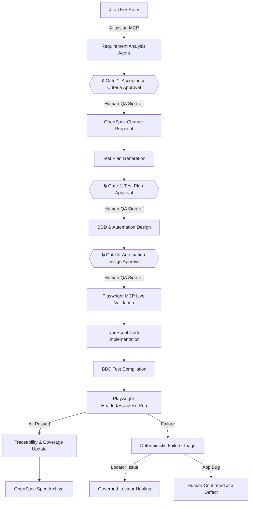
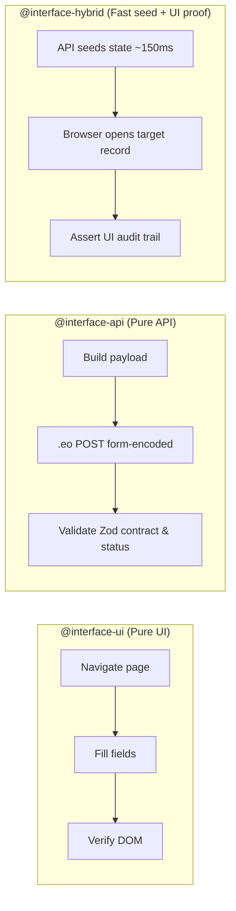
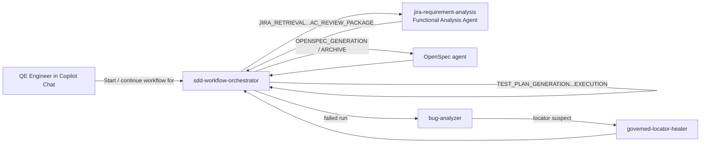
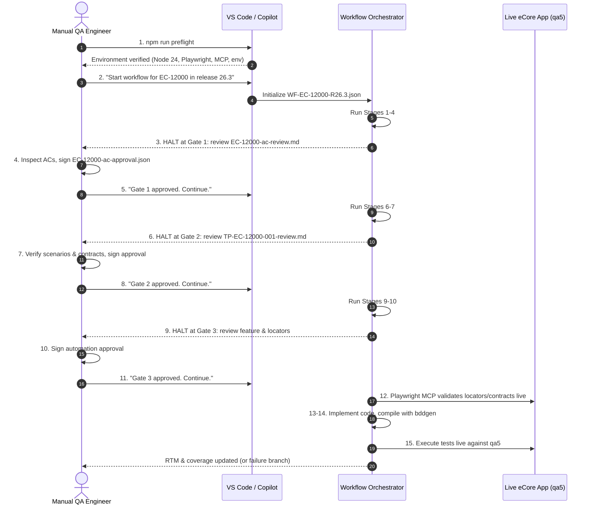
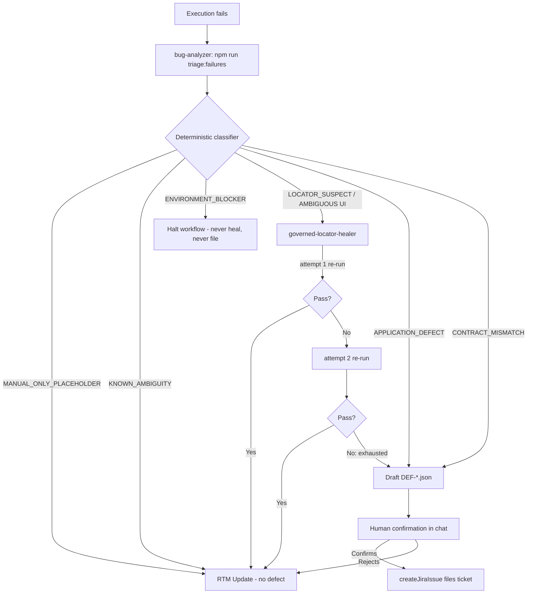
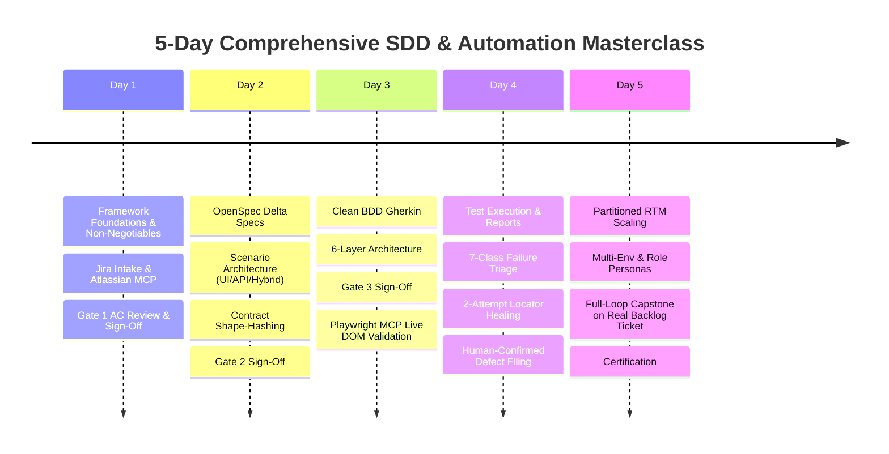

# Manual QA Training & Operations Playbook

**Orchestrator-Driven, Spec-Driven Playwright-BDD Automation Framework**

**Status: Final.** This is the single, authoritative training and operations guide for this
framework. It is written to be **used repeatedly, not read once** — every section is designed to
support the recurring Watch → Learn → Hands-on → Apply to real work → Review → Repeat training
loop in [§20](#20-continuous-qa-training-cycle-watch-learn-hands-on-apply-review-repeat), applied
against real QE tickets, not just reference stories.

A complete, production-grade training guide and operational manual for **Manual QA Engineers, QA
Leads, Product Owners, and Automation Engineers**. It covers the core concepts of the framework, why
it exists, how every agent and skill in it works, and exactly how to operate it day to day from VS
Code.

> **Core concepts, in three paragraphs**
> - **What is SDD (Spec-Driven Development)?** Every change starts from an approved, machine- and
>   human-readable specification — not from a developer's or an agent's private understanding of the
>   requirement. The specification is written and approved *before* a test or a line of automation
>   code exists, and every test/code artifact is checked against it, never the other way around.
> - **What is OpenSpec?** OpenSpec is the tool that authors and version-controls that specification:
>   a **delta change** (`openspec/changes/<change>/`) describing exactly what's new or different for
>   this story, folded on completion into a **living spec** (`openspec/specs/`) that always reflects
>   current, approved behaviour. Full detail in [§4](#4-the-role-of-openspec-from-delta-changes-to-living-specifications).
> - **Why this framework is required:** a raw Jira story, left ungoverned, either stays manual
>   forever (slow, inconsistent, hard to scale past a few hundred tests) or gets automated by an
>   unsupervised AI agent (fast, but it will guess business rules, invent locators, and quietly mark
>   things as passing that never ran). This framework is the middle path: an
>   **orchestrator-driven workflow** that lets AI agents draft the repetitive parts at speed, while
>   **three mandatory human approval gates** keep every business rule, locator, API contract, and
>   defect under human judgement — see the five non-negotiable rules in
>   [§1.2](#12-the-five-non-negotiable-rules) and why WK specifically needs this in
>   [§1.4](#14-why-wolters-kluwer-is-adopting-this-model).

---

## Table of Contents

1. [Executive Summary & Framework Vision](#1-executive-summary--framework-vision)
2. [What is Spec-Driven Development (SDD) & OpenSpec?](#2-what-is-spec-driven-development-sdd--openspec)
3. [Why Wolters Kluwer Is Moving Toward This Model](#3-why-wolters-kluwer-is-moving-toward-this-model)
4. [Core Glossary, Stable ID Architecture & Traceability Model](#4-core-glossary-stable-id-architecture--traceability-model)
5. [The Role of OpenSpec: From Delta Changes to Living Specifications](#5-the-role-of-openspec-from-delta-changes-to-living-specifications)
6. [The Testing Spectrum: UI vs. API vs. HYBRID](#6-the-testing-spectrum-ui-vs-api-vs-hybrid)
7. [API Contract Governance, eCore RPC Architecture & Shape-Hashing](#7-api-contract-governance-ecore-rpc-architecture--shape-hashing)
8. [The 3 Human Approval Gates: Deep-Dive & Operator Manual](#8-the-3-human-approval-gates-deep-dive--operator-manual)
9. [The End-to-End 18-Stage Workflow & Orchestration Layer](#9-the-end-to-end-18-stage-workflow--orchestration-layer)
10. [Workflow Mechanics: Durable State, Locking, Idempotency & Entry Points](#10-workflow-mechanics-durable-state-locking-idempotency--entry-points)
11. [Complete Agent & Tooling Roster](#11-complete-agent--tooling-roster)
12. [MCP Deep-Dive: Playwright MCP & Jira MCP](#12-mcp-deep-dive-playwright-mcp--jira-mcp)
13. [Ambiguities (`AMB-*`), Execution Blockers (`BLOCKER-*`) & Escalation Notes](#13-ambiguities-amb-execution-blockers-blocker--escalation-notes)
14. [Step-by-Step QA Operating Playbook: From Story Intake to Verified Suite](#14-step-by-step-qa-operating-playbook-from-story-intake-to-verified-suite)
15. [Test Execution, Multi-Environment Profiles, Scoping & Second-Identity Roles](#15-test-execution-multi-environment-profiles-scoping--second-identity-roles)
16. [Deterministic Failure Triage, Governed Locator Healing & Defect Logging](#16-deterministic-failure-triage-governed-locator-healing--defect-logging)
17. [Reports, Metrics, Capability-Partitioned RTM & Scaling to 3,000+ Tests](#17-reports-metrics-capability-partitioned-rtm--scaling-to-3000-tests)
18. [Architecture, Six-Layer Design, Governance Rules (`SEM-*`) & Environment Gotchas](#18-architecture-six-layer-design-governance-rules-sem--environment-gotchas)
19. [Where Existing Tests Live & How Tests Migrate to the New Framework](#19-where-existing-tests-live--how-tests-migrate-to-the-new-framework)
20. [How This Fits the QE Lifecycle & What Changes for QE Engineers Day-to-Day](#20-how-this-fits-the-qe-lifecycle--what-changes-for-qe-engineers-day-to-day)
21. [Day-to-Day Guide: Operating VS Code with OpenSpec & SDD](#21-day-to-day-guide-operating-vs-code-with-openspec--sdd)
22. [5-Day Comprehensive Masterclass Training Curriculum (Watch → Learn → Hands-on → Apply → Review → Repeat)](#22-5-day-comprehensive-masterclass-training-curriculum-watch--learn--hands-on--apply--review--repeat)
23. [Full Worked Hands-On Exercise: Taking One Real QE Ticket End-to-End](#23-full-worked-hands-on-exercise-taking-one-real-qe-ticket-end-to-end)
24. [Frequently Asked Questions & Cross-Examination Defense Guide](#24-frequently-asked-questions--cross-examination-defense-guide)
25. [Quick Reference Card](#25-quick-reference-card)

---

## 1. Executive Summary & Framework Vision

### 1.1 The Core Mission
This framework bridges the historic divide between **Manual QA domain expertise** and **Automated
Test Execution**. It takes a raw Jira user story and transforms it into an approved, traceable, and
executable Playwright-BDD test suite through a **durable, resumable, agent-driven workflow with
three mandatory human approval gates**.

Put simply: today, a manual QA engineer reads a Jira story, writes test cases by hand (in a
spreadsheet, TestRail, or personal notes), and either executes them manually forever or hands them
to an automation engineer to hand-code weeks later. Both paths are slow, inconsistent between
testers, and leave no durable, checkable link between *what the business asked for* and *what the
test actually checks*. This framework closes that gap: **one durable workflow**, driven by AI
agents but **gated by humans**, produces an unbroken chain of evidence from the Jira story all the
way to a passing (or honestly failing) Playwright execution — and every link in that chain is a real
file on disk that can be opened, diffed, and audited, not a claim made in a chat window.

The core premise:
> **AI agents write the repetitive code and probe live applications, but human QA engineers retain
> absolute governance over business rules, acceptance criteria, test designs, locator safety, and
> defect reporting.**

What that means for each audience in this room:
- **If you're new to this:** you will spend far less time typing boilerplate Gherkin and locator
  code, and far more time reading, judging, and signing off on what an agent has already drafted —
  the skill you're building is *review and governance*, not typing speed.
- **If you're already an expert automation engineer:** you keep 100% authority over every business
  rule, every locator, and every filed bug. Nothing here removes your judgement — it removes the
  manual typing between *"I know what to test"* and *"the test exists, runs, and is traceable."*
- **If you're a QA Lead or manager:** you get a machine-checkable, always-current
  requirements-to-execution trace for every story, without asking anyone to keep a spreadsheet up to
  date, and without trusting a status update that nobody can independently verify.



### 1.2 The Five Non-Negotiable Rules
Enforced programmatically by [src/utils/semantic-rules.ts](../src/utils/semantic-rules.ts) and the
Zod models. Violating any of them fails `npm run validate:artifacts`.

1. **A chat message is never an approval.** An approval only exists when a schema-valid JSON
   artifact (e.g., `requirements/approved/EC-12000-ac-approval.json`) is written to disk.
2. **Never invent a business rule.** No role, error message, boundary limit, timeout, or security
   policy may be invented by an AI agent. Missing facts are escalated as `AMB-*` ambiguities.
3. **Never fabricate a passing result.** No scenario reports `PASSED` without a real execution
   record. A coverage metric whose denominator is zero is `null` — never 0% and never 100%.
4. **Never guess a locator or an API contract.** Unverified selectors stay
   `MCP_VALIDATION_REQUIRED`; unverified endpoints stay `API_CONTRACT_UNVERIFIED` until validated
   through Playwright MCP.
5. **No agent approves its own output.** Every gate needs a human signature; a defect is filed to
   Jira only after a human confirms the composed bug in chat.

### 1.3 Who This Guide Serves

| Role | What you get from this guide |
| :--- | :--- |
| **Manual QA Engineer** | How to drive the workflow from VS Code Copilot Chat, review and sign each gate, scope and execute tests, interpret failure triage reports, and escalate blockers without coding. |
| **QA Lead / Manager** | Complete governance model, honest RTM coverage semantics, scaling architecture to 3,000+ tests, team onboarding cycles, and audit traceability compliance. |
| **Product Owner** | How requirements are analyzed, how ambiguities (`AMB-*`) surface for business clarification, and where your decisions are immutably recorded. |
| **Automation Engineer** | Layering rules, API contract shape-hashing, Playwright MCP live DOM validation, 2-attempt locator healing guardrails, and runtime environment safety. |

---

## 2. What is Spec-Driven Development (SDD) & OpenSpec?

### 2.1 The Core Paradigm of SDD
**Spec-Driven Development (SDD)** is an engineering and quality methodology where **every software
change and automated test originates from an explicit, machine-readable, and human-approved
specification** — rather than an engineer's or an AI agent's private mental model of what the code
should do.

In traditional development, requirements exist as loose text in Jira tickets, Confluence pages, or
meeting notes. Developers interpret them into code, and QA engineers interpret them into tests. Over
time, the code evolves, the tests drift, the Jira ticket is closed, and nobody knows what the true
intended behaviour of the system is.

In **Governed SDD**:
1. **The Specification Precedes the Code:** No automation script, step definition, or page object is
   authored until a structured specification of the delta change has been validated and approved.
2. **The Specification is the Single Source of Truth:** Both test assertions and application code are
   judged against the approved specification.
3. **Living Documentation:** When a feature is completed, its delta specification is folded into a
   central repository of living specifications that stay permanently up to date.

```
Traditional Development:
  Jira Story ──► Developer Interpretation ──► Code
       │
       └───────► QA Interpretation ─────────► Disconnected Test (High Drift Risk)

Spec-Driven Development (SDD):
  Jira Story ──► Approved Spec (OpenSpec) ──┬──► Living Documentation
                                           └──► Traceable Automated Test (Zero Drift)
```

### 2.2 What is OpenSpec?
**OpenSpec** is the open-standard specification toolset and format (powered by the pinned CLI
`@fission-ai/openspec`) used in this framework to author, validate, and archive living specifications.

OpenSpec structures changes into two distinct lifecycle artifacts:
- **Delta Changes (`openspec/changes/<change-name>/`):** Active, in-flight changes being proposed,
  designed, and tested for a specific user story.
- **Living Specs (`openspec/specs/<capability>/<spec-name>/spec.md`):** Permanent, version-controlled
  specifications representing the verified, current behavior of the application.

An OpenSpec change consists of four standardized files:
- **`proposal.md`:** The *why* — business motivation, user personas, high-level capabilities, and
  expected outcomes.
- **`specs/<capability>/<spec-name>/spec.md`:** The *what* — exact behavioral requirements formatted
  as Gherkin-aligned specifications (diffs showing what is added, modified, or removed).
- **`design.md`:** The *how* — architectural decisions, interface choices (`UI`/`API`/`HYBRID`),
  data models, and security boundaries.
- **`tasks.md`:** The *steps* — implementation checklist tracking concrete milestones from spec
  creation to test execution.
- **`.openspec.yaml`:** Schema and timestamp metadata governing the change.

### 2.3 Why OpenSpec Replaces Stale Documentation
- **Machine-Validatable:** Every change is checked with `npx openspec validate <change-name> --strict`.
  Broken references or schema violations fail instantly.
- **Version-Controlled Alongside Code:** Living specs live in the Git repository, branch with the
  code, and merge through pull requests.
- **Immutable Archival:** When a story passes execution, `npx openspec archive <change-name>` folds
  the delta into the living spec and date-stamps the change folder (e.g.
  `openspec/changes/archive/2026-09-18-add-home-navigation/`).

---

## 3. Why Wolters Kluwer Is Moving Toward This Model

Wolters Kluwer operates in mission-critical, regulated legal, tax, and healthcare domains where
software defects and compliance failures carry severe financial, legal, and reputational consequences.
The move to this framework is driven by four strategic imperatives:

### 3.1 Scaling to 3,000+ Tests Without Linear Headcount Growth
- Traditional QA scaling requires hiring more manual testers or automation engineers in direct
  proportion to feature growth.
- This framework leverages AI agents for the labor-intensive drafting of requirements, scenarios,
  Gherkin features, locators, and API contracts — allowing a single QA engineer to govern, review,
  and execute 5x to 10x more coverage with higher consistency.
- Capability-partitioned RTMs and indexed lookups ensure that maintaining 3,000+ tests does not
  degrade into unmanageable monolithic test suites.

### 3.2 Speed with Uncompromising Quality and Governance
- Ungoverned GenAI code-assistants hallucinate business rules, guess locators, invent endpoints, and
  silently falsify pass results to satisfy prompts.
- This framework establishes **Three Mandatory Human Approval Gates** enforced by file-system
  validation. An AI agent is never permitted to approve its own work or invent a business policy.
- Speed is achieved during generation; absolute safety is maintained during approval.

### 3.3 Regulatory Auditability and End-to-End Traceability
- Regulated products (like eCore and SmartSign+) require proof that every deployed feature was
  tested against explicit business requirements.
- The framework creates a permanent, immutable chain of custody:
  $$\text{Jira Story} \longrightarrow \text{REQ-*} \longrightarrow \text{AC-*} \longrightarrow \text{TS-*} \longrightarrow \text{TRC-*} \longrightarrow \text{Real Execution Record}$$
- Every artifact is a schema-valid JSON/Markdown file committed to Git, enabling instant audit
  reporting without manual spreadsheet reconciliation.

### 3.4 Consistency, Knowledge Retention & Unified Cross-Product Standards
- Manual test cases written in different styles across disparate tools leave severe knowledge silos
  when engineers rotate or leave.
- Standardized stable IDs and structured templates guarantee that artifacts look identical regardless
  of who authored them.
- This exact same SDD/OpenSpec model is shared across Wolters Kluwer platforms (eCore and the
  `ssp-specs` SmartSign+ ecosystem), allowing QE engineers to move across teams with zero
  process re-training.

---

## 4. Core Glossary, Stable ID Architecture & Traceability Model

Every artifact in this framework carries an immutable, regex-validated **Stable ID** (defined in
[src/models/common.model.ts](../src/models/common.model.ts)). Merges and updates are always
performed by key, never by position or array index.

```
                                  +-----------------------+
                                  |   JIRA STORY KEY      |  (e.g., EC-12000)
                                  +-----------------------+
                                              |
                     +------------------------+------------------------+
                     |                                                 |
                     v                                                 v
         +-----------------------+                         +-----------------------+
         |   REQUIREMENT ID      |                         |  AMBIGUITY ID         |
         |   REQ-EC-12000-001    |                         |  AMB-EC-12000-001     |
         +-----------------------+                         +-----------------------+
                     |
                     v
         +-----------------------+
         |  ACCEPTANCE CRITERION |
         |   AC-EC-12000-001     |
         +-----------------------+
                     |
                     v
         +-----------------------+                         +-----------------------+
         |  TEST SCENARIO ID     | ----------------------> |  TRACEABILITY ID      |
         |   TS-EC-12000-001     |                         |  TRC-EC-12000-001     |
         +-----------------------+                         +-----------------------+
                     |                                                 |
                     +------------------------+------------------------+
                                              |
                                              v
                                  +-----------------------+
                                  |  APPROVAL ARTIFACT    |
                                  |  APR-AC-EC-12000-001  |
                                  |  APR-TP-EC-12000-001  |
                                  |  APR-AD-EC-12000-001  |
                                  +-----------------------+
```

### 4.1 Stable ID Reference Table

| Artifact Type | ID Pattern | Real Example | What It Represents |
| :--- | :--- | :--- | :--- |
| **Jira Story** | `[A-Z]+-[0-9]+` | `EC-12000`, `ETA-351` | Parent business user story in Jira. |
| **Requirement** | `REQ-<STORY>-<nnn>` | `REQ-EC-12000-001` | A normalized, discrete business requirement. |
| **Acceptance Criterion** | `AC-<STORY>-<nnn>` | `AC-EC-12000-002` | An extracted or proposed condition of satisfaction. |
| **Ambiguity** | `AMB-<STORY>-<nnn>` | `AMB-EC-12000-001` | An unresolved question or missing business rule. |
| **Execution Blocker** | `BLOCKER-<STORY>-<nnn>` | `BLOCKER-EC-12000-004` | Environment/data/app defect blocking execution. |
| **Test Plan** | `TP-<STORY>-<nnn>` | `TP-EC-12000-001` | The parent test plan. |
| **Test Scenario** | `TS-<STORY>-<nnn>` | `TS-EC-12000-003` | A single business test scenario. |
| **Traceability Clarification** | `CLR-TP-<STORY>-<nnn>` | `CLR-TP-EC-12000-002` | A clarification raised by the test plan itself. |
| **Test-Plan Risk** | `RISK-TP-<STORY>-<nnn>` | `RISK-TP-EC-12000-001` | A risk recorded against a plan. |
| **Approval Artifact** | `APR-{AC\|TP\|AD}-…` | `APR-AC-EC-12000-001` | The human QA sign-off recorded on disk. |
| **Traceability Trace** | `TRC-<STORY>-<nnn>` | `TRC-EC-12000-001` | RTM link: requirement → code → execution. |
| **Defect Report** | `DEF-<STORY>-<nnn>` | `DEF-ETA-411-001` | A triaged defect artifact ready for Jira filing. |

> **ID immutability rule:** `REQ-*`, `AC-*` and `TS-*` IDs are story-scoped and never renamed or
> shared — even when a scenario is reused across stories (see [§6.5](#65-cross-story-scenario-reuse)).

---

## 5. The Role of OpenSpec: From Delta Changes to Living Specifications

### 5.1 What is OpenSpec?
**OpenSpec** is the specification authority. Instead of tests written against closed Jira tickets
that leave no record of intended behaviour, OpenSpec maintains **Living Specifications**.

1. **Delta Changes (`openspec/changes/<change-name>/`)** drafted at Stage `OPENSPEC_GENERATION`:
   - `proposal.md` — business intent and user context.
   - `specs/<capability>/<spec-name>/spec.md` — the exact behavioural delta (a *diff*, not the
     current state).
   - `design.md` — technical/architectural decisions.
   - `tasks.md` — implementation breakdown.
   - `.openspec.yaml` — change metadata (`schema`, `created`).
2. **Strict Validation:** `npx openspec validate <change-name> --strict`.
3. **Living Spec Archival (`openspec/specs/`)** at Stage `OPENSPEC_ARCHIVE`: `npx openspec archive
   <change-name>` folds the delta into the root spec and moves the change to a **date-stamped**
   archive folder, e.g. `openspec/changes/archive/2026-09-18-add-home-navigation/`.

```
       NEW JIRA STORY
             │
             ▼
[OPENSPEC_GENERATION]
  └─► Delta Spec: openspec/changes/track-paper-out-media-type/
             │
             ▼
[Test Plan → Implementation → Execution → RTM]
             │
             ▼
[OPENSPEC_ARCHIVE]
  ├─► Living Spec: openspec/specs/paper-out-export/<spec-name>/spec.md
  └─► Retired change: openspec/changes/archive/<YYYY-MM-DD>-<change-name>/
```

> **The CLI is the only writer.** Never hand-edit `openspec/specs/` and never move a change directory
> manually. Archiving is documentation lifecycle only — it moves **no** feature file and changes
> **no** tag, so every scenario in `features/approved/**` keeps running exactly as before.

### 5.2 Archive discipline
- Archive **only** after the RTM records a real passing execution for the story.
- A story with **deferred** ACs is archived for the **delivered** ones only; deferred ACs stay
  visible as open work and are never silently dropped.
- RTM entries carry `openSpecRefs`; after archival those refs are repointed from the change path to
  the living-spec path (`SEM-RTM` enforces this).

---

## 6. The Testing Spectrum: UI vs. API vs. HYBRID

This framework supports **UI, API, and HYBRID** scenarios inside the same Gherkin syntax, selected
by an `@interface-` tag. **A missing `@interface-` tag means UI**, so every file written before API
support existed is still valid.



### 6.1 `@interface-ui` — Pure Browser Automation
Drives the full browser lifecycle (`page.goto`, `click`, `fill`). Uses accessible locators
(`getByRole` → `getByLabel` → `getByPlaceholder` → `getByText` → `getByTestId`). Never brittle CSS or
raw XPath.

### 6.2 What eCore's API surface actually is
eCore is a **server-rendered Java application** — do not assume a REST API exists.
- **Sign-in is a form POST returning `302`**: no login endpoint, no token, no JSON body.
- The only AJAX lives under `/ssweb/setup/workspace/**/ajax/`, is RPC-style verbs ending in `.eo`,
  and takes **form-encoded** requests.
- Two traps: `submitTransactionSearch.eo` returns an **HTML fragment**; `getWorkspaceTableData.eo`
  returns a DataTables envelope in which **every business field is an HTML string**. Either can seed
  state; neither may judge an acceptance criterion.
- ~178 further `.eo` paths are **declared** in markup but **never exercised** → `UNVERIFIED`. A path
  appearing in that list is **not** permission to call it. Several are irreversible against shared QA
  data (`deleteTransaction`, `voidDocument`, `authorizeDestruction`).

### 6.3 `@interface-api` — Direct Backend RPC Execution
Executes fast form-encoded `.eo` requests via typed clients in `src/api/` (each extends `ApiClient`
in [src/api/api-client.ts](../src/api/api-client.ts), e.g.
[src/api/eo-request-export.client.ts](../src/api/eo-request-export.client.ts)) and validates the
**whole** response against a Zod contract in `src/models/api/` (e.g.
[src/models/api/eo-export.model.ts](../src/models/api/eo-export.model.ts)). Spot-checking three
fields and ignoring forty is the API version of a test that never looked.

### 6.4 `@interface-hybrid` — The High-Speed Production Pattern
- **Problem:** building preconditions through the UI (login → 5 menus → search → create → approve)
  costs 60+ seconds per test.
- **Solution:** a step issues a direct `.eo` call to seed state in ~150ms, then the browser verifies
  the user-facing outcome (e.g. the audit trail in the Document History modal).
- **Governance:** the API step is **scaffolding only** — it reaches a state, it never proves one.
  The human-approved acceptance criterion is judged by the UI, until a human promotes the observed
  contract to `HUMAN_APPROVED`.

### 6.5 Cross-story scenario reuse
Before authoring a new scenario, the agent checks the capability RTM and
[traceability/index/lookup.index.json](../traceability/index/lookup.index.json) for an existing
scenario covering the same behaviour in another story.
- A matching **title is never proof of equivalence** — AC text, Gherkin behaviour, `interfaceType`,
  data classification and release/requirement version must all match.
- Reuse is **proposed, never assumed**: `scenarioAction: REUSE` + a `reuseSource`
  (`sourceJiraStoryId`, `sourceTestScenarioId`, `matchedLayers`, `rationale`, `status: PROPOSED`).
- It becomes usable only when a human sets `reuseSource.status = CONFIRMED` at Gate 2.
  `SEM-TEST-REUSE` fails an `APPROVED` plan carrying a still-`PROPOSED` claim.

---

## 7. API Contract Governance, eCore RPC Architecture & Shape-Hashing

To stop agents guessing APIs or cementing product bugs as "correct":

| Provenance | Meaning | Can it back an AC assertion? |
| :--- | :--- | :--- |
| `API_CONTRACT_UNVERIFIED` | Placeholder; nothing has confirmed it. | ❌ |
| `OBSERVED` | Captured from live traffic during MCP exploration — what the app *does*. | ❌ (can seed state only) |
| `AGENT_DRAFTED` (`UNVERIFIED`) | Drafted only when a human explicitly asks and confirms twice; records `DICTATED:`/`PROPOSED:` fields. | ❌ |
| `HUMAN_APPROVED` | Human confirmed endpoint, params, status at Gate 2. | ✅ |
| `OPENAPI` | Sourced from an OpenAPI document. | ✅ |

- A `HUMAN_APPROVED` contract must record a **`responseShapeHash`** from `computeResponseShapeHash`
  in [src/utils/api-contract-shape.ts](../src/utils/api-contract-shape.ts). The hash covers **keys
  and types only** (not values/ids/row counts, which change every run), so real drift is caught
  without false alarms.
- `SEM-API-CONTRACT` fails the build when an `@interface-` tag and its plan disagree, or when an
  approved plan asserts against a non-authoritative contract.

---

## 8. The 3 Human Approval Gates: Deep-Dive & Operator Manual

The workflow **halts immediately** at each gate. No agent can bypass one.

```
 🔒 GATE 1 — ACCEPTANCE CRITERIA        halts after AC_REVIEW_PACKAGE
    Review:  requirements/reviews/<STORY>-ac-review.md
    Sign:    requirements/approved/<STORY>-ac-approval.json
 🔒 GATE 2 — TEST PLAN                   halts after TEST_PLAN_GENERATION
    Review:  test-plans/generated/<TP-ID>-review.md
    Sign:    test-plans/approved/<TP-ID>-approval.json
 🔒 GATE 3 — AUTOMATION DESIGN           halts after AUTOMATION_REVIEW_PACKAGE
    Review:  features/generated/<cap>/<TP-ID>-automation-design.md
    Sign:    features/approved/<cap>/<TP-ID>-automation-approval.json
```

### 8.1 What is an approval gate, conceptually?
Think of a gate as a **mandatory checkpoint that the workflow physically cannot pass without a
specific file existing on disk**. It is not a Jira status, not a Slack thumbs-up, and not a chat
reply saying "looks good" — the orchestrator checks the filesystem, not the conversation. If the
approval file (`APR-*`) is missing, absent, or fails schema validation, the workflow stays halted at
that stage no matter what anyone says in chat. This is deliberate: a gate can never be skipped by
accident, under time pressure, or because an agent "was sure it was fine."

There are exactly three gates, placed at the three points where a wrong guess is most expensive to
fix later: **what** to test (Gate 1, the requirement itself), **how thoroughly** to test it (Gate 2,
scenario coverage and interface choices), and **exactly what the automation will click, type, and
call** (Gate 3, the concrete implementation plan). Passing a gate does not certify that the work
downstream is bug-free — it certifies that a named human took responsibility for the decision at
that specific checkpoint, which is exactly what makes the framework auditable.

### 8.2 How to actually operate a gate, step by step
This sequence is identical for all three gates — only the file names change:
1. **Wait for the halt.** The orchestrator announces which review package it produced and that it is
   now halted (e.g. *"Halted at Gate 2 — review `test-plans/generated/TP-EC-12000-001-review.md`"*).
2. **Open the review package first**, not the underlying JSON — it's written in plain Markdown
   specifically so a reviewer can read it without needing a code-editor mindset.
3. **Cross-check it against the real source of truth** — the actual Jira story for Gate 1, the
   approved requirements for Gate 2, the approved test plan for Gate 3. Never approve because the
   document "reads well"; approve because it matches reality.
4. **Make a per-item decision**, not a single yes/no for the whole package. Most templates support
   item-level decisions (`APPROVE` / `REJECT` / `DEFER` / `REQUEST_CHANGES`) — only `APPROVE` items
   flow downstream, so a 90%-good package doesn't force an all-or-nothing call.
5. **Copy the matching `*-approval.template.json` to its approved path**, fill in `reviewer`,
   `reviewedAt`, `decision`, and item-level notes, and **save it to disk**.
6. **Run `npm run validate:artifacts` yourself** before telling the agent to continue — catching a
   schema mistake yourself is faster than waiting for the orchestrator to reject it.
7. **Tell the orchestrator to continue** (e.g. *"Gate 2 approved, continue"*) — the next stage only
   runs because the file exists, never because of the sentence you typed.

### 8.3 Gate 1 — Acceptance Criteria Review Checklist
**QA checklist:**
- Are all Jira ACs captured verbatim in `extractedCriteria`?
- Are proposed edge criteria valid, necessary, and justified with clear rationales?
- Is every `AMB-*` ambiguity accurately stated and escalated to the Product Owner?
- **Sign-off:** copy the `*-ac-approval.template.json` to `requirements/approved/<STORY>-ac-approval.json`,
  set item decisions, add reviewer + timestamp.

### 8.4 Gate 2 — Test Plan Review Checklist
**QA checklist:**
- Is there 100% scenario coverage across Gate 1 ACs?
- Are interface types (`UI`, `API`, `HYBRID`, `MANUAL_ONLY`) correctly assigned?
- Does each `API`/`HYBRID` scenario carry a contract, and is each `OBSERVED` contract promoted to
  `HUMAN_APPROVED` with a computed `responseShapeHash`?
- Are physical/visual/non-reversible scenarios correctly designated as `MANUAL_ONLY`?
- Are cross-story `REUSE` claims verified against real behaviour, not just matching titles?
- Remember: An **API scenario adds coverage — it never silently replaces a UI scenario**.

### 8.5 Gate 3 — Automation Design Review Checklist
**QA checklist:**
- Is Gherkin written in pure business language (zero selectors, click coordinates, or technical
  method names in feature files)?
- Are all six mandatory tags present: `@release-`, `@capability-`, `@req-`, `@ac-`, `@tp-`, `@ts-`
  plus `@interface-`?
- Does the locator hierarchy follow accessible roles (`getByRole` → `getByLabel` → `getByPlaceholder`
  → `getByText` → `getByTestId`)?
- Are destructive actions safeguarded with `CLEANUP -` waivers?
- Feature files stay in `features/generated/` until Gate 3 sign-off — only `features/approved/` is
  compiled into `.features-gen/` by `bddgen`.

> **Decision granularity:** only items with an item-level `APPROVE` flow downstream. `REJECT`,
> `DEFER` and `REQUEST_CHANGES` are excluded and recorded in the RTM with the matching status.
> `REQUEST_CHANGES` returns the workflow to the generating stage and increments `retryCount`.

---

## 9. The End-to-End 18-Stage Workflow & Orchestration Layer

The orchestration layer
([workflow/definitions/sdd-jira-to-automation.workflow.json](../workflow/definitions/sdd-jira-to-automation.workflow.json))
runs **one stage per invocation**, then persists state. The linear happy path has 15 stages through
`EXECUTION`; a conditional **failure-handling branch** inserts `FAILURE_TRIAGE`,
`LOCATOR_HEALING`/`BUG_REPORTING` before `RTM_UPDATE`. An all-green run skips the failure branch.

```
[1 JIRA_RETRIEVAL] → [2 REQUIREMENT_NORMALIZATION] → [3 AC_ANALYSIS] → [4 AC_REVIEW_PACKAGE]
      → 🔒[5 AC_APPROVAL] → [6 OPENSPEC_GENERATION] → [7 TEST_PLAN_GENERATION]
      → 🔒[8 TEST_PLAN_APPROVAL] → [9 BDD_DESIGN] → [10 AUTOMATION_REVIEW_PACKAGE]
      → 🔒[11 AUTOMATION_APPROVAL] → [12 PLAYWRIGHT_VALIDATION] → [13 IMPLEMENTATION]
      → [14 BDD_GENERATION] → [15 EXECUTION]
             │
   ┌─────────┴─────────────────────────────┐
   │ (all passed)                          │ (any failed)
   ▼                                        ▼
[RTM_UPDATE] → [OPENSPEC_ARCHIVE] → DONE   [FAILURE_TRIAGE]
                                             ├─ LOCATOR_SUSPECT/AMBIGUOUS → [LOCATOR_HEALING] ─ healed → [RTM_UPDATE]
                                             │                                              └ not healed(×2) → [BUG_REPORTING]
                                             ├─ APPLICATION_DEFECT / CONTRACT_MISMATCH → [BUG_REPORTING] → [RTM_UPDATE]
                                             ├─ MANUAL_ONLY_PLACEHOLDER / KNOWN_AMBIGUITY → [RTM_UPDATE] (no defect)
                                             └─ ENVIRONMENT_BLOCKER → HALT (never healed, never filed)
```

### 9.1 Stage Reference Table

| Stage | Owner Agent | Key Inputs | Key Outputs | Quality Function |
| :--- | :--- | :--- | :--- | :--- |
| `JIRA_RETRIEVAL` | `jira-requirement-analysis` | Jira key | `requirements/raw/<STORY>.json` | Fetch verbatim snapshot via Atlassian MCP. |
| `REQUIREMENT_NORMALIZATION` | `jira-requirement-analysis` | raw JSON | `requirements/normalized/<STORY>.json` | Assign stable `REQ-*` IDs. |
| `AC_ANALYSIS` | `jira-requirement-analysis` | normalized JSON | (same, enriched) | Extract verbatim `AC-*`, flag `AMB-*`. |
| `AC_REVIEW_PACKAGE` | `jira-requirement-analysis` | normalized JSON | `*-ac-review.md`, `*-ac-approval.template.json`, `*.rtm.proposed.json` | Build Gate 1 package. |
| **`AC_APPROVAL`** | **Human QA** | review package | `requirements/approved/<STORY>-ac-approval.json`, `<STORY>.json` | 🔒 Gate 1. |
| `OPENSPEC_GENERATION` | `OpenSpec` | Gate 1 approval | `openspec/changes/<change>/**` | Draft delta spec, tasks, design. |
| `TEST_PLAN_GENERATION` | `sdd-workflow-orchestrator` | approved reqs + change | `test-plans/generated/<TP-ID>.json` + review + template | Author `TS-*`, interface types, contracts. |
| **`TEST_PLAN_APPROVAL`** | **Human QA** | Gate 2 review | `test-plans/approved/<TP-ID>-approval.json`, `<TP-ID>.json` | 🔒 Gate 2; promote `OBSERVED`→`HUMAN_APPROVED`. |
| `BDD_DESIGN` | `sdd-workflow-orchestrator` | approved plan | `features/generated/<cap>/<feature>.feature` + design.md | Author tagged Gherkin. |
| `AUTOMATION_REVIEW_PACKAGE` | `sdd-workflow-orchestrator` | generated feature | design.md (final) + approval template | Build Gate 3 package. |
| **`AUTOMATION_APPROVAL`** | **Human QA** | Gate 3 review | `features/approved/<cap>/<TP-ID>-automation-approval.json` + `<feature>.feature` | 🔒 Gate 3. |
| `PLAYWRIGHT_VALIDATION` | `sdd-workflow-orchestrator` (drives Playwright MCP) | approved feature | `reports/validation/<TP-ID>-browser-validation.json` (+ `-api-validation.json`) | Validate locators/contracts live. |
| `IMPLEMENTATION` | `sdd-workflow-orchestrator` | validation reports | `steps/**`, `src/pages/**`, `src/components/**`, `src/api/**`, `src/models/api/**`, `src/fixtures/**`, `test-data/**` | Author layered code. |
| `BDD_GENERATION` | `sdd-workflow-orchestrator` | approved features + steps | `.features-gen/**` | `npm run bdd` compiles specs. |
| `EXECUTION` | `sdd-workflow-orchestrator` | `.features-gen/**` | `reports/playwright-report/**`, `traceability/executions/<EXEC-ID>.json` | Run live against `qa5`. |
| `FAILURE_TRIAGE` | `bug-analyzer` | `reports/execution/results.json` | `defects/<DEF-ID>.json`, `reports/defects/**` | Classify failures deterministically. |
| `LOCATOR_HEALING` | `governed-locator-healer` | defect | updated `src/pages/**`/`src/components/**` | Repair locators, capped at 2 attempts. |
| `BUG_REPORTING` | `bug-analyzer` | triaged defect | defect + `*.rtm.proposed.json` + Jira ticket | File bug after human confirmation. |
| `RTM_UPDATE` | `sdd-workflow-orchestrator` | execution record | `<cap>.rtm.json`, `<cap>.coverage.json`, `lookup.index.json`, history | Merge traceability & coverage. |
| `OPENSPEC_ARCHIVE` | `OpenSpec` | passing RTM | `openspec/specs/**`, `openspec/changes/archive/**` | Fold delta into living spec. |

> **PLAYWRIGHT_VALIDATION & IMPLEMENTATION ownership:** the orchestrator drives the `playwright-test`
> MCP tools directly (`browser_navigate`, `browser_snapshot`, `browser_click/type/select_option`,
> `browser_network_requests`) rather than delegating to the generic `playwright-test-planner` /
> `playwright-test-generator` sub-agents, whose built-in output does not match this framework's
> governed JSON reports or strict layering.

---

## 10. Workflow Mechanics: Durable State, Locking, Idempotency & Entry Points

### 10.1 Durable State Architecture
Each story+release has exactly one instance: `workflow/instances/WF-<STORY>-R<release>.json`
(validated by `workflow/definitions/workflow-state.schema.json`). Never infer state from chat — the
orchestrator always reads the instance file first. An append-only history log lives at
`workflow/history/<workflowId>.history.jsonl`.

### 10.2 Locking & Controlled Merge
A `processingLock` guards shared files. Delegated agents never write the RTM directly — they write
`<capability>.rtm.proposed.json`; the orchestrator validates, acquires the lock, merges by key,
validates with `npm run validate:rtm`, releases the lock, records history, and deletes the proposal.
Parallelism is allowed **only** when batches write to disjoint files.

### 10.3 Idempotency & Batching Guardrails
Every stage is idempotent and resumable. If an output already exists and its inputs are unchanged,
the stage is skipped. Work proceeds in controlled batches — **one story per invocation**, scenario
generation capped by the workflow's `maxScenariosPerInvocation` (10). Never process all stories or
all tests in one shot.

### 10.4 The Two Entry Points

| Entry Point | Starts At | When to use |
| :--- | :--- | :--- |
| `NEW_STORY` (default) | `JIRA_RETRIEVAL` | A story never processed before. |
| `TEST_STRATEGY_REVISION` | `TEST_PLAN_GENERATION` | Approved requirements unchanged, but tests must change (most commonly **adding API coverage** to an already-automated story). Re-enters at Gate 2; Gate 1 is **not** re-run. |

`TEST_STRATEGY_REVISION` reuses the same instance and **preserves prior evidence** first: it appends
a `WORKFLOW_RESTARTED` event and confirms the previous state is committed to version control before
resetting. The revised plan is a new `artifactVersion` of the same `TP-ID`, merged by
`testScenarioId`; existing scenarios are preserved, new ones added; an added API scenario must not
retire a UI scenario without explicit Gate 2 approval.

### 10.5 Read-Only Status Inspection
```powershell
npm run workflow:status   # summary of every workflow instance, no side effects
```

---

## 11. Complete Agent & Tooling Roster

### 11.1 How the Agents Work, in One Picture
The **`sdd-workflow-orchestrator`** is the only agent that owns workflow state. It reads the durable
instance file, runs **exactly one stage**, delegates that stage to a specialist agent when one
exists, persists the result, and halts at the next gate. No agent jumps ahead, and no agent invents
what a specialist agent hasn't produced.



### 11.2 The Functional Analysis Agent — `jira-requirement-analysis`
This is the agent QE meets first on every new story:
- Retrieves the Jira issue through the official Atlassian MCP (never guessing at description or ACs).
- Preserves the raw snapshot verbatim in `requirements/raw/<STORY>.json`.
- Normalizes requirement statements into stable `REQ-*` IDs.
- Extracts acceptance criteria verbatim as `AC-*`.
- Proposes additional criteria **only** with explicit, justified rationales (`PROPOSED_BY_REQUIREMENT_ANALYSIS`).
- Raises an `AMB-*` for every missing business rule or contradiction.
- **Stops at Gate 1** — it never approves its own extraction and never generates tests.

### 11.3 The Test-Case Generation Stage — `TEST_PLAN_GENERATION`
Test-case generation is a stage the `sdd-workflow-orchestrator` performs itself once Gate 1 is signed:
- Authors `TS-*` business scenarios mapping to approved ACs.
- Assigns interface types (`UI`, `API`, `HYBRID`, `MANUAL_ONLY`).
- Attaches API contracts where required and verifies shape hashes.
- Proposes cross-story reuse (`reuseSource`) when equivalent coverage exists in another story.
- Generic `playwright-test-planner` and `playwright-test-generator` sub-agents are tool-provided
  and remain available for scratchpad exploration, but are **never invoked** by the governed workflow.

### 11.4 Full Agent Inventory

| Agent | Role | When QE sees it |
| :--- | :--- | :--- |
| `sdd-workflow-orchestrator` | Owns state, stage sequencing, gates, and drives Playwright MCP directly at `PLAYWRIGHT_VALIDATION`/`IMPLEMENTATION`. | Every stage of every story. |
| `jira-requirement-analysis` | Functional analysis — extracts verbatim ACs, proposes edge criteria, flags ambiguities. | Stages 1–4, always halts at Gate 1. |
| `OpenSpec` | Drafts, validates, and archives the delta spec and living spec. | `OPENSPEC_GENERATION`, `OPENSPEC_ARCHIVE`. |
| `bug-analyzer` | Triages failed executions, classifies failures into 7 categories, drafts defects, and files Jira tickets upon human confirmation. | Any red run at `FAILURE_TRIAGE`/`BUG_REPORTING`. |
| `governed-locator-healer` | Governed locator repair in page objects; capped at exactly two attempts. | `LOCATOR_HEALING`. |
| `Explore` | Fast, read-only codebase Q&A. Safe to call anytime for research without state side-effects. | Whenever you need quick answers. |

### 11.5 Skills Inventory
Skills are reusable, prompt-driven playbooks with strict tool and behavioral constraints:

| Skill | Purpose |
| :--- | :--- |
| `openspec-propose` | Draft a complete new OpenSpec change (proposal + design + specs + tasks) in one step. |
| `openspec-apply-change` | Work through an OpenSpec change's task list during implementation. |
| `openspec-update-change` | Revise an existing change's planning artifacts and keep them coherent. |
| `openspec-sync-specs` | Fold an approved delta spec into the main living specs without archiving. |
| `openspec-archive-change` | Finalize and archive a completed change into the living specification. |
| `openspec-explore` | Thinking-partner mode for exploring architecture or requirements before proposing a change. |
| `playwright-mcp-validate` | Drive Playwright MCP against the live app to replace placeholders with verified locators/contracts. |
| `blocker-escalation-note` | Turn a recorded `BLOCKER-*`/`AMB-*` into a short, precise note for a PO, developer, or DevOps. |

### 11.6 How QE Interacts with the Agents
QE interacts with agents exclusively via natural language in VS Code Copilot Chat, backed by disk artifacts:
1. **Start or Resume:** *"Start the workflow for EC-12000 in release 26.3."* / *"Continue WF-EC-12000-R26.3."*
2. **Reviewing Artifacts:** Open and read the Markdown review packages (`*-ac-review.md`,
   `*-review.md`, `*-automation-design.md`) generated at each stage.
3. **Signing Gates:** Author or edit the approval JSON on disk and save it.
4. **Clarifying Ambiguities:** Provide the PO's answers directly in the Gate 1 approval artifact.
5. **Confirming Defects:** Explicitly reply in chat to authorize `bug-analyzer` to file a Jira ticket.

---

## 12. MCP Deep-Dive: Playwright MCP & Jira MCP

### 12.1 What is Model Context Protocol (MCP)?
**Model Context Protocol (MCP)** is an open standard that allows AI agents to securely invoke tools,
inspect systems, and retrieve structured data from external servers — replacing uncontrolled LLM
hallucinations with deterministic, real-world observations.

### 12.2 Playwright MCP: Live DOM & API Observation
**Playwright MCP** exposes a real Chromium browser instance to the agent via tool calls:
- `browser_navigate`: Opens real application pages.
- `browser_snapshot`: Captures the live accessibility tree (accessible roles, names, and states).
- `browser_click` / `browser_type` / `browser_select_option`: Exercises interactive elements live.
- `browser_network_requests`: Inspects actual HTTP/RPC traffic exchanged with the backend.

**Why this matters:**
- Rule 4 strictly forbids guessing selectors. An agent cannot "imagine" what the DOM looks like.
- Every locator in `src/pages/**` is confirmed against the live application at `PLAYWRIGHT_VALIDATION`.
- **Session Capture:** Running `npm run capture:session` performs a one-time login to generate
  `.auth/ecore-session.json`. The `seed` project resumes this session so live passwords never pass
  through LLM prompts during MCP exploration.

### 12.3 Jira MCP (Atlassian MCP Server): Verbatim Story Intake
**Atlassian MCP** connects the agent directly to the enterprise Jira instance:
- `getJiraIssue`: Retrieves the complete, raw issue payload (summary, description, custom fields, comments, attachments).
- `searchJiraIssuesUsingJql`: Discovers related issues, duplicate bugs, or existing coverage.
- `createJiraIssue`: Files human-confirmed bug reports with full failure evidence.

**The REST Fallback:**
- If Jira MCP is unavailable in a local session, `npm run jira:fetch -- <STORY>` acts as the
  documented fallback, downloading the issue snapshot into `reports/jira/` using environment credentials.

---

## 13. Ambiguities (`AMB-*`), Execution Blockers (`BLOCKER-*`) & Escalation Notes

### 13.1 Ambiguities (`AMB-*`)
An **Ambiguity (`AMB-*`)** is a structured, recorded gap where the Jira story is missing a critical
business rule (e.g. timeout duration, error text, user permission, or boundary limit).
- **Rule 2 Guardrail:** An agent is strictly forbidden from inventing a business rule. It must raise
  an `AMB-<STORY>-<nnn>`.
- **Resolution Flow:**
  1. Raised during `AC_ANALYSIS` and highlighted in `*-ac-review.md`.
  2. QE consults the Product Owner to obtain the definitive business decision.
  3. QE records the PO's decision in `requirements/approved/<STORY>-ac-approval.json`.
  4. The orchestrator folds the decision into the requirement model and test plan.

### 13.2 Execution Blockers (`BLOCKER-*`)
An **Execution Blocker (`BLOCKER-*`)** occurs when the business rule is understood, but the live
application, test environment, or data prevents execution (e.g., missing database record, locked UI
transaction, or destructive irreversible action).
- Handled via `blocker-escalation-note` to generate concise, actionable notes for developers or DevOps.
- Traceable scenarios blocked by environment issues are triaged as `KNOWN_AMBIGUITY` or
  `ENVIRONMENT_BLOCKER` — never logged as false application bugs.

---

## 14. Step-by-Step QA Operating Playbook: From Story Intake to Verified Suite

### 14.1 Beginner Primer: What is a Feature File and Step Definition?
- **Feature File (`features/approved/*.feature`):** Plain-English Gherkin scenarios (`Given`, `When`,
  `Then`) expressing user intent and business rules.
- **Step Definition (`steps/*.ts`):** Thin TypeScript functions mapping Gherkin phrases to page
  object actions.
- **Page Objects (`src/pages/*.ts`):** Encapsulated classes that own DOM locators and browser interactions.
- **API Clients (`src/api/*.ts`):** Typed classes that execute backend RPC calls and validate response schemas.

### 14.2 Operating Sequence



---

## 15. Test Execution, Multi-Environment Profiles, Scoping & Second-Identity Roles

### 15.1 Headless vs. Headed Execution
```powershell
# Headless (default CI/fast run)
npx bddgen; npx playwright test --grep "@EC-12000"

# Headed (opens Chrome browser window to watch execution live)
npx bddgen; npx playwright test --headed --grep "@EC-12000"
```

> **Reporter Trap:** Never pass `--reporter=list` or similar on a real run. CLI reporter flags
> completely replace the config reporter array, preventing `html` and `json` reports from being
> generated. Scope solely with `--grep`.

### 15.2 Targeted Tagged Execution

| Scope | Command |
| :--- | :--- |
| **Single scenario** | `npx playwright test --grep "@ts-TS-EC-12000-001"` |
| **Whole story** | `npx bddgen; npx playwright test --grep "@EC-12000"` |
| **Smoke** | `npm run test:smoke` |
| **Regression** | `npm run test:regression` |
| **Critical / high risk** | `npm run test:critical` |
| **API only** | `npx playwright test --grep "@interface-api"` |
| **Hybrid only** | `npx playwright test --grep "@interface-hybrid"` |

### 15.3 Multi-Environment Profiles
Configuration flows exclusively through [src/utils/env.ts](../src/utils/env.ts) — **never read
`process.env` directly** in application or test code.
- Multi-environment profiles live in `config/environments/<profile>.json` or `.env.<profile>`.
- Select a profile using `TEST_ENV_PROFILE=<name>` or `--env=<name>` CLI arguments, falling back to `.env`.
- Supported tiers: `local`, `dev`, `qa`, `uat`, `staging`, `prod` (defined in `TEST_ENVIRONMENTS`).

### 15.4 Second-Identity Roles
A scenario needing a secondary persona (e.g. an "Approver" or "Admin" distinct from the primary user)
uses `env.requireEcoreLoginAs('<ROLE>')` rather than hardcoding secondary credentials:
- Roles are declared non-secretly in `config/test-users.json` (pointing to an `envPrefix`).
- Secrets live exclusively in `.env` as `<envPrefix>_USERNAME` and `<envPrefix>_PASSWORD`.
- Agents are strictly forbidden from inventing roles; they must be declared by humans.

### 15.5 Captured Session for MCP Exploration (Never for Test Runs)
```powershell
npm run capture:session   # signs in once → .auth/ecore-session.json (git-ignored)
```
- The `seed` project resumes this captured session so passwords never pass through LLM tool calls.
- The `bdd` and `technical` test suites **always execute real sign-in** to validate the live authentication path.

### 15.6 Jira Access & REST Fallback
Jira integration is MCP-first. When running outside an MCP session:
```powershell
npm run jira:fetch -- EC-12000   # REST fallback snapshot into reports/jira/
```
The snapshot is purely raw input; promoting it into `requirements/raw/<STORY>.json` is governed by
Stage 1 (`JIRA_RETRIEVAL`).

### 15.7 Negative-Scenario Safety & Account Lockout Guardrails
The live eCore authentication system enforces account lockout policies after repeated invalid attempts.
- **Rule:** Negative paths (invalid passwords, malformed usernames) must **never** use real test accounts.
- They must use synthetic fabricated data from `test-data/<capability>.sample.json` (`dataClassification: SYNTHETIC_INPUTS`).
- Only valid, happy-path sign-in scenarios invoke `env.requireEcoreLogin()`.

---

## 16. Deterministic Failure Triage, Governed Locator Healing & Defect Logging



### 16.1 The Full 7-Class Triage Taxonomy
Failure triage ([src/utils/failure-triage.ts](../src/utils/failure-triage.ts)) is 100% deterministic,
evaluating failures in strict priority order:

1. **`MANUAL_ONLY_PLACEHOLDER`:** A step definition intentionally threw to keep a `MANUAL_ONLY`
   scenario traceable. Handled as expected behavior $\rightarrow$ routes directly to `RTM_UPDATE`. No `DEF-ID`.
2. **`KNOWN_AMBIGUITY`:** Error text cites an already-recorded `BLOCKER-*` or `AMB-*` awaiting human
   clarification $\rightarrow$ routes to `RTM_UPDATE`. No `DEF-ID`.
3. **`ENVIRONMENT_BLOCKER`:** DNS failure, TLS error, proxy refusal, or missing network config. The
   application was never reached $\rightarrow$ **HALT immediately**. Never healed, never logged as a bug.
4. **`CONTRACT_MISMATCH`:** API executed but payload violated the approved Zod contract or HTTP
   status code $\rightarrow$ routes to `BUG_REPORTING` (never enters locator healing).
5. **`LOCATOR_SUSPECT` (UI):** Element not found or timed out in a UI scenario $\rightarrow$ routes
   to `LOCATOR_HEALING` first.
6. **`APPLICATION_DEFECT`:** Application threw a visible 500 error or violated a business assertion $\rightarrow$ routes to `BUG_REPORTING`.
7. **`AMBIGUOUS` (UI Fallback):** Unclear UI failure $\rightarrow$ routes to `LOCATOR_HEALING` as a safety net.

### 16.2 The Two-Attempt Locator Healing Cap
`governed-locator-healer` operates under strict guardrails:
- May modify **only** locators and waits inside `src/pages/**` or `src/components/**`.
- **Forbidden:** Never touches feature files, step definitions, assertions, or test data.
- **Capped at exactly 2 attempts:** If re-running the failed scenario fails twice, the healer marks
  the issue `LOCATOR_UNHEALABLE`, reverts speculative edits, and hands off to `BUG_REPORTING`.

### 16.3 Human-Confirmed Defect Filing
- `bug-analyzer` composes the defect report (`defects/DEF-<STORY>-<nnn>.json`) containing runtime
  fingerprints, error traces, and screenshots.
- It presents the complete bug draft to the human in chat.
- **Mandatory Control Point:** The agent cannot call `createJiraIssue` until a human explicitly
  confirms in chat (*"Confirmed, please file"*).
- Duplicate fingerprints already marked `REPORTED` in `lookup.index.json` are classified `DUPLICATE`
  to prevent ticket spamming.

---

## 17. Reports, Metrics, Capability-Partitioned RTM & Scaling to 3,000+ Tests

### 17.1 Report Locations & Inspection

| Report | Location | Purpose & Command |
| :--- | :--- | :--- |
| **Playwright HTML Report** | `reports/playwright-report/index.html` | Visual execution report with step timings and screenshots (`npm run report`). |
| **Playwright JSON Results** | `reports/execution/results.json` | Raw execution payload consumed by triage and RTM scripts. |
| **Governed Execution Record** | `traceability/executions/<EXEC-ID>.json` | Permanent audit record of a verified execution run. |
| **Browser Code Coverage** | `reports/coverage/report/index.html` | V8 JS coverage report (`npm run coverage:open`). Informational only. |
| **Requirements Traceability Matrix** | `traceability/capabilities/<capability>.rtm.json` | Maps `REQ` $\rightarrow$ `AC` $\rightarrow$ `TS` $\rightarrow$ `TRC` $\rightarrow$ `EXEC`. |
| **Capability Coverage Matrix** | `traceability/capabilities/<capability>.coverage.json` | Granular breakdown of automated, manual, deferred, and blocked criteria. |
| **Validation Reports** | `reports/validation/validation-*.json` | Output of the 24 schema and semantic parity checks. |

### 17.2 Requirement Coverage vs. Browser Code Coverage (Honest Metrics)
- **Requirement Coverage (The True Metric):**
  $$\text{Actionable Coverage \%} = \frac{\text{Passed Actionable ACs}}{\text{Total Actionable ACs}} \times 100$$
  - If total actionable ACs is 0, coverage is reported as `null` (never 0% and never 100%).
- **Browser Code Coverage (Informational Only):**
  - Measures executed JavaScript bytecode in the browser.
  - **Never** used as evidence for requirement satisfaction. API-only tests execute 0% browser code
    but may provide 100% requirement coverage.

### 17.3 Capability Partitioning & Lookup Indexes (`byDefectId`)
To scale beyond 3,000+ tests without file locking bottlenecks or git merge conflicts:
- RTM and coverage matrices are split per business capability (e.g. `account-access.rtm.json`,
  `home-navigation.rtm.json`, `paper-out-export.rtm.json`).
- `traceability/index/lookup.index.json` maintains indexed lookups by story ID, scenario ID, trace ID,
  and defect ID (`byDefectId`) for $O(1)$ constant-time lookup.

### 17.4 Validation Scopes (`npm run validate:artifacts`)
Runs 24 structural, schema, and semantic checks:
```powershell
npm run validate:artifacts     # runs all 24 checks
npm run validate:requirements  # validates requirements & approvals
npm run validate:rtm           # validates RTM references and coverage integrity
npm run validate:automation    # validates locator hygiene and tag parity
```

---

## 18. Architecture, Six-Layer Design, Governance Rules (`SEM-*`) & Environment Gotchas

### 18.1 Strict Six-Layer Architecture
```
[1 Gherkin Feature Files]   features/approved/**     → Declarative business behavior + @tags only
[2 Step Definitions]        steps/**                 → Thin orchestration; calls pages/services
[3 Page Objects/Components] src/pages/**, components → Owns DOM locators & UI interactions
[4 API Clients & Models]    src/api/**, models/api   → Owns .eo endpoints, params, & Zod schemas
[5 Fixtures & Services]     src/fixtures/**, services → Setup, teardown, and session orchestration
[6 Test Data Layer]         test-data/**             → Isolated synthetic sample data only
```

### 18.2 Complete `SEM-*` Semantic Rules Matrix

| Rule Code | Description & Quality Boundary |
| :--- | :--- |
| `SEM-FEATURE-TAGS` | Every scenario must carry all 6 mandatory tags (`@release-`, `@capability-`, `@req-`, `@ac-`, `@tp-`, `@ts-`). |
| `SEM-AUTOMATION-HYGIENE` | Strictly forbids XPath, `.nth()`, raw CSS chains, and `waitForTimeout` (unless justified by comment). |
| `SEM-API-CONTRACT` | Ensures `@interface-api` scenarios carry a `HUMAN_APPROVED` contract with a matching `responseShapeHash`. |
| `SEM-APPROVAL-EVIDENCE` | Gate approval artifacts must explicitly match the artifact version on disk. |
| `SEM-GATES` | All 3 approval gates must be backed by disk artifacts before compilation or execution. |
| `SEM-TEST-REUSE` | Forbids unconfirmed `PROPOSED` cross-story reuse claims from flowing into approved test plans. |
| `SEM-SAMPLE-ISOLATION` | Strictly separates synthetic `SAMPLE_DATA` from real Jira story records. |
| `SEM-NO-PLACEHOLDERS` | Forbids unreplaced `REPLACE_WITH_` template placeholders from passing into approved artifacts. |
| `SEM-NO-DUPLICATES` | Prevents duplicate executable tests from being generated for the same business scenario. |
| `SEM-RTM` | Verifies that all RTM references (requirements, scenarios, OpenSpec living specs) resolve to existing files. |
| `SEM-COVERAGE` | Guarantees that coverage metrics are mathematically derived from RTM data without human tampering. |
| `SEM-OPENSPEC` | Ensures open OpenSpec changes pass `npx openspec validate --strict`. |
| `SEM-DISCOVERY-SIGNAL` | Enforces that multi-candidate UI loops check inner dialog content, not just generic title chrome. |
| `SEM-DEFECT-EVIDENCE` | Verifies that defect artifacts reference real failed execution results and traces. |
| `SEM-VERSIONS` | Requires artifact version increments whenever approved content is modified. |
| `SEM-LOCKS` | Guards capability RTM partitions against concurrent write collisions. |

### 18.3 Template-Driven Generation (Never Copy Another Story)
- Agents must always author new artifacts by populating blank templates from `templates/` (governed
  by `templates/manifest.json`).
- Finished reference stories (`ETA-351`, `ETA-411`, `EC-12000`) are for human study only — an agent
  is strictly forbidden from copying existing story files to prevent drift propagation.

### 18.4 Environment Gotchas (These Will Bite You)
- **Windows PowerShell:** Always chain commands with `;` (semicolon). `&&` is a syntax error in Windows PowerShell.
- **Node 24 ESM Type Stripping:** Relative TypeScript imports **must** include the explicit `.ts`
  extension (e.g. `import { env } from '../utils/env.ts'`).
- **Parameter Properties Forbidden:** `erasableSyntaxOnly: true` compiles `constructor(private page: Page)`
  as an error. Use explicit class property definitions and constructor assignments.
- **CommonJS Interop:** `tsc --noEmit` will not catch CJS named-export errors in Node ESM runtime. Always
  default-import and destructure: `import pkg from 'cjs-dep'; const { fn } = pkg;`.
- **E403 Artifactory Registry:** If npm throws E403 on public packages, configure the internal
  corporate Artifactory in user-level `~/.npmrc`. Never run `npm install -g`.

---

## 19. Where Existing Tests Live & How Tests Migrate to the New Framework

### 19.1 Where Existing Tests Live Today
- **Manual Test Cases:** Stored in Jira, TestRail, ALM, or spreadsheets without machine-verifiable links to ACs.
- **Legacy Automation:** Existing Playwright/Cucumber suites live in sibling repositories (e.g. `ssp-specs` / `SmartSignPlaywrightTS`).

### 19.2 Where Tests Live in This Framework
| Artifact | Workspace Path | Role |
| :--- | :--- | :--- |
| Gherkin Features | `features/approved/<capability>/*.feature` | Business behavior and test specifications. |
| Step Definitions | `steps/*.ts` | Thin orchestration layer. |
| Page Objects | `src/pages/*.ts`, `src/components/*.ts` | Encapsulated DOM interaction layer. |
| API Clients | `src/api/*.ts` | Form-encoded RPC clients. |
| API Contracts | `src/models/api/*.ts` | Zod validation schemas. |
| Test Plans | `test-plans/approved/*.json` | Governed scenario matrices. |
| Traceability | `traceability/capabilities/*.rtm.json` | Capability-level RTM and coverage. |

### 19.3 The Incremental Migration Model
Migration is executed **story-by-story**, never via a risky big-bang rewrite:
1. **New Stories:** Automated directly using the `NEW_STORY` entry point.
2. **Legacy Manual Coverage:** As stories are touched for maintenance or enhancements, they are
   intaked through SDD. Legacy manual tests remain active until formally superseded at Gate 2.
3. **Adding API/Hybrid Scenarios:** Existing automated stories are upgraded by entering at Gate 2 via
   `TEST_STRATEGY_REVISION` — preserving prior execution evidence while appending fast API scenarios.
4. **Cross-Story Reuse:** Existing automated scenarios are linked via `reuseSource`, avoiding duplicate test authoring.

---

## 20. How This Fits the QE Lifecycle & What Changes for QE Engineers Day-to-Day

### 20.1 Mapping onto the Full QE Lifecycle

| Lifecycle Phase | Traditional Manual / Scripted QE | Governed SDD Framework |
| :--- | :--- | :--- |
| **Sprint Planning & Grooming** | Read Jira story; attempt to mentally catch missing rules. | `jira-requirement-analysis` normalizes story, flags `AMB-*` ambiguities, and proposes edge ACs for PO sign-off at **Gate 1**. |
| **Test Planning** | Author manual test cases in TestRail or Excel. | Orchestrator drafts `TS-*` scenarios, interface types, and reuse claims for human sign-off at **Gate 2**. |
| **Specification & Living Docs** | Write static Confluence pages that go stale in weeks. | OpenSpec generates delta spec (`proposal.md`, `spec.md`, `design.md`) validated against schema. |
| **Automation Development** | Hand-code selectors, waits, and steps from scratch over days. | Orchestrator validates locators via Playwright MCP, authors layered TypeScript, and submits for human sign-off at **Gate 3**. |
| **Test Execution** | Trigger manual runs or unmonitored CI jobs. | Single command (`npx bddgen; npx playwright test`) executes headed/headless against live environments. |
| **Failure Triage & Healing** | Manually re-run failed tests, inspect DOM, update brittle XPaths. | Deterministic triage classifies 7 failure types; `governed-locator-healer` auto-repairs stale locators (max 2 tries). |
| **Defect Management** | Copy-paste error logs, take manual screenshots, manually file Jira bugs. | `bug-analyzer` compiles complete defect report with trace evidence; files Jira bug upon **explicit human chat confirmation**. |
| **Traceability & Sign-off** | Spend hours manually building test summary spreadsheets. | Orchestrator automatically updates partitioned RTM, computes honest coverage, and archives living OpenSpec specs. |

### 20.2 What Changes Day-to-Day for QE Engineers
- **From Manual Typing to High-Level Governance:** You spend less time typing repetitive code and
  more time auditing business logic, analyzing edge cases, and making risk decisions.
- **Absolute Authority Over Quality:** You are the gatekeeper. No AI agent can approve an AC, merge a
  test, or file a bug without your explicit signature.
- **Zero Ambiguity Friction:** When requirements are unclear, structured `AMB-*` items give you
  immediate, professional leverage to get clear answers from Product Owners.
- **Elevated Technical Proficiency:** You gain hands-on mastery over modern Playwright, TypeScript,
  BDD Gherkin, MCP tooling, and API contract shape-testing.

---

## 21. Day-to-Day Guide: Operating VS Code with OpenSpec & SDD

### 21.1 Workspace Setup & Picking the Right Agent
1. Open the multi-root workspace file: `File` $\rightarrow$ `Open Workspace from File...` $\rightarrow$ `eCore_OpenSpec_POC.code-workspace`.
2. Open VS Code Copilot Chat (`Ctrl+Alt+I` / `Cmd+Alt+I`).
3. Select `@sdd-workflow-orchestrator` in the chat picker for all workflow tasks.
4. Use `@Explore` when asking read-only codebase questions.

### 21.2 Driving Stages from Chat
- **Start New Story:** `"Start workflow for EC-12000 in release 26.3"`
- **Inspect Review Package:** `"Show me the Gate 1 review package for EC-12000"`
- **Advance Past Gate:** `"Gate 1 approved on disk. Continue workflow for EC-12000"`
- **Check Workflow State:** `"What is the current status of WF-EC-12000-R26.3?"`

### 21.3 Terminal Commands for Daily Use
```powershell
# 1. Health check (run at start of every session)
npm run preflight

# 2. Check workflow instances
npm run workflow:status

# 3. Validate artifacts after editing an approval
npm run validate:artifacts

# 4. Compile BDD feature files
npm run bdd

# 5. Execute targeted test suite
npx playwright test --grep "@EC-12000"

# 6. View execution HTML report
npm run report

# 7. Triage test failures
npm run triage:failures
```

---

## 22. 5-Day Comprehensive Masterclass Training Curriculum (Watch → Learn → Hands-on → Apply → Review → Repeat)

This masterclass is designed for a mixed cohort of manual testers, QA leads, and senior automation
engineers. It follows the pedagogical loop:
$$\textbf{Watch} \longrightarrow \textbf{Learn} \longrightarrow \textbf{Hands-on (Sandbox)} \longrightarrow \textbf{Apply (Real Ticket)} \longrightarrow \textbf{Review} \longrightarrow \textbf{Repeat}$$



---

### Day 1: Foundations, Governed Requirements Intake & Gate 1

#### Schedule & Modules
- **09:00 - 10:30 (Module 1.1):** Framework Vision, Why SDD?, and The 5 Non-Negotiable Rules.
- **10:45 - 12:15 (Module 1.2):** Stable ID Grammar, Atlassian MCP vs. REST Fallback (`npm run jira:fetch`).
- **13:15 - 14:45 (Module 1.3):** Requirement Normalization, Verbatim vs. Proposed ACs, and `AMB-*` Ambiguities.
- **15:00 - 16:30 (Module 1.4):** Gate 1 Review Package, Item-Level Decision Semantics, and Approval Sign-Off.
- **16:30 - 17:00 (Module 1.5):** Apply to Real Work: Intaking a Live Backlog Ticket.

#### Module Details & Trainer Script
- **Concepts & Theory:** Explain why chat messages are never approvals, how Atlassian MCP retrieves
  raw Jira data without hallucinations, and the difference between extracted vs. proposed criteria.
- **Trainer Screen Demo:**
  1. Open VS Code terminal and run `npm run preflight`.
  2. Open Copilot Chat and type: `"Start workflow for ETA-351 in release 1.0"`.
  3. Walk through `requirements/raw/ETA-351.json` $\rightarrow$ `requirements/normalized/ETA-351.json` $\rightarrow$ `requirements/reviews/ETA-351-ac-review.md`.
- **Live Trainer Talk Track:**
  > *"Notice how the agent did not just summarize the Jira ticket in chat and ask 'do you like this?'
  > It fetched the exact JSON, generated stable IDs like `REQ-ETA-351-001` and `AC-ETA-351-002`, and
  > stopped dead in its tracks at Gate 1. It is waiting for a signed file on disk. If we don't write
  > `requirements/approved/ETA-351-ac-approval.json`, this workflow will not move one millimeter forward."*
- **Hands-on Sandbox Lab:** Trainees clone the repo, run preflight, and sign Gate 1 for reference story `ETA-351`.
- **Apply to Real Work:** Trainees intake their own assigned sprint ticket and generate its Gate 1 review package.
- **Common Traps:** Forgetting to run `npm run validate:artifacts` after editing JSON; trying to type approval in chat.
- **Knowledge Check:**
  - *Q:* What happens if a Jira story is missing the session timeout duration?
  - *A:* The agent must flag an `AMB-*` ambiguity; it is strictly forbidden from inventing the number.

---

### Day 2: OpenSpec Delta Specs, Test Planning, API Contracts & Gate 2

#### Schedule & Modules
- **09:00 - 10:30 (Module 2.1):** OpenSpec Architecture: Delta Changes (`proposal.md`, `spec.md`, `design.md`, `tasks.md`).
- **10:45 - 12:15 (Module 2.2):** Testing Spectrum: Designing `@interface-ui`, `@interface-api`, `@interface-hybrid`, and `@interface-manual`.
- **13:15 - 14:45 (Module 2.3):** API Contract Governance, eCore `.eo` RPC Endpoints, and `responseShapeHash` Protection.
- **15:00 - 16:30 (Module 2.4):** Cross-Story Scenario Reuse (`reuseSource`) & Gate 2 Test Plan Sign-Off.
- **16:30 - 17:00 (Module 2.5):** Apply to Real Work: Authoring & Signing Gate 2 for the Live Ticket.

#### Module Details & Trainer Script
- **Concepts & Theory:** How OpenSpec maintains living specs; why eCore uses form-encoded `.eo` RPC
  instead of REST; why `OBSERVED` traffic cannot back an AC assertion until promoted to
  `HUMAN_APPROVED` with a shape hash.
- **Trainer Screen Demo:**
  1. Inspect `openspec/changes/track-paper-out-media-type/`.
  2. Run `npx openspec validate track-paper-out-media-type --strict`.
  3. Walk through `test-plans/generated/TP-EC-12000-001-review.md` showing hybrid test design.
- **Live Trainer Talk Track:**
  > *"Look at this scenario for Paper Out Export. If we navigate 6 screens through the UI to create a
  > batch, each test takes 70 seconds. By using `@interface-hybrid`, we make a 150ms `.eo` POST to seed
  > the batch, and then use Playwright to verify the Document History modal in the browser. Fast tests,
  > full UI proof."*
- **Hands-on Sandbox Lab:** Review and approve Gate 2 for `EC-12000`, verifying contract hashes.
- **Apply to Real Work:** Draft the test scenario matrix and sign Gate 2 for the live sprint ticket.
- **Common Traps:** Assuming matching scenario titles prove equivalence without checking AC text; asserting against `OBSERVED` contracts.
- **Knowledge Check:**
  - *Q:* Why must a `HUMAN_APPROVED` API contract record a `responseShapeHash`?
  - *A:* To detect silent structural schema drift over time without triggering false alarms on dynamic IDs/timestamps.

---

### Day 3: BDD Gherkin, Six-Layer Architecture, Gate 3 & Playwright MCP Live Validation

#### Schedule & Modules
- **09:00 - 10:30 (Module 3.1):** Declarative Business Gherkin & Mandatory Traceability Tags (`@release-`, `@capability-`, `@req-`, etc.).
- **10:45 - 12:15 (Module 3.2):** Six-Layer Architecture: Feature $\rightarrow$ Steps $\rightarrow$ Page Objects $\rightarrow$ API Clients $\rightarrow$ Fixtures $\rightarrow$ Data.
- **13:15 - 14:45 (Module 3.3):** Gate 3 Automation Design Review & Approval Sign-Off.
- **15:00 - 16:30 (Module 3.4):** Playwright MCP Live Validation: Driving Real Browsers Against `qa5`.
- **16:30 - 17:00 (Module 3.5):** Apply to Real Work: Validating Locators and Promoted Code for the Live Ticket.

#### Module Details & Trainer Script
- **Concepts & Theory:** Accessible locator hierarchy (`getByRole` $\rightarrow$ `getByLabel` $\rightarrow$ `getByText`);
  `SEM-AUTOMATION-HYGIENE` rules forbidding XPath and `.nth()`; how Playwright MCP verifies elements live.
- **Trainer Screen Demo:**
  1. Show `features/generated/account-access/organization-sign-in.feature`.
  2. Sign Gate 3 approval: `features/approved/account-access/TP-ETA-351-001-automation-approval.json`.
  3. Execute `PLAYWRIGHT_VALIDATION` stage; show `reports/validation/TP-ETA-351-001-browser-validation.json`.
- **Live Trainer Talk Track:**
  > *"Notice that during BDD design, the feature file was in `features/generated/`. It was impossible
  > to compile with `bddgen` because `bddgen` only looks at `features/approved/`. Gate 3 is the airlock.
  > Once approved, Playwright MCP opens a real browser, clicks the actual buttons on qa5, verifies
  > the accessibility tree, and only then writes the page object code."*
- **Hands-on Sandbox Lab:** Promote feature files to `features/approved/`, run MCP validation, and inspect generated step code.
- **Apply to Real Work:** Review Gherkin, approve Gate 3, and run MCP validation on the live backlog ticket.
- **Common Traps:** Writing technical click/fill steps in feature files; using raw CSS selectors without `VALIDATED -` comments.
- **Knowledge Check:**
  - *Q:* Where are DOM locators allowed to live?
  - *A:* Exclusively in Page Objects (`src/pages/**`) or Components (`src/components/**`). Never in feature files or step definitions.

---

### Day 4: Test Execution, 7-Class Failure Triage, Locator Healing & Defect Logging

#### Schedule & Modules
- **09:00 - 10:30 (Module 4.1):** Compiling (`npm run bdd`) & Executing Headed/Headless Playwright Suites.
- **10:45 - 12:15 (Module 4.2):** Inspecting HTML Reports, Execution Traces (`trace.zip`), and Network Payloads.
- **13:15 - 14:45 (Module 4.3):** The 7-Class Triage Taxonomy: `npm run triage:failures`.
- **15:00 - 16:30 (Module 4.4):** Governed Locator Healing (`governed-locator-healer`) & The 2-Attempt Cap.
- **16:30 - 17:00 (Module 4.5):** Human-Confirmed Jira Bug Filing with `bug-analyzer`.

#### Module Details & Trainer Script
- **Concepts & Theory:** How `bddgen` compiles Gherkin into `.features-gen/`; how failures are triaged
  into 7 deterministic categories; why environment failures never file bugs; why locator healing is capped at 2.
- **Trainer Screen Demo:**
  1. Run `npx bddgen; npx playwright test --grep "@ETA-351"`.
  2. Intentionally modify a locator in `src/pages/login.page.ts` to trigger a failure.
  3. Run `npm run triage:failures` $\rightarrow$ show `LOCATOR_SUSPECT` classification.
  4. Run `LOCATOR_HEALING` stage $\rightarrow$ watch healer auto-repair the locator and re-test.
  5. Demonstrate an application bug $\rightarrow$ show composed defect draft in chat $\rightarrow$ demonstrate human confirmation.
- **Live Trainer Talk Track:**
  > *"When a test fails, we don't panic and we don't start rewriting assertions. We run triage. If it's
  > a network outage, it's an `ENVIRONMENT_BLOCKER` and stops. If it's a shifted button ID, the healer
  > fixes the page object in 2 attempts. If it's a real product defect, `bug-analyzer` writes the complete
  > bug report, attaches the trace, and asks us in chat: 'Should I file this in Jira?' We have the final say."*
- **Hands-on Sandbox Lab:** Break a locator, observe auto-healing, simulate a bug, and walk through the confirmation gate.
- **Apply to Real Work:** Execute the automated suite for your live ticket; triage and resolve any runtime failures.
- **Common Traps:** Retrying tests blindly instead of running triage; editing `.features-gen/` directly.
- **Knowledge Check:**
  - *Q:* What happens if an API test fails with a status code 500? Does it enter locator healing?
  - *A:* No. `@interface-api` failures are classified `CONTRACT_MISMATCH` or `APPLICATION_DEFECT` and route directly to bug reporting.

---

### Day 5: Scaling Architecture, Multi-Environment Profiles, Capstone & Certification

#### Schedule & Modules
- **09:00 - 10:30 (Module 5.1):** Partitioned RTM Scaling, `lookup.index.json`, and Honest Coverage Metrics.
- **10:45 - 12:15 (Module 5.2):** Multi-Environment Profiles (`config/environments/`) and Second-Identity Roles (`config/test-users.json`).
- **13:15 - 14:45 (Module 5.3):** OpenSpec Living Spec Archival (`npx openspec archive`) and RTM Ref Synchronization.
- **15:00 - 16:30 (Module 5.4):** Full-Loop Capstone Execution: Independent End-to-End Delivery of a Fresh Story.
- **16:30 - 17:00 (Module 5.5):** Capstone Evaluation, Artifact Verification, and Masterclass Certification Sign-Off.

#### Module Details & Trainer Script
- **Concepts & Theory:** How capability partitioning enables 3,000+ tests without merge bottlenecks;
  how `env.ts` resolves credentials safely; how archiving completes the living documentation cycle.
- **Trainer Screen Demo:**
  1. Inspect `traceability/capabilities/account-access.rtm.json` and `lookup.index.json`.
  2. Run `npx openspec archive add-home-navigation`.
  3. Show the newly created living spec in `openspec/specs/home-navigation/` and the date-stamped archive folder.
- **Live Trainer Talk Track:**
  > *"Congratulations — you have taken a raw Jira requirement, extracted verified ACs, designed a hybrid
  > test plan, validated locators live, executed the test suite, updated the RTM, and archived a permanent
  > living spec. You are no longer just writing scripts — you are governing a high-speed, auditable quality pipeline."*
- **Capstone Lab:** Trainees independently execute a full end-to-end workflow on an unseen Jira ticket from intake to archival.
- **Certification Evaluation:** Lead reviews `npm run validate:artifacts`, checks disk approvals, audits the RTM, and awards certification.

---

## 23. Full Worked Hands-On Exercise: Taking One Real QE Ticket End-to-End

Follow this exact terminal and chat procedure to take an unautomated Jira ticket from intake to verified archival:

### Step 1: Health Check & Environment Verification
```powershell
npm run preflight
```
*Expected Output:* All 5 checks (`NODE-VERSION`, `DEPENDENCIES`, `CLI-BINARIES`, `PLAYWRIGHT-BROWSERS`, `ENVIRONMENT`) pass with 0 errors.

### Step 2: Story Intake & Gate 1 (Acceptance Criteria)
1. In VS Code Copilot Chat (`@sdd-workflow-orchestrator`), enter:
   `"Start workflow for <YOUR-TICKET-KEY> in release 26.3"`
2. The orchestrator runs Stages 1–4 and halts at Gate 1.
3. Open `requirements/reviews/<YOUR-TICKET-KEY>-ac-review.md`. Verify extracted ACs against Jira.
4. Copy `requirements/reviews/<YOUR-TICKET-KEY>-ac-approval.template.json` to `requirements/approved/<YOUR-TICKET-KEY>-ac-approval.json`.
5. Set `decision: "APPROVE"`, add your name and timestamp, and save.
6. Verify: `npm run validate:artifacts`.

### Step 3: OpenSpec Delta Spec & Gate 2 (Test Plan)
1. In chat, enter: `"Gate 1 approved on disk. Continue workflow for <YOUR-TICKET-KEY>"`
2. Orchestrator generates the OpenSpec change and drafts the test plan in `test-plans/generated/`.
3. Open `test-plans/generated/TP-<YOUR-TICKET-KEY>-001-review.md`. Check scenario coverage and interface types.
4. If API endpoints were observed, confirm their shape hashes and promote to `HUMAN_APPROVED`.
5. Copy template and save `test-plans/approved/TP-<YOUR-TICKET-KEY>-001-approval.json` with `APPROVE`.
6. Verify: `npm run validate:artifacts`.

### Step 4: BDD Design & Gate 3 (Automation Design)
1. In chat, enter: `"Gate 2 approved on disk. Continue workflow for <YOUR-TICKET-KEY>"`
2. Orchestrator authors Gherkin features in `features/generated/` and generates the automation design doc.
3. Review feature files for business language and mandatory `@tags`.
4. Copy template and save `features/approved/<capability>/TP-<YOUR-TICKET-KEY>-001-automation-approval.json`.
5. Verify: `npm run validate:artifacts`.

### Step 5: Live MCP Validation & Implementation
1. In chat, enter: `"Gate 3 approved on disk. Continue workflow for <YOUR-TICKET-KEY>"`
2. Orchestrator drives Playwright MCP against `qa5` to validate locators live, authors step definitions and page objects, and compiles BDD specs.

### Step 6: Test Execution & Verification
1. Run the newly generated test suite:
   ```powershell
   npx bddgen; npx playwright test --grep "@<YOUR-TICKET-KEY>"
   ```
2. Open the HTML execution report:
   ```powershell
   npm run report
   ```

### Step 7: RTM Update & OpenSpec Archival
1. In chat, enter: `"Execution passed. Update RTM and archive OpenSpec for <YOUR-TICKET-KEY>"`
2. Orchestrator merges traceability into `traceability/capabilities/<capability>.rtm.json`.
3. OpenSpec archives the delta change into `openspec/specs/<capability>/`.
4. Final validation check:
   ```powershell
   npm run validate:artifacts
   ```

---

## 24. Frequently Asked Questions & Cross-Examination Defense Guide

Use these authoritative, rule-backed answers when presenting to senior architects, engineering leads, or QA skeptics:

#### Q1: "Isn't this just letting generative AI write unchecked automation?"
**Answer:** Absolutely not. GenAI is used strictly as a fast *drafting engine*. Every business rule,
acceptance criterion, test scenario, locator strategy, and defect is blocked by **Three Mandatory
Human Approval Gates** on disk. No agent can approve its own work (Rule 5), and no code compiles
into the test suite without a human-signed approval artifact (Rule 1).

#### Q2: "What prevents the agent from hallucinating or inventing missing requirements?"
**Answer:** Rule 2 is enforced programmatically by `SEM-NO-PLACEHOLDERS` and `validate-artifacts.ts`.
If a Jira story is missing a boundary, role, or error message, the agent is strictly forbidden from
inventing a value. It must flag an `AMB-*` ambiguity. If an agent attempts to insert an unratified
rule, the build fails validation.

#### Q3: "What prevents tests from falsely reporting GREEN when something didn't run?"
**Answer:** Rule 3 strictly forbids fabricated results. A test can only report `PASSED` if a real
execution record (`traceability/executions/<EXEC-ID>.json`) is generated by Playwright Test runner.
Furthermore, `SEM-COVERAGE` enforces that coverage percentages are mathematically calculated from RTM
data; if actionable criteria are 0, coverage returns `null` — never a fake 100%.

#### Q4: "Why don't we use generic Playwright code-generators directly?"
**Answer:** Generic tools generate flat, unlayered `.spec.ts` files with hardcoded selectors and
zero requirement traceability. They don't integrate with Jira, don't maintain living specs, don't
partition RTMs, and don't provide governed failure triage. This framework enforces a strict Six-Layer
Architecture designed to scale to 3,000+ enterprise tests.

#### Q5: "How does this prevent flaky tests and brittle locators?"
**Answer:** Two built-in defenses:
1. **Playwright MCP Validation:** Selectors are tested against the live DOM accessibility tree before
   code is written (favoring accessible `getByRole` over brittle XPath).
2. **Governed Locator Healing:** If an element shifts, `governed-locator-healer` automatically
   repairs the page object within a strict 2-attempt cap.

#### Q6: "What is the difference between an `OBSERVED` contract and a `HUMAN_APPROVED` contract?"
**Answer:** `OBSERVED` records what the application *did* during network inspection (which might be
a bug). `HUMAN_APPROVED` records what a human confirmed the application *should* do, sealed with a
`responseShapeHash` to detect future schema drift. An AC assertion can **only** be judged by a
`HUMAN_APPROVED` or `OPENAPI` contract.

#### Q7: "How does the framework handle destructive actions in shared QA environments?"
**Answer:** eCore operations like *Print/Verify* permanently destroy document vault records. The
framework enforces `SEM-AUTOMATION-HYGIENE` and destructive action waivers (`CLEANUP -`). Irreversible
actions are designated `MANUAL_ONLY` or depend on human-provisioned test fixtures.

#### Q8: "How does the framework scale across multiple teams without Git merge conflicts?"
**Answer:** Through **Capability Partitioning**. Instead of a single monolithic RTM or fixture
registry, artifacts are split per business capability (`account-access`, `paper-out-export`, etc.)
and indexed via `traceability/index/lookup.index.json` with cooperative file locking (`processingLock`).

---

## 25. Quick Reference Card

### Essential CLI Commands
```powershell
# Environment & Health Check
npm run preflight              # Verify Node 24, CLIs, browsers, env config
npm run validate:artifacts     # Run 24 structural & semantic validation checks
npm run workflow:status        # Inspect state of all workflow instances

# Test Execution (Headless default; add --headed to watch)
npx bddgen; npx playwright test --grep "@EC-12000"
npm run test:smoke             # Run @suite-smoke suite
npm run test:regression        # Run @suite-regression suite
npm run test:critical          # Run @suite-critical suite
npx playwright test --grep "@interface-api"     # Run API-only tests
npx playwright test --grep "@interface-hybrid"  # Run Hybrid tests

# Reports & Triage
npm run report                 # Open Playwright HTML execution report
npm run coverage:open          # Open browser code coverage report
npm run triage:failures        # Classify failures and fingerprint defects

# Session & OpenSpec Tooling
npm run capture:session        # Create .auth/ecore-session.json for MCP
npx openspec validate <change-name> --strict
npx openspec archive <change-name>
```

### Stable ID Quick Reference
- Jira Story: `[A-Z]+-[0-9]+` (e.g. `EC-12000`)
- Requirement: `REQ-<STORY>-<nnn>` (e.g. `REQ-EC-12000-001`)
- Acceptance Criterion: `AC-<STORY>-<nnn>` (e.g. `AC-EC-12000-002`)
- Ambiguity: `AMB-<STORY>-<nnn>` (e.g. `AMB-EC-12000-001`)
- Test Scenario: `TS-<STORY>-<nnn>` (e.g. `TS-EC-12000-003`)
- Approval Artifact: `APR-{AC|TP|AD}-<STORY>-<nnn>` (e.g. `APR-AC-EC-12000-001`)
- Traceability Link: `TRC-<STORY>-<nnn>` (e.g. `TRC-EC-12000-001`)
- Defect Report: `DEF-<STORY>-<nnn>` (e.g. `DEF-ETA-411-001`)

### The 5 Non-Negotiable Laws
1. **A chat message is never an approval.** (Only disk JSON artifacts count).
2. **Never invent a business rule.** (Raise an `AMB-*` ambiguity).
3. **Never fabricate a passing result.** (Requires real execution records).
4. **Never guess a locator or API contract.** (Live MCP validation required).
5. **No agent approves its own output.** (Human gate sign-off mandatory).

---

*This is the authoritative, final training and operations manual for the SDD Playwright-BDD
framework, maintained under version control in [docs/](.). For architectural authority, refer to
[README.md](../README.md) and [AGENTS.md](../AGENTS.md).*
